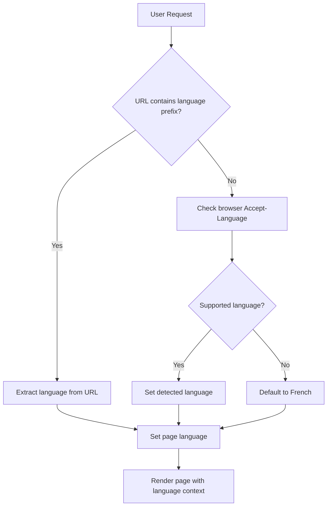

# Design Document

## Overview

This design implements multilingual support for the Jekyll blog using the Chirpy theme, enabling seamless French and English content management while maintaining backward compatibility. The solution leverages Jekyll's built-in internationalization capabilities combined with custom plugins and liquid templates to provide a robust multilingual experience.

The design follows a hybrid approach that preserves existing French URLs while introducing a structured multilingual system for new content. This ensures zero downtime and maintains SEO rankings while enabling future scalability to additional languages.

## Architecture

### URL Structure Strategy

The multilingual implementation uses a hybrid URL structure to maintain backward compatibility:

**Legacy French Content (Preserved):**

- `/posts/title/` - Existing French posts remain unchanged
- `/categories/category-name/` - Existing French categories
- `/tags/tag-name/` - Existing French tags

**New Multilingual Structure:**

- `/fr/posts/title/` - New French posts
- `/en/posts/title/` - English posts
- `/fr/categories/category-name/` - French categories
- `/en/categories/category-name/` - English categories

### Language Detection and Routing



### Content Organization

```text
_posts/
├── fr/
│   ├── 2025-01-01-nouveau-post.md
│   └── 2025-01-02-autre-post.md
├── en/
│   ├── 2025-01-01-new-post.md
│   └── 2025-01-02-another-post.md
└── [legacy posts remain at root level]

_data/
├── locales/
│   ├── fr.yml
│   └── en.yml
└── translations.yml

_includes/
├── lang/
│   ├── language-switcher.html
│   ├── hreflang-tags.html
│   └── localized-navigation.html
```

## Components and Interfaces

### Language Switcher Component

**Location:** Navigation header
**Functionality:** Provides language toggle with visual indicators

```html
<!-- _includes/lang/language-switcher.html -->
<div class="language-switcher">
  <button class="lang-toggle" data-lang="{{ page.lang | default: site.lang }}">
    <span class="flag flag-{{ page.lang | default: site.lang }}"></span>
    <span class="lang-code">{{ page.lang | default: site.lang | upcase }}</span>
  </button>
  <div class="lang-dropdown">
    
      <a href="{{ page.url | replace_first: '/' + page.lang, '/' + lang }}" 
         class="lang-option active"
         data-lang="{{ lang }}">
        <span class="flag flag-{{ lang }}"></span>
        <span class="lang-name">{{ site.data.locales[lang].language_name }}</span>
      </a>
    
  </div>
</div>
```

### Multilingual Post Management

**Front Matter Schema:**

```yaml
---
title: "Post Title"
description: "Post description"
lang: fr
translation_key: unique-post-identifier
translations:
  en: /en/posts/english-title/
  fr: /fr/posts/french-title/
categories: [category1, category2]
tags: [tag1, tag2]
---
```

### Localization Data Structure

**_data/locales/en.yml:**

```yaml
language_name: English
language_code: en
layout:
  post: Post
  category: Category
  tag: Tag
tabs:
  home: Home
  categories: Categories
  tags: Tags
  archives: Archives
  about: About
# ... additional translations
```

### SEO and Hreflang Implementation

**Hreflang Tags Component:**

```html
<!-- _includes/lang/hreflang-tags.html -->

  
    <link rel="alternate" hreflang="{{ translation[0] }}" href="{{ site.url }}{{ translation[1] }}" />
  
  <link rel="alternate" hreflang="{{ page.lang | default: site.lang }}" href="{{ site.url }}{{ page.url }}" />

```

## Data Models

### Site Configuration Extensions

**_config.yml additions:**

```yaml
# Multilingual configuration
languages: [fr, en]
default_language: fr
exclude_from_localization: [assets, admin]

# Language-specific configurations
lang_config:
  fr:
    title: "Un Dev perdu dans un monde d'Ops"
    tagline: "Je partagerai mes aventures de dev, devops, homelab"
    description: "Un blog pour parler de dev, devops, homelab"
  en:
    title: "A Dev Lost in an Ops World"
    tagline: "Sharing my dev, devops, homelab adventures"
    description: "A blog about dev, devops, homelab, and life"

# Permalink structure for multilingual posts
permalink: /:categories/:title/
```

### Post Data Model

```ruby
# Jekyll Post object extensions
class Post
  attr_accessor :lang, :translation_key, :translations
  
  def alternate_languages
    translations.keys.reject { |lang| lang == self.lang }
  end
  
  def translation_for(lang)
    translations[lang] if translations
  end
  
  def has_translation?(lang)
    translations && translations.key?(lang)
  end
end
```

### Translation Management

**_data/translations.yml:**

```yaml
post_relationships:
  unique-post-1:
    fr: /fr/posts/titre-francais/
    en: /en/posts/english-title/
  unique-post-2:
    fr: /posts/legacy-french-post/  # Legacy URL
    en: /en/posts/english-version/
```

## Error Handling

### Missing Translation Fallbacks

1. **Missing Page Translation:**
   - Redirect to homepage of target language
   - Display notification about unavailable translation
   - Suggest related content in target language

2. **Missing Locale Data:**
   - Fall back to default language (French)
   - Log missing translation keys for future updates
   - Display English key as fallback text

3. **Invalid Language Codes:**
   - Redirect to default language version
   - Set proper language context
   - Update browser language preference

### Error Page Localization

```html
<!-- 404.html with language detection -->
---
layout: default
permalink: /404.html
---
<div class="error-page">
  <h1>{{ site.data.locales[page.lang].not_found.title | default: "Page non trouvée" }}</h1>
  <p>{{ site.data.locales[page.lang].not_found.message | default: "Cette page n'existe pas." }}</p>
  <a href="/{{ page.lang }}/">{{ site.data.locales[page.lang].not_found.home_link | default: "Retour à l'accueil" }}</a>
</div>
```

## Testing Strategy

### Unit Tests

1. **Language Detection Logic:**
   - Test browser language parsing
   - Validate fallback mechanisms
   - Verify URL language extraction

2. **Translation Linking:**
   - Test post translation relationships
   - Validate cross-language navigation
   - Verify hreflang tag generation

### Integration Tests

1. **URL Routing:**
   - Test all URL patterns work correctly
   - Verify legacy URL preservation
   - Validate language-specific routing

2. **Content Rendering:**
   - Test localized navigation rendering
   - Verify language switcher functionality
   - Validate SEO meta tag generation

### End-to-End Tests

1. **User Journey Testing:**
   - Complete language switching workflow
   - Cross-language content discovery
   - SEO crawler simulation

2. **Performance Testing:**
   - Page load times with language detection
   - Build time impact assessment
   - Memory usage optimization

### Accessibility Testing

1. **Screen Reader Compatibility:**
   - Language attribute validation
   - Navigation announcement testing
   - Content language identification

2. **Keyboard Navigation:**
   - Language switcher accessibility
   - Focus management during language changes
   - ARIA label localization

### Browser Compatibility

1. **Language Detection:**
   - Test across major browsers
   - Validate Accept-Language header parsing
   - Verify localStorage language persistence

2. **Visual Consistency:**
   - Flag icon rendering
   - Language switcher styling
   - Responsive design validation