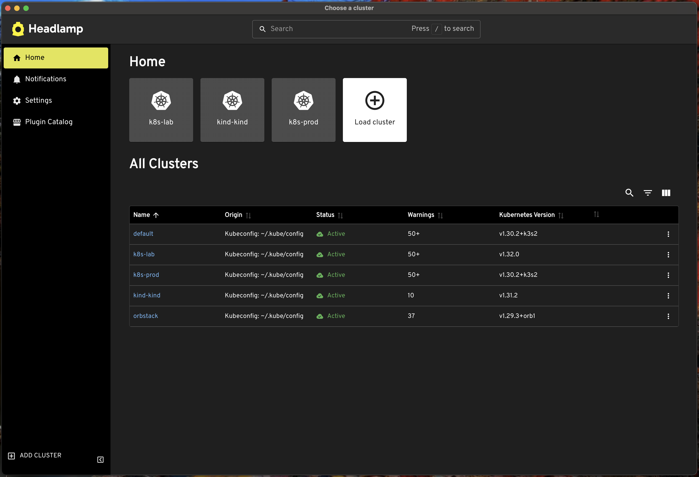
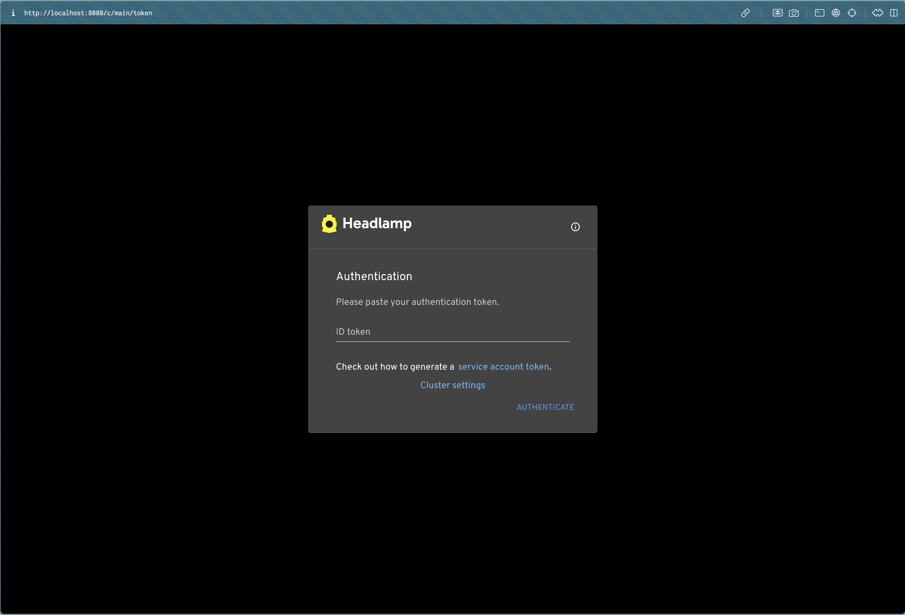
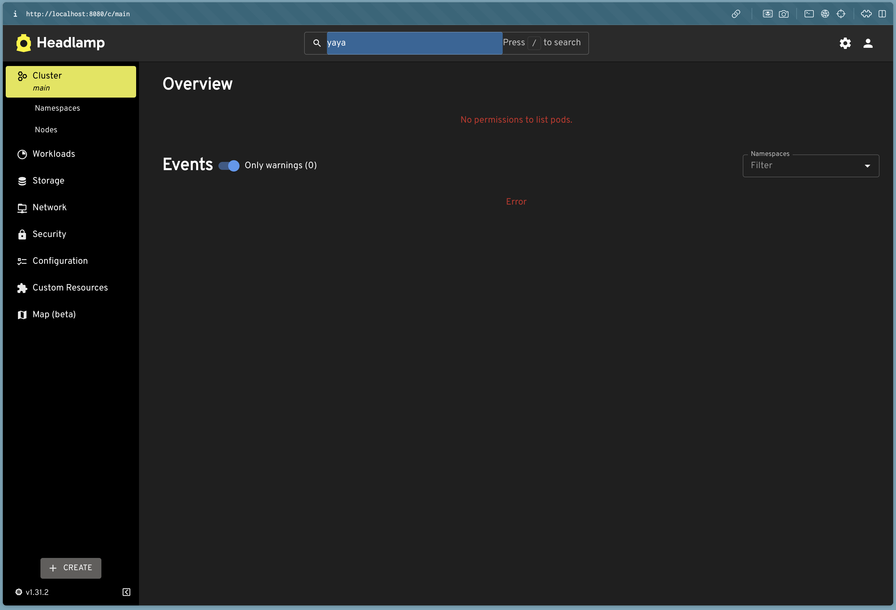

## Contexte :

Depuis l'avènement du [dashboard Kubernetes](https://github.com/kubernetes/dashboard), plusieurs outils ont vu le jour pour faciliter la gestion vos clusters Kubernetes sur votre pc. <br />
Jusque-là, k8slens était le plus avancé et très populaire au sein de la communauté, malheureusement, il est passé de l'autre côté de la force.

[K8slens](https://k8slens.dev/) a été acquis par la société [Mirantis](https://www.mirantis.com) qui a décidé de fermer les sources et de le rendre payant **(ce qui rappel [docker](https://www.docker.com) également acquis par la même société)**.
[La version 6.0.0](https://forums.k8slens.dev/t/lens-6-release-and-vision-for-the-future/106) de Lens publiée le 28 juillet 2022 a été la dernière version complètement gratuite avec toutes les fonctionnalités.

[Mirantis](https://www.mirantis.com) propose une version **personnelle** gratuite de Lens, mais tout de même avec quelques limitations, voir le [modèle de prix](   https://k8slens.dev/pricing)

### Alternatives à K8slens :

Il existe deux types d'alternatives open source à Lens :

- #### A base de la CLI :

  - [k9s](https://k9scli.io/) : open source, courbe d'apprentissage un peu plus élevée, mais il est très puissant et complet.
    - un article est en cours de rédaction pour expliquer comment l'utiliser (**excéllent outil pour les amoureux de k8s et la cli**).
  - [kdash](https://kdash.cli.rs/) : open source, mais il est moins puissant que k9s, j'ai fait un tour, mais pas trop aimé, il reste quand en development active.

- #### A base d'interface graphique desktop ou web :

  - ##### Open source :

  - [kubernetes dashboard](https://github.com/kubernetes/dashboard) qui fait partie du projet kubernetes et est open source (facile à utiliser).
  - Il existe un [fork](https://github.com/MuhammedKalkan/OpenLens) de lens, par **[Muhammed Kalkan](https://github.com/MuhammedKalkan)** applé *openlens* qui est open source et gratuit. <br />
      Le problème est que ce fork est à l'arrêt en raison de la fermeture des sources de K8slens comme expliqué dans le readme du [dépôt github](https://github.com/MuhammedKalkan), il est donc sujet à des bugs et vulnérabilités. <br >
      La dernière version est la v6.5.2-366 en date du 30 juin 2023 (il est préferable de trouver une solution alternative). <br />
      Il reste encore fonctionnel avec quelques menus disparus comme celui permettant de voir les logs ou s'attacher à un pod.<br />
      Pour rajouter ces menus, il suffit d'installer l'extension **@alebcay/openlens-node-pod-menu** et redemarrer K8s. <br />

  - [seabird](https://getseabird.github.io/) : open source, mais il reste assez basique et il est en cours de développement.
  - [devtron](https://devtron.ai/) : projet [CNCF](https://www.cncf.io)  plus qu'un simple dashboard pour manager k8s, c'est une plateforme capable de faire du CI/CD avec argo.
  - [Headlamp](https://headlamp.dev/) : projet [CNCF](https://www.cncf.io) qui est le sujet de cet article.

  - ##### Payant :

    La plupart des outils suivants sont payants, mais offre aussi des versions communautaires gratuite limitée
    - [Portainer](https://www.portainer.io/)
    - [Rancher](https://rancher.com/)
    - [Aptakube](https://www.aptakube.com/)
    - [K8Studio](https://k8studio.io/)
    - [Octant](https://octant.dev/)

### [C'est quoi headlamp ?](https://headlamp.dev/)

Headlamp est une ui permettant de manager un ou plusieurs clusters kubernetes, gratuit et open source, le projet est en phase de sandboxing au [CNCF](https://www.cncf.io). <br />
C'est sûre qu'il restera libre et open source et aura beaucoup de support et contribution de la part de la communauté et de la CNCF elle-même. <br />
Le projet est en gains de popularité et le dépôt github comptabilise plus de 2k stars et est en forte adoption par la communauté. <br />

### Installation :

Headlamp offre deux options d'installation :

- #### Desktop :

  Vous pouvez télécharger le binaire [ici](https://headlamp.dev/#download-platforms) en sélectionnant votre système d'exploitation ou utiliser le gestionnaire de packets de votre système.
  - Une fois l'installation terminée, vous pouvez lancer head comme vos autres applications, si vous aviez choisi l'option desktop.
  - 

- #### Sur le cluster kubernetes lui-même via un helmchart.

  - Prérequis :
    - **un cluster kubernetes** : Vous devez déjà avec un cluster kubernetes pour pouvoir installer headlamp dessus.
      - [voir cet article sur comment démarrer un cluster kubernetes avec kind](https://mombe090.github.io/posts/kind/)
    - **Helm** : est devenu aux furs des années l'outil de management de packets pour kubernetes le plus utilisé, un article est en rédaction à ce sujet. <br /> [voir comment installer helm](https://helm.sh/docs/intro/install/)
      - install avec helm :

        - ```bash
                helm repo add headlamp https://headlamp-k8s.github.io/headlamp/
                helm install my-headlamp headlamp/headlamp --namespace kube-system
            ```

      - vous pouvez voir les pods de headlamp avec

        - ```shell
              kubectl get pods --namespace kube-system -l app.kubernetes.io/instance=my-headlamp
              NAME                           READY   STATUS    RESTARTS   AGE
              my-headlamp-7cb69f6cb7-4qj4k   1/1     Running   0          54s

           ```

      - Afficher le service k8s de headlamp :

        - ```bash
                kubectl get svc --namespace kube-system -l app.kubernetes.io/instance=my-headlamp
                NAME          TYPE        CLUSTER-IP      EXTERNAL-IP   PORT(S)   AGE
                my-headlamp   ClusterIP   10.96.252.252   <none>        80/TCP    3m26s
              ```

      - Activer le port-forwarding sur le port 8080

        - ```bash
                kubectl port-forward --namespace kube-system svc/my-headlamp 8080:80
            ```

      - Vous pouvez maintenant acceder au dashboard en allant sur l'url suivante : http://localhost:8080
        - 
        - Pour obtenir le token d'authentification de headlamp :

        - ```bash
            kubectl create token headlamp-admin -n kube-system
            ```

        - Copiez le token et utilisez-le pour vous connecter au dashboard.
          - 
          - On vois qu'avec ce token **headlamp-admin**, on a pas la possibilité de voir ou modifier les objects ainsi que d'autres actions.
          - Pour resource ce problème, on vas créer un clusterrolebinding (qui est l'object kube qui permet d'associer un role à un utilisateur ou un serviceaccount dans notre cas) et lui donner le role de cluster-admin. <br />
          - Kubernetes utilise le mode RBAC (Role Based Access Control) pour autoriser les utilisateurs et les services à acceder aux ressources. <br />

          - ```shell
                kubectl create clusterrolebinding headlamp-admin-sa --clusterrole=cluster-admin --serviceaccount=headlamp-admin
                clusterrolebinding.rbac.authorization.k8s.io/headlamp-admin-sa created
              ```

          - Actualiser la page de headlamp et on vois que l'on a le droit de voir et modifier les ressources.
          - 

### Amusez-vous avec headlamp ⚡️!

## Références

- [CNCF](https://www.cncf.io/)
- [kubernetes](https://kubernetes.io/)
- [kubernetes dashboard](https://github.com/kubernetes/dashboard)
- [headlamp](https://headlamp.dev/)
- [seabird](https://getseabird.github.io/)
- [metallb](https://metallb.universe.tf/)
- [devtron](https://devtron.ai/)
- [k9s](https://k9scli.io/)
- [kdash](https://kdash.cli.rs/)
- [octant](https://octant.dev/)
- [Portainer](https://www.portainer.io/)
- [Argo](https://argoproj.github.io/argo-cd/)
- [Rancher](https://rancher.com/)
