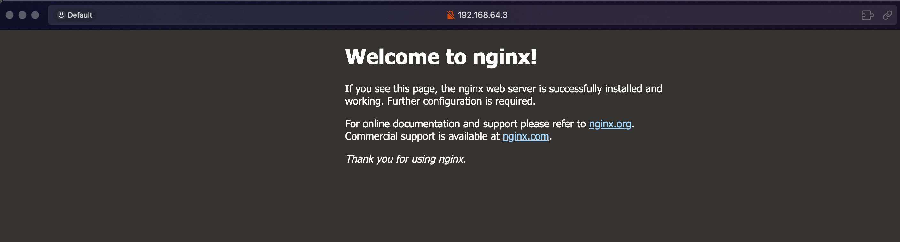

#### Si vous avez besoin d'un cluster kubernetes pour tester des choses en local, opter pour des solutions comme [kind](https://kind.sigs.k8s.io/), un article est disponible ici : [Démarrer un cluster kubernetes en quelques secondes avec kind](https://mombe090.github.io/posts/kind/).

## Contexte :

Il existe plusieurs distrubitions kubernetes production ready et se categorise en deux types :

- ### Gérer par une entreprise externe :

  - Si vous êtes une grosse boîte et que le budget, ce n'est pas un problème, cela peut être une bonne option.
  - Plusieurs clouds providers offrent des services de gestion de kubernetes, comme :
    - [EKS](https://aws.amazon.com/eks/) : Amazon Elastic Kubernetes Service
    - [AKS](https://azure.microsoft.com/en-us/services/kubernetes-service/) : Azure Kubernetes Service
    - [GKE](https://cloud.google.com/kubernetes-engine) : Google Kubernetes Engine
    - [digitalocean](https://www.digitalocean.com/products/kubernetes/) : DigitalOcean Kubernetes
    - [linode](https://www.linode.com/products/kubernetes/) : Linode Kubernetes
    - [scaleway](https://www.scaleway.com/en/kubernetes-kapsule/) : Scaleway Kubernetes
    - etc ...
  - Quelque-uns proposent aussi des options hybrid (cloud + onprem) ou onprem uniquement comme :
    - [Rancher Kubernetes Engine](https://rancher.com/) :
    - [RedHat OpenShift](https://www.openshift.com/)  
    - [Google anthos](https://cloud.google.com/anthos)
    - [VMware Tanzu](https://tanzu.vmware.com/)
    - [Microsoft Azure Arc](https://azure.microsoft.com/en-us/services/azure-arc/)
    - etc ...

- #### Avantages :

  - Ces services sont gérés par des experts payés pour le maintien et la sécurité votre cluster.
  - Facilite la scalabilité jusqu'à tenir les traffics les plus élevés et les plus critiques aux mondes.
  - Haute disponibilité
  - Backup et restauration
  - Gestion des certificats SSL
  - Gestion de la persistance des données avec solution très éfficace et perfomante.
  - ... Finalement, vous ne vous concentrez que sur l'essentiel, vos workloads et votre business.
  
- #### Inconvénients :

  - Ces avantages ci-haut ont un coût associé. (ça peut aller jusqu'à plusieurs milliers de dollars par mois)
    - Par experience, la facture peut rapidement devenir le plus grand sujet de discussion entre CFO et CTO.
    - ***il existe tout de même des solutions pour mitiger le coût comme [karpenter](https://karpenter.sh/) et [kube-green](https://kube-green.dev/) qui permet de scaler les nœuds en fonction de la charge, par example (moin d'EC2 durant la nuit si le traffic est bas et rééquilibre au besoin durant la journée).***
    - Vous avez un contrôle limité sur les nœuds de votre cluster.

- ### Gérer par vous-même :

  - Si les compétences pour gérer un cluster kubernetes sont présentes dans votre équipe, vous pouvez opter pour une distribution kubernetes open source et la faire fonctionner par vous-meme et aussi souscrire à du support aux besoins, pour les journées où les competences en interne sont limitées pour de plus grands problèmes que vous allez surement rencontrer.
  - Certes existe plusieurs challenges (stockagé, sécurité, réseaux, kubernetes lui-même est complexe à troubleshooter) qui sont absorbés dans le cas de la gestion par une entreprise externe.
  - Cela peut être une bonne option pour les petites et moyennes entreprises qui veulent économiser de l'argent.
  - En plus, vous avez le contrôle total sur votre cluster et vous pouvez les adapter à vos besoins.
  - Il existe plusieurs distributions kubernetes open source prêtent pour la production, voici queques exemples les plus connues et certifiées par la [CNCF](https://www.cncf.io) :
    - [k3s](https://k3s.io/) : Déveloper par [Rancher](https://rancher.com/), c'est une distribution kubernetes légère et facile à installer, sur des machines avec peu de resources.
    - [k0s](https://k0sproject.io/) : Déveloper par [Mirantis](https://www.mirantis.com), très similaire à k3s.
    - [microk8s](https://microk8s.io/) : la distribution kubernetes de [Canonical](https://canonical.com).
    - [kubeadm](https://kubernetes.io/docs/setup/production-environment/tools/kubeadm/) : l'outil de bootstrap de kubernetes qui a été pendant longtemps la seule option production ready pour installer kubernetes (un peu plus complex à gérer par rapport aux autres sur la liste).
    - [kubespray](https://kubespray.io/) : sous la gouvernance du **Kubernetes Interest Groups (SIG)**, elle permet de déployer un cluster kubernetes sur plusieurs machines onprem comme sur du cloud.
    - [Talos Linux](https://talos.dev/) : Une distribution linux open source designer pour kubernetes à 100%, c'est la `hype` du moment, un article lui sera dedié bien vite.

  #### Avantages :

  - Bénéfices des avantages de kubernetes sans exploser votre budget.
  - Un contrôle total sur votre control-plane ainsi que les nœuds.
  - Faire monter équipe en competences et en connaissances sur kubernetes.
  - Aujourd'hui, il est possible d'utiliser plusieurs outils open source pour mitiger les downtime et les autres problèmes.
  
  #### Inconvénients :

  - Vous devez tout faire par vos équipes
  - Donc des compétences techniques sur l'écosystème de kubernetes sont nécessaires.
  - Vous occupez de la maintenance, mise à jour des packets, application  
  - Gérer des firewalls, routers, etc ...
  - Faire des patch de sécurité.
  - Trouvez un moin éfficace de gérer la scalabilité Vertical et Horizontal
  - Faire de la redondance de site
   ...

## Objectif :

Sur cet article, nous allons voir comment installer un cluster kubernetes prêt pour la production avec [k3s](https://k3s.io/)
et déployer le serveur web [nginx](https://www.nginx.com/) comme exemple de workload.

### Création des nœuds (VMs) qui vont former notre cluster kubernetes :

- Pour faire simple, nous allons créer 3 nœuds (VMs) :
  - 1 nœud qui va servir de control-plane k8s appelé **server** dans le contexte de k3s.
  - 2 nœuds pour les workers ou **agents**.
  - Il existe plusieurs solutions et outils pour créer des machines virtuelles, comme : <br>
    Voici quelques-un les plus populaires sur des workstation :
    - [VirtualBox](https://www.virtualbox.org/)
    - [VMware Workstation ou Fusion](https://www.vmware.com/products/desktop-hypervisor/workstation-and-fusion)
    - [Microsoft Hyper-V](https://docs.microsoft.com/en-us/virtualization/hyper-v-on-windows/)
    - [KVM](https://www.linux-kvm.org/page/Main_Page)
    - [QEMU](https://www.qemu.org/)
  
- il y a aussi quelques outils qui facilitent la gestion de ces VMs : <br />
  Ces outils fournissent des configurations déclaratives ou adhoc via une CLI pour la gestion de tout le cycle de vie des VMs.
  - [Vagrant](https://www.vagrantup.com/) de [HashiCorp](https://www.hashicorp.com/) qui a été le pionnier dans ce domaine.
  - [Multipass](https://multipass.run/) de [Canonical](https://canonical.com/) qui se démarque par sa simplicité. <br />

#### Nous allons utiliser multipass pour créer nos VMs :

- Multipass simplifie la gestion des machines virtuelles, tout comme Docker l'a fait pour les conteneurs.
- Développer chez [Canonical](https://canonical.com), il permet de créer et gérer des machines virtuelles.
- Il supporte la method [cloudinit](https://cloudinit.readthedocs.io/en/latest/)
  - largement utilisé pour automatiser la configuration initiale des instances de machines virtuelles (VM) dans les environnements cloud et onprem.
  - Il permet de personnaliser vos VMs lors de la création avec comme option : import de clés ssh, de création d'utilisateurs, installer des packets etc...)
- Il est disponible sur Windows, macOS et Linux. voir [Installer Multipass](https://canonical.com/multipass/install) et choisissez votre OS.
- Le seul inconvenient, il n'y a qu'ubuntu comme distribution supportée pour le moment.
- Pour créer une VM avec multipass, vous pouvez utiliser l'application graphique ou la CLI :
- Avec la CLI, vous pouvez utiliser la commande `multipass launch` pour créer une VM avec des options comme le nombre de CPUs, la mémoire, le disque, le nom, le réseau etc ...
- Ci-desous, les commandes pour créer les nœuds de notre cluster :

  ```bash
  multipass launch noble --name server-01 --cpus  2  --memory 2G    --disk 5G --network en0
  multipass launch noble --name agent-01  --cpus  1  --memory 512M  --disk 5G --network en0
  multipass launch noble --name agent-02  --cpus  1  --memory 512M  --disk 5G --network en0
  ```

  - *Note* :
    - J'utilise le minimum de ressources requises pour k3s, vous pouvez augmenter les ressources si vous avez besoin. [voir le requirement](https://docs.k3s.io/installation/requirements#hardware)
    - `noble` est l'image ubuntu 24.04 LTS, vous pouvez utiliser `multipass find` pour lister les images disponibles.
    - `--network en0` est l'interface réseau que j'utilise, vous pouvez utiliser `multipass networks` pour lister les interfaces disponibles.
  - Si c'est votre première installation via multipass, ça risque de prendre un peu de temps pour télécharger l'image ubuntu (les autres fois, il cache l'image en local).
  - Après quelque temps si tout se passe bien, vous devriez avoir cette sortie :

    - ```bash
         Launched: server-01
         Launched: worker1
         Launched: worker2

    ```text
  - Vous pouvez vérifier que les VMs sont créées avec la commande `multipass list` (les ip sont générées automatiquement, mais vous pouvez les mettre statiques avec `cloudinit` ou directement ajuster le fichier `/etc/netplan/50-cloud-init.yaml`) :

    - ```text
         Name                    State             IPv4             Image
         server-01               Running           192.168.64.3     Ubuntu 24.04 LTS
         agent-01                Running           192.168.64.4     Ubuntu 24.04 LTS
         agent-02                Running           192.168.64.5     Ubuntu 24.04 LTS

     ```text

#### Exécuter une command sur une instance de VM avec multipass :

Multipass permet d'exécuter des commandes sur une VM avec la commande `multipass exec` comme docker sur lequel il s'est fortement inspiré :

##### Exemple :

Ces commandes sont optionnelles, mais je vous recommande de les faire pour mettre à jour les packages d'ubuntu avant d'installer k3s :

- Server-01 :

  ```bash
  multipass exec server-01 -- sudo apt update 
  multipass exec server-01 -- sudo apt upgrade -y
  ```

- Server-02 :

  ```bash
  multipass exec agent-01 -- sudo apt update 
  multipass exec agent-01 -- sudo apt upgrade -y
  ```

- Server-03 :

  ```bash
  multipass exec agent-02 -- sudo apt update 
  multipass exec agent-02 -- sudo apt upgrade -y
  ```
  
#### Se connecter à une VM avec multipass :

En créant une instance, multipass ajoute une clé ssh pour se connecter à la VM dans le fichier `/home/ubuntu/.ssh/authorized_keys` de l'utilisateur ubuntu. <br />
La clé privé est stockée sur votre machine en fonction de votre OS (voir [cette discussion github à ce sujet](https://github.com/canonical/multipass/issues/913)).

```bash
$ multipass shell server-01

Welcome to Ubuntu 24.04.1 LTS (GNU/Linux 6.8.0-49-generic aarch64)
*
*
*
ubuntu@server-01:~$ 
```

***Tout est prêt pour installer server k3s qui represent le control-plane de notre cluster kubernetes.***

## Installation de k3s sur le control-plane (server) :

Pour installer k3s, on peut suivre le [quickstart guide](https://rancher.com/docs/k3s/latest/en/quick-start/), il y a aussi beaucoup d'options d'installation de disponibles sur la [documentation officielle](https://rancher.com/docs/k3s/latest/en/installation) que je vous conseille de lire et trouve celles qui vous conviennent. <br />

L'une des options les plus utilisés pour des clusters de production est celui d'avoir un cluster de haute disponibilité (HA) avec au moins 3 serveurs (control-plane) et un loadbalancer en avant. <br /><br />

***Si vous êtes un peu à l'aise avec [ansible](https://www.ansible.com/), il y a ce [dépôt github](https://github.com/techno-tim/k3s-ansible) maintenu par [TechnoTim](https://github.com/timothystewart6) qui offre un ensemble de playbooks et roles pour créer un cluster kubernetes HA avec Metallb comme loadbalancer. <br />***

- ### Connectez-vous à la VM server-01 :

  ```bash
  multipass shell server-01
  ```

- #### Une fois connecté, vous pouvez installer k3s avec la commande suivante :

  ```bash
  curl -sfL https://get.k3s.io | sh -
  
  [INFO]  Finding release for channel stable
  [INFO]  Using v1.31.4+k3s1 as release
  [INFO]  Downloading hash https://github.com/k3s-io/k3s/releases/download/v1.31.4+k3s1/sha256sum-arm64.txt
  [INFO]  Downloading binary https://github.com/k3s-io/k3s/releases/download/v1.31.4+k3s1/k3s-arm64
  [INFO]  Verifying binary download
  [INFO]  Installing k3s to /usr/local/bin/k3s
  [INFO]  Skipping installation of SELinux RPM
  [INFO]  Creating /usr/local/bin/kubectl symlink to k3s
  [INFO]  Creating /usr/local/bin/crictl symlink to k3s
  [INFO]  Creating /usr/local/bin/ctr symlink to k3s
  [INFO]  Creating killall script /usr/local/bin/k3s-killall.sh
  [INFO]  Creating uninstall script /usr/local/bin/k3s-uninstall.sh
  [INFO]  env: Creating environment file /etc/systemd/system/k3s.service.env
  [INFO]  systemd: Creating service file /etc/systemd/system/k3s.service
  [INFO]  systemd: Enabling k3s unit
  Created symlink /etc/systemd/system/multi-user.target.wants/k3s.service → /etc/systemd/system/k3s.service.
  [INFO]  systemd: Starting k3s
  ```

  *Simple n'est pas ?* <br />
  Rancher fait cette abstraction et tout le script qui permet de lancer k3s est fait pour vous. <br />

- #### Verifier le status du service k3s avec Systemd

```bash
  sudo systemctl status k3s
  
  ● k3s.service - Lightweight Kubernetes
  Loaded: loaded (/etc/systemd/system/k3s.service; enabled; preset: enabled)
  Active: active (running) since Sat 2025-01-04 17:27:59 EST; 26s ago
  Docs: https://k3s.io
  Process: 13514 ExecStartPre=/bin/sh -xc ! /usr/bin/systemctl is-enabled --quiet nm-cloud-setup.service 2>/dev/null (code=exited, status=0/SUCCESS)
  Process: 13516 ExecStartPre=/sbin/modprobe br_netfilter (code=exited, status=0/SUCCESS)
  Process: 13520 ExecStartPre=/sbin/modprobe overlay (code=exited, status=0/SUCCESS)
  Main PID: 13521 (k3s-server)
  Tasks: 96
  Memory: 1.1G (peak: 1.1G)
  CPU: 9.538s
```

#### Vérifier que le cluster est bien installé :

```bash
sudo k3s kubectl get nodes

NAME        STATUS   ROLES                  AGE     VERSION
server-01   Ready    control-plane,master   10m   v1.31.4+k3s1
```

Par défault k3s génère le fichier de configuration de kubernetes sur `/etc/rancher/k3s/k3s.yaml` avec toutes les informations (ip, user, certificates ...) réquises pour se connecter au cluster. <br />
Pour utiliser kubectl sans `sudo`, vous pouvez copier ce fichier dans votre répertoire `~/.kube/config` :

```bash
mkdir ~/.kube
sudo cp /etc/rancher/k3s/k3s.yaml ~/.kube/config
sudo chmod 755 ~/.kube/config
```

Ajoutez la ligne suivante à votre fichier `~/.bashrc`  :

```bash
echo 'export KUBECONFIG=~/.kube/config' >> ~/.bashrc
source ~/.bashrc
```

Si vous voulez accéder au cluster avec kubectl ou ([headlamp](https://mombe090.github.io/posts/headlamp/) [un article est disponible sur le blog](https://mombe090.github.io/posts/headlamp/)) à partir du votre machine hôte, vous pouvez copier le dossier `~/.kube` dans le dossier de l'utilisateur :

```bash
scp -rv ubuntun@ip-server-01:~/.kube .
```

Maintenant vous pouvez utiliser `kubectl` sans `sudo` :

```bash
k3s kubectl get pods --namespace kube-system

NAME                                      READY   STATUS      RESTARTS   AGE
coredns-ccb96694c-8zwdm                   1/1     Running     0          4h26m
helm-install-traefik-crd-rl97x            0/1     Completed   0          4h26m
helm-install-traefik-tvm47                0/1     Completed   1          4h26m
local-path-provisioner-5cf85fd84d-cxz5b   1/1     Running     0          4h26m
metrics-server-5985cbc9d7-9hsb2           1/1     Running     0          4h26m
svclb-traefik-260ec65e-dqnhz              2/2     Running     0          4h26m
traefik-57b79cf995-v76fj                  1/1     Running     0          4h26m
```

On voit qu'il y a quelques services déjà installés par défault avec k3s, comme traefik proxy, servicelb. <br />
`Un ingress controller et un loadbalancer sont installés pour votre cluster kubernetes avec trafik proxy`. <br />
Par contre pour faire simple, nous allons utiliser le service de type `NodePort` pour accéder à notre application d'exemple. <br />
Un article dédié aux ingress controllers, kubernetes gateway api et loadbalancer sera rédiger bientôt.

#### Récupérer le token pour joindre les agents au cluster (workers/nœuds) :

Sur le `server-01`, vous pouvez récupérer le token suivant :

```bash
sudo cat /var/lib/rancher/k3s/server/node-token
```

## Installation et join des agents (workers/nœuds) :

- Connectez-vous aux VMs `agent-01` et `agent-02` :
  - Exemple : `agent-01`

    ```bash
    multipass shell agent-01
    ```

- Une fois connecté, vous pouvez installer k3s avec la commande suivante :
- Remplacer `K3S_URL` et `K3S_TOKEN` respectivement par l'IP de `server-01` et la sortie de la commande `sudo cat /var/lib/rancher/k3s/server/node-token` ci-haut :

  ```bash
  curl -sfL https://get.k3s.io | K3S_URL=https://192.168.64.3:6443 K3S_TOKEN=remplacer-le-votre-ici sh -
  
  [INFO]  Finding release for channel stable
  [INFO]  Using v1.31.4+k3s1 as release
  [INFO]  Downloading hash https://github.com/k3s-io/k3s/releases/download/v1.31.4+k3s1/sha256sum-arm64.txt
  [INFO]  Downloading binary https://github.com/k3s-io/k3s/releases/download/v1.31.4+k3s1/k3s-arm64
  [INFO]  Verifying binary download
  [INFO]  Installing k3s to /usr/local/bin/k3s
  [INFO]  Skipping installation of SELinux RPM
  [INFO]  Creating /usr/local/bin/kubectl symlink to k3s
  [INFO]  Creating /usr/local/bin/crictl symlink to k3s
  [INFO]  Creating /usr/local/bin/ctr symlink to k3s
  [INFO]  Creating killall script /usr/local/bin/k3s-killall.sh
  [INFO]  Creating uninstall script /usr/local/bin/k3s-agent-uninstall.sh
  [INFO]  env: Creating environment file /etc/systemd/system/k3s-agent.service.env
  [INFO]  systemd: Creating service file /etc/systemd/system/k3s-agent.service
  [INFO]  systemd: Enabling k3s-agent unit
  Created symlink /etc/systemd/system/multi-user.target.wants/k3s-agent.service → /etc/systemd/system/k3s-agent.service.
  [INFO]  systemd: Starting k3s-agent
  ```
  
- Vérifier le status du service k3s avec Systemd :

  ```bash
  sudo systemctl status k3s
  ```

- Faite la même chose pour `agent-02` :

  ```bash
  multipass shell agent-02
  ```

  ```bash
  curl -sfL https://get.k3s.io | K3S_URL=https://192.168.64.3:6443 K3S_TOKEN=remplacer-le-votre-ici sh -
  ```

### Vérifier que les agents sont bien joinés au cluster :

Reconnectez-vous à la VM `server-01` :

```bash
kubectl get nodes

NAME        STATUS   ROLES                  AGE   VERSION
server-01   Ready    control-plane,master   3m    v1.31.4+k3s1
agent-01    Ready    <none>                 2m    v1.31.4+k3s1
agent-02    Ready    <none>                 2m    v1.21.5+k3s1
```

## Installer votre premier workload sur le cluster kubernetes :

- Vous pouvez maintenant installer une application utilisant kubectl :
  - Exemple : le serveur web`nginx`
    - Créer un deployment et un service nginx :

      ```bash
      kubectl create deployment nginx --image=nginx 
      ```

      ```bash
      kubectl expose deployment nginx --port=80 --target-port=80 --type=NodePort
      ```

    - Vérifier que le pod est bien créé :

      ```bash
      kubectl get pods
      
      NAME                     READY   STATUS    RESTARTS   AGE
      nginx-676b6c5bbc-fn4bx   1/1     Running   0          85s
      ```

    - Vérifier que le service est bien créé :

      ```bash
      kubectl get svc
      
      NAME         TYPE        CLUSTER-IP      EXTERNAL-IP   PORT(S)        AGE
      kubernetes   ClusterIP   10.43.0.1       <none>        443/TCP        4h40m
      nginx        NodePort    10.43.111.120   <none>        80:30516/TCP   52s
      ```

      Le service à généré un port aléatoire, dans mon cas, c'est `30516`, il sera différent chez vous.
    - Vous pouvez patcher le service avec un nombre statique qui doit être entre 30000 et 32767 :
    -

      ```bash
         kubectl patch svc nginx -p '{"spec": {"ports": [{"port": 80, "nodePort": 32500}]}}'
      
         service/nginx patched
      ```

    - Vous pouvez maintenant accéder à votre application en utilisant l'IP de n'importe quel nœud sur le port `32900` :

      ```bash
      curl http://192.168.64.3:32500
      
      <!DOCTYPE html>
      <html>
      <head>
        <title>Welcome to nginx!</title>
        <style>
         html { color-scheme: light dark; }
         body { width: 35em; margin: 0 auto;
         font-family: Tahoma, Verdana, Arial, sans-serif; }
        </style>
      </head>
      <body>
        <h1>Welcome to nginx!</h1>
        <p>If you see this page, the nginx web server is successfully installed and
           working. Further configuration is required.
        </p>
        <p>For online documentation and support please refer to
        <a href="http://nginx.org/">nginx.org</a>.<br/>
        Commercial support is available at
        <a href="http://nginx.com/">nginx.com</a>.</p>
      
        <p><em>Thank you for using nginx.</em></p>
      </body>
      </html>

      ```

      ou sur un navigateur Web
      

## Supprimer les instances de vms :

```bash
multipass stop server-01 agent-01 agent-02
multipass delete server-01 agent-01 agent-02
multipass purge
```

### Lire doc de k3s, il y a plusieurs options d'installation possibles et amusez-vous ⚡️!

## Références

- [k3s](https://k3s.io/)
- [k3s documentation](https://rancher.com/docs/k3s/latest/en/)
- [multipass](https://multipass.run/)
- [cloudinit](https://cloudinit.readthedocs.io/en/latest/)
