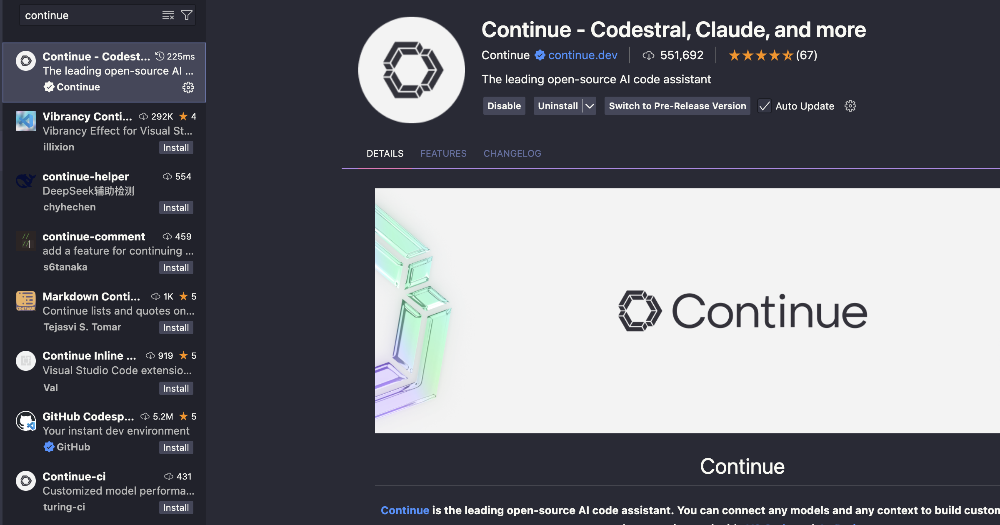
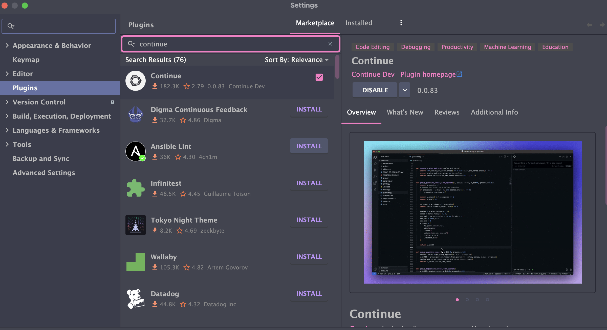
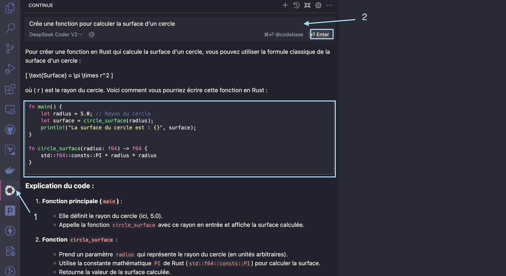

## Contexte :
Nous vivons certainement l'une des périodes les plus intéressentes dans l'informatique depuis l'avènement de l'internet. <br />

Les modèles LLM (Large Langage Model) sont de plus en plus évolués, capables de comprendre et de générer du contenu textuel, image, audio, vidéo de manière cohérente et convaincante. <br />
Ces modèles sont entrainés et compréssés avec beaucoup de données (près que toute la connaissance humaine numérisée). <br />

C'est un grand changement dans notre manière d'interagir et utiliser les ordinateurs, telephones et autres objets connectés. <br />

Tout ça pour dire que ça va changer beaucoup de choses dans notre quotidien et dans notre manière de travailler, elle remplacera beaucoup de métiers, mais en créera aussi beaucoup d'autre comme ça été le cas de la machine à Vapeur, l'électricité, l'internet ainsi que d'autres inventions humaines à travers son évolution 🌎 <br />

Dans le milieu du développement de logiciels, on peut s'en servir comme pair-programmeur **(coéquipier comme au Tenis à 2)**, mentor, coach, ... <br />

[Open-AI](https://openai.com/) a été le pionnier en sortant leur model **GPT-3.5** en Novembren 2022, plusieurs autres modèles gratuits comme payants ont suivi. <br />
`Microsoft` en collaboration avec `OpenAI` a sorti `Github Copilot` est un outil de **pair-programming** qui vous aide dans vos tâches de development à l'interieur de votre IDE (vscode, jetbrains ...). 

Pendant une année durant sa *beta teste*, elle était gratuite pour tout le monde, rendu payante [10$ USD/mois](https://github.com/features/copilot/plans?cft=copilot_li.features_copilot). <br />

## Objectif : 
Sur cet article, nous allons voir comment exécuter quelques models open-source en local avec le [Ollama](https://ollama.ai/) et comment utiliser [continue](https://github.com/continuedev/continue) pour servir de pair-programmeur dans un IDE de votre choix (vscode ou jetbrains idea ...).

## C'est quoi un LLM ?
Un grand modèle de langage (LLM pour Large Language Model) est un modèle d’apprentissage automatique capable de comprendre et générer des textes.
Ils opèrent en analysant des volumes massifs de données de langage.
***source [cloudflare](https://www.cloudflare.com/fr-fr/learning/ai/what-is-large-language-model/)***

### C'est quoi Ollama ?
[Ollama](https://ollama.ai/) est un est projet open-source qui permet d'exécuter les models de langage de LLM (Large Langage Model) en local. 
Il supporte beaucoup de models comme `Llama`, `Mistral`, `Gemma`, `DeepSeek`, `Phi` ... voir la liste complète [ici](https://ollama.ai/library). 

Très simple à installer et disponible sur le [docker hub](https://hub.docker.com/r/ollama/ollama) ainsi que sur les trois principaux OS (Windows, MacOS et Linux).

### C'est quoi Continue ?
[Continue](https://github.com/continuedev/continue) est plugin ou extension pour IDE qui s'interface avec `Ollama` ou tout autres agents du genre pour fournir des fonctionnalités d'assistant ou copilot dans votre environnement de développement. <br />
Il est disponible pour [VSCode](https://marketplace.visualstudio.com/items?itemName=Continue.continue) et [JetBrains IDE](https://plugins.jetbrains.com/plugin/22707-continue). <br />

> Je lui ai découvert sur cet [podcast](https://podcasts.apple.com/us/podcast/devops-and-docker-talk-cloud-native-interviews-and-tooling/id1451860877) de `Bret Fisher` avec comme invité le cocréateur de `Continue` [voir la version vidéo avec démo ici](https://www.youtube.com/watch?v=9zyJrMwGEKs)
{: .prompt-info }

Dans cet article, nous allons voir l'intégration `Continue` avec deux models open-source (local via `Ollama` et disponible sur internet) entrainé spécialement pour générer du code :

C'est modèles spécialisés en génération de code et d'assistance aux développements donc plus légère que leurs homologues généralistes.

Chaque modèle se présente avec différents tags pour le nombre de paramètres sur lequel il a été entrainé et plus celui-ci est gros plus, plus sa taille est grande et plus il est performant.
> Choisir celui qui correspond avec les ressources de votre machine ou la rapidité de votre internet.
{: .prompt-warning }

- [Codestral](https://mistral.ai/news/codestral/) un modèle open-source de la société française Mistral AI.
  - Ce modèle est particulièrement bon pour mes activités de coding perso, de devops et homelab
  - Il n'est pas en local par contre, il est hébergé quelque part dans les serveurs de Mistral AI
  - Il est sous la nouvelle licence [Mistral AI Non-Production License](https://mistral.ai/news/mistral-ai-non-production-license-mnpl/), gratuit pour des travaux d'apprentissages et de recherche.
  - Créer un compte sur [Mistral](https://mistral.ai) puis rechercher codestral pour récuperer le token d'authentification, voir son [intégration avec continue ici](https://docs.mistral.ai/capabilities/code_generation/#how-to-set-up-codestral-with-continue) : 
- [DeepSeek Coder V2](https://ollama.com/library/deepseek-coder-v2) un modèle open-source de la société chinoise DeepSeek .
  - Ce modèle est très bon pour générer du code, mais il est très gourmand en ressources.
  - La plus légère version 16b pèse 8.9GB
  - **Disponible sur `Ollama`**

- [Qwen2.5-coder](https://ollama.com/library/qwen2.5-coder), 
  - si vous êtes contraint par les resources disponible, internet ou même matérielles, celui-ci peut-être un bon model pour tester l'utilisation d'`Ollama` et `Continue`
  - Son modèle de 1.5B pèse moins de 1GB
  - **Disponible sur `Ollama`**

### Installation

Vous pouvez installer `ollama` en utilisant des outils de conteneurisation comme `docker` / `podman` ou l'installer directement sur votre système d'exploitation.
- Docker ou Podman : voir les instructions [ici](https://ollama.com/blog/ollama-is-now-available-as-an-official-docker-image)
- Système d'exploitation : Télécharger [ici](https://ollama.com/download)

Pour installer `continue` en fonction que vous soyez sur vscode ou les IDE de jetbrains :
- `vscode` : ouvrez l'appliction -> puis `Extensions` -> rechercher `Continue` -> `Install`
  - 
- `Intellij` : 
  - `Intellij Idea` -> puis `Settings` -> puis `Pluggins` -> rechercher `Continue` -> `Install`
  - 

### Utilisation :

Dans cet exemple, j'ai opté pour la séconde, si vous l'utiliser quotidiennement comme moi, assurez-vous q'`Ollama`se lance au démarrage de votre système.
Quand `Ollama` est démarré, vous verrez sur votre barre des tâches une icône représentation l'animal **Lama**.

#### Teste avec petit modèle :
Nous allons tester que tout est fonctionnel avec cet model `qwen2.5-coder:1.5b` <1024MB :
```bash
ollama run qwen2.5-coder:1.5b
pulling manifest
pulling 29d8c98fa6b0... 100% ▕█████████████████████████████▏ 986 MB
pulling 66b9ea09bd5b... 100% ▕█████████████████████████████▏   68 B
pulling e94a8ecb9327... 100% ▕█████████████████████████████▏ 1.6 KB
pulling 832dd9e00a68... 100% ▕█████████████████████████████▏  11 KB
pulling 152cb442202b... 100% ▕█████████████████████████████▏  487 B
verifying sha256 digest
writing manifest
success
>>> Qui est Linus Torvalds ?
Linus Torvalds est un informaticien et chef de projet fondamental de la Linux, l'une des versions les plus importantes de la famille d'operating systèmes Unix et GNU/Linux.
Il acontribué significativement à la conception, la programmation et la diffusion de Linux. 
Linus Torvalds est connu pour son travail sur le développement de l'architecture Linux et pour ses contributions cruciales au système d'exploitation Linux.
```
Quand vous avez une sortie pareille à votre prompt, ça veut dire que vous êtes prêt pour la suite, `ctrl/cmd + D` pour sortir. 

Pour apprendre plus sur la command `ollam`, execute `ollama help`:
```shell
ollama help

Large language model runner

Usage:
  ollama [flags]
  ollama [command]

Available Commands:
  serve       Start ollama
  create      Create a model from a Modelfile
  show        Show information for a model
  run         Run a model
  stop        Stop a running model
  pull        Pull a model from a registry
  push        Push a model to a registry
  list        List models
  ps          List running models
  cp          Copy a model
  rm          Remove a model
  help        Help about any command

Flags:
  -h, --help      help for ollama
  -v, --version   Show version information

Use "ollama [command] --help" for more information about a command.

```
### Configurer continue avec deepSeek-coder-v2 :
Continue génère un dossier `.continue` dans le dossier d'utilisateur [plus de détail ici](https://docs.continue.dev/customize/overview), ouvrer le dossier puis éditer le fichier `~/.continue/config.json`.

Ci-dessous, j'utilise ici le model de `deePseek-coder-v2` avec 16 Milliards de paramètres, si vous optez pour un autre modèle plus léger adapter la config.

```json
{
  "models": [
    {
      "title": "DeepSeek Coder V2",
      "model": "deepseek-coder-v2",
      "provider": "ollama"
    }
  ],
  "tabAutocompleteModel": {
     "title": "DeepSeek Coder V2",
     "model": "deepseek-coder-v2",
     "provider": "ollama"
  }
}
```
Enregistrer les et retournez dans votre IDE :
- `vscode`: Cliquer sur l'icône de continue parmi les extensions installées 
  - 
  - Ouvrez un de vos projets et commencé à coder, avec la section `Tab Autocomplete Model` configurer dans `~/.continue/config.json`, vous devriez voir une suggestion automatique comme sur l'image ci-dessous :
  - 

## Les alternatives :
- *Continue* : Il existe une alternative avec laquel on peut utiliser codestral de manière gratuite qui s'appel [Tabnine](https://www.tabnine.com/)
- *Ollalma* : l'une des alternative est [Lm Studio](https://lmstudio.ai/docs/api/server)


## Réferences :
- [Ollama](https://github.com/ollama/ollama)
- [Continue](https://docs.continue.dev/)
- [Mistral](https://mistral.ai/news/mistral-ai-non-production-license-mnpl/)
