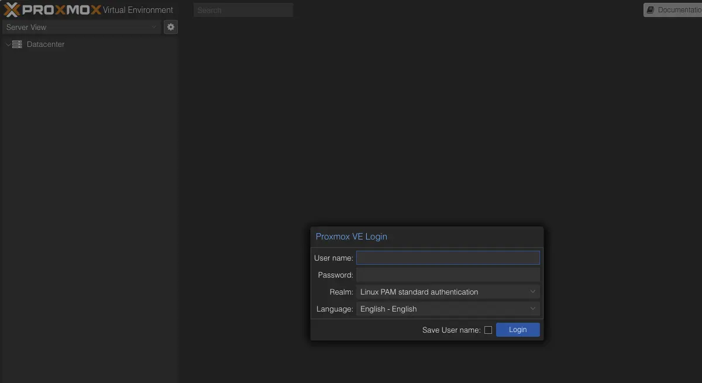
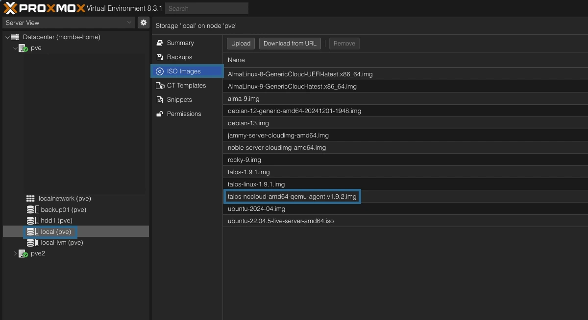
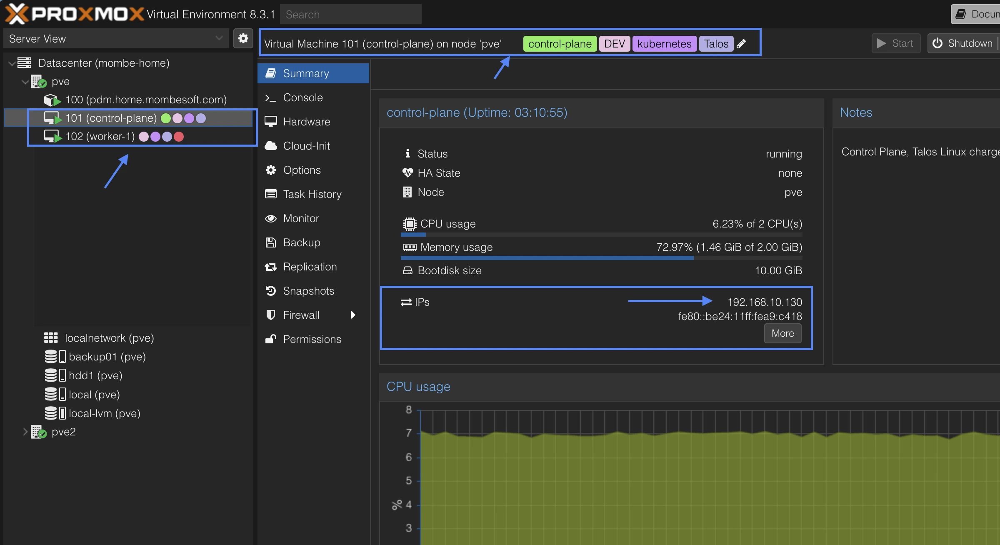

> **Note :** deux articles sont disponibles qui traitent la création de cluster kubernetes avec `kind` et `k3s` voir : <br /
> [Démarrer un cluster kubernetes en quelques secondes avec kind](https://mombe090.github.io/posts/kind/)  <br />
> [K3s la distribution kubernetes légère, performante et très éfficace à petite comme à grande echelle](https://mombe090.github.io/posts/k3s/)
{: .prompt-info }

## Prérequis :

- Un serveur physique dédié ou si vous avez un vieux pc qui traine dans un coin.
- Proxmox VE 8.0 ou supérieur ([voir Installation de Proxmox VE](https://www.proxmox.com/en/products/proxmox-virtual-environment/get-started))
- Un accès root au serveur Proxmox VE
- Un accès internet pour télécharger les images et les paquets nécessaires
- OpentoFu/Terraform installé sur votre machine ([voir Installation d'opentoFu](https://opentofu.org/docs/intro/install/i))
- Les CLI `kubectl` et [tolosctl](https://omni.siderolabs.com/how-to-guides/how-to-install-talosctl) optionel.
- [Quelques connaissances de base de Linux, terraform ou opentofu le concepte d'`insfrastructure as code`, de Kubernetes sont un plus]

## Contexte :

Dépuis sa création en 2014, le projet [Kubernetes](https://kubernetes.io/fr/docs/home/) était principalement utilisé sur des machines linux tradionnelles avec des distributions comme `RedHat`, `Ubuntu`, `Debian`, `CentOS` etc...  <br />
Ces distributions étaient déjà là avant l'arrivée de `kubernetes` donc pas forcément designer pour l'orchestration de conteneurs, mais font très bien le job. <br />
La plupart viennent avec quelques packets par ci par là dont `kubernetes` n'a pas besoin pour fonctionner correctement, mais qui peuvent poser des problèmes de sécurité. <br />

Pour pallier ce problème, des distributions comme `Flatcar Linux`, `RancherOS`, `CoreOS`, `Talos Linux` (qui est le sujet de cet article) sont apparues.
Elles sont légères, sécurisées et conçues spécifiquement pour l'orchestration de conteneurs avec le moins de packets possible, juste ce qui est nécessaire pour faire fonctionner `kubernetes` par exemple.

## Objectif :

Sur cet article, nous allons voir comment provisionner 2 machines virtuelles [Talos Linux](https://www.talos.dev/) sur `Proxmox VE` via un outil d'`infrastructure-as-code` comme `OpenTofu` et créer cluster kubernetes.
> **Note :** J'utiliserai 2 machines, un pour le control-plane et l'autre pour le worker, mais libre à vous d'en rajouter autant que vous le souhaitez.
> Il est même recommandé d'avoir au moins 3 machines pour le control-plane voir 3 autres pour le cluster etcd afin d'assurer une haute disponibilité du cluster, notamment pour des workloads en production.
{: .prompt-info }

### Une petite présentation des outils utilisés :

- #### [Proxmox VE](https://www.proxmox.com/en/proxmox-ve) :

  [Proxmox VE](https://www.proxmox.com/en/proxmox-ve) est une plateforme `open-source` de virtualisation basée sur Debian. <br />
  Elle permet de créer et de gérer des machines virtuelles ainsi que des conteneurs Linux `LXC`. <br /><br />
  
  > Depuis l'annonce bouleversante du changement de la politique de licence `VmWare (ESXi/vCenter)` par son nouveau propriétaire `Broadcom`, beaucoup dont les `cloud providers` se sont tournés vers `Proxmox VE` pour remplacer `VmWare` dans leurs infrastructures de virtualisation.
  > Si vous êtes bidouilleur à la maison, ce projet est particulièrement intéressant pour créer des environnements de test et de développement.
  {: .prompt-info }

- #### [OpenTofu](https://opentofu.org/) :

  [OpenTofu](https://opentofu.org/) est un outil d'`infrastructure-as-code` déclarative né suite à la décision d'`HashiCorp` de changer de licence de quelques produits dont `Terraform`. <br />
  C'est un fork de `Terraform v1.5.0` qui a été la dernière complètement `open-source` sous la licence [MPL](https://www.mozilla.org/en-US/MPL/2.0/).
  Le projet est hebergé par la plus grande fondation de l'`open-source` au monde, la [linux foundation](https://www.linuxfoundation.org/press/announcing-opentofu) et en discussion pour intégrer la [cloud native computing foundation](https://www.cncf.io/) qui est une sous-organisation de la `linux foundation`. <br />

- #### [bpg/proxmox](https://search.opentofu.org/provider/bpg/proxmox/latest) :

  [bpg/proxmox](https://search.opentofu.org/provider/bpg/proxmox/latest) est un `provider` pour `OpenTofu/terraform` qui permet de gérer le cycle de vie de machines virtuelles et des conteneurs Linux `LXC` sur `Proxmox VE`. <br />
  Vous trouverez la documentation sur les registres de `providers` de [terraform](https://registry.terraform.io/providers/bpg/proxmox/latest/docs) et d'`opentofu` (en beta) [opentofu](https://search.opentofu.org/provider/bpg/proxmox/latest).

- #### [Talos Linux](https://www.talos.dev/) :

  [Talos Linux](https://www.talos.dev/) se désigne comme étant une distribution linux conçu spécialement pour kubernetes. <br />
  Elle est sécurisée, immutable et optimisée avec le minimum de packets réquis pour les charges de travail kubernetes. <br />
  
  > Il faut noter Talos est entièrement immutable, on ne peut pas se connecter via ssh.
  > C'est lors de la sélection de l'image d'installation de la machine que l'on peut choisir les packets à installer. <br />
  > Il expose un API via laquelle les communications sont faites. <br />
  {: .prompt-info }
  
  A ma connaissance, c'est la seule distribution linux qui a opté pour ce mechanism de gestion qu'on retrouve souvent sur les images de conteneurs distroless.
  C'est très intéressant niveau sécurité puisque la surface d'attaque est beaucoup réduite par rapport aux distro traditionnelles.

### Connexion à la console UI de proxmox VE :

Pour créer les VM, il faut s'assurer que `proxmox VE` est up and running, pour ce faire accéder sur [https://changer-ip-du-server:8006](https://ip-du-server:8006)



### Initialisation et configuration du provider BGP/Proxmox :

- Afin de pouvoir communiquer de façon sécurisée avec l'API de proxmox, il faut créer ces deux variables d'environnement :
  - `PROXMOX_VE_USERNAME` et `PROXMOX_VE_PASSWORD` :
    - BASH:

      - ```bash
          export PROXMOX_VE_USERNAME="root@pam" 
          export PROXMOX_VE_PASSWORD="votre-super-mot-de-passe"
        ```

    - POWERSHELL:

      - ```powershell
          $env:PROXMOX_VE_USERNAME="root@pam" 
          $env:PROXMOX_VE_PASSWORD="votre-super-mot-de-passe"
        ```

    - Note: il est possible de créer un utilisé spécifique pour open tofu, lui donner les droits nécessaires et générer un token d'authentification, mais pour faire simple, on va utiliser l'utilisateur root. voir [ici](https://search.opentofu.org/provider/bpg/proxmox/latest#api-token-authentication) pour plus d'informations.
- Le code ci-dessous ajoute le provider dans un fichier `main.tf` :

    ```terraform
    terraform {
       required_version = ">= 1.0.0" #version de terraform supérieur ou égale à 1.0.0
       required_providers {
       proxmox = {
         source = "bpg/proxmox"
         version = "0.70.0"
       }
      }
    }
    
    provider "proxmox" {
      endpoint = "https://${var.pve_ip}}:8006/"
  
      # si vous avez un certificat auto-signé, il faut mettre cette ligne à true
      insecure = true
  
      # bgp utilise un acces pour exécuter la cli de proxmox qm/pvesm ... pour créer les VM car l'API est limité.
      # Il faut noter qu'avec l'adoption en masse de proxmox, l'API vas surement être amélioré.
      ssh {
        agent = true
      }
    }
    ```

  - > Il est fortement recommandé d'externaliser le state d'opentofu dans un storage distant comme un bucket S3 ou s3 compatible avec [MinIO](https://min.io/)
     {: .prompt-info }
  - Déclaration de variable `pve_ip` dans un fichier `variables.tf` comme ceci :

    - ```terraform
      variable "pve_ip" {
        type = string
        description = "IP address of the Proxmox VE server"
        default = "changer par l'ip de votre serveur proxmox"
      }
      ```

  - Vous pouvez maintenant initialiser votre projet avec la commande suivante :

  - ```shell
     tofu init

     Initializing the backend...
  
     Initializing provider plugins...
     - Finding bpg/proxmox versions matching "0.70.0"...
       - Installing bpg/proxmox v0.70.0...
       - Installed bpg/proxmox v0.70.0 (signed, key ID F0582AD6AE97C188)
       .
       .
       .
     OpenTofu has been successfully initialized!

    ```

  - Ceci aura pour effet de télécharger le code source du provider `bgp/proxmox` dans un répertoire `.terraform` à la racine de votre projet.

### Téléchargement l'image de Talos Linux pour proxmox :

Talos étant immutable, la société `Sidero Labs` qui maintient Talos propose une plateforme pour sélectionner et télécharger l'image de Talos Linux en fonction de votre hyperviseur ou cloud provider avec les packets et configurations que vous souhaitez.

- Manuellement via la plateforme [https://factory.talos.dev](https://factory.talos.dev)  :
  - Une fois sur la page, Selectionner `Cloud Server`
    - Optez pour la dernière version disponible.
    - Parmis la liste, sélectionnez  `Nocloud`  qui est celui qui est compatible avec proxmox.
    - choisissez votre architecture `amd64` par exemple
    - Rechercher `qemu` et cochez la case `siderolabs/qemu-guest-agent (vx.x.x)`
    - Vous pouvez laisser les champs customization vide à moins que vous sachiez ce que vous faites
    - Il vous affiche différents urls pour télécharger l'image, nous irons avec le format raw.xz pour pouvoir lui passer des paramètres au démarrage de la VM comme les configurations de réseau.
  - Maintenant, télécharger l'image sur votre serveur proxmox et décompresser là avec la commande suivante (xz-utils est réquis, vous pouvez l'installer avec `apt install xz-utils -y`) :

    - ```bash
          wget https://factory.talos.dev/image/ce4c980550dd2ab1b17bbf2b08801c7eb59418eafe8f279833297925d67c7515/v1.9.2/nocloud-amd64.raw.xz
          xz -d nocloud-amd64.raw.xz
          mv nocloud-amd64.raw /var/lib/vz/template/iso/talos.1.9.2.img #proxmox ne supporte pas directement les fichiers raw mais on peut le renommer en .img
        ```

- Utilisation du provider d'openTofu [siderolabs/talos](https://search.opentofu.org/provider/siderolabs/talos/latest/docs/resources/image_factory_schematic) pour récupérer le `schematic id` utilisé par Sidero Labs pour savoir les packets à installer. [Documentation](https://www.talos.dev/v1.9/learn-more/image-factory/#schematics)
  - Dans le fichier `main.tf` ajouter le provider juste après celui de `bgp/proxmox` comme ceci :

    - ```terraform
        terraform {
           required_version = ">= 1.0.0" #version de terraform supérieur ou égale à 1.0.0
           required_providers {
             proxmox = {
              source = "bpg/proxmox"
              version = "0.70.0"
             }
             talos = {
              source = "siderolabs/talos"
              version = "0.7.0"
             }
           }
        }
        ```

  - Exécuter la commande `tofu init` pour télécharger le nouveau provider.
  - Dans un nouveau fichier `talos-image.tf`, ajouter la `data talos_image_factory_extensions_versions` et la `resource talos_image_factory_schematic` pour récupérer le `schematic id` :

  - ```terraform
       data "talos_image_factory_extensions_versions" "this" {
       talos_version = var.talos_version
       filters = {
          names = [
            "qemu-guest-agent" 
          ]
           #qemu guest agent facile la communication entre le serveur proxmox et la vm. 
           #BGP se base sur cette communication pour fonctionner recupérer l'état des VM.
           #C'est donc un pré-requis pour que BGP fonctionne correctement, sinon il risque d'attendre indéfiniment que la VM lui réponde.
        } 
       }

       resource "talos_image_factory_schematic" "this" {
         schematic = yamlencode({
            customization = {
            systemExtensions = {
               officialExtensions = data.talos_image_factory_extensions_versions.this.extensions_info.*.name
            }
           } 
         })
       }
      ```

  - Dans le même fichier `talos-image.tf` ajouter cette `null_resource` pour exécuter un script sur le serveur proxmox afin de télécharger l'image talos avec le `schematic id` et la version passer en paramètre :

      ```terraform
      resource "null_resource" "this" {
        connection {
          type        = "ssh"
          host        = var.pve_ip
          user        = "root" # Remplacez par l'utilisateur approprié
          private_key = file("~/.ssh/id_ed25519") 
          #remplacez par votre clé ssh privée, vous pouvez copiez ce ficher dans les authorization_keys du serveur proxmox avec ssh-copy-id root@ip_du_serveur_proxmox
        }

        provisioner "file" {
          source      = "script.sh"
          destination = "script.sh"
        }

        provisioner "remote-exec" {
          inline = [
           "chmod +x script.sh",
          "./script.sh ${var.talos_img_name} ${var.talos_version} ${talos_image_factory_schematic.this.id}",
          ]
        }
        #Permet de toujours exécuter cette resource lors du tofu apply
        triggers = {
         always_run = timestamp()
        }
      }
      ```

  - Voici le Contenu du fichier `script.sh` qui doit être à la racine du projet:

    - ```bash
        #!/usr/bin/env bash

        #$1 = nom de l'image
        #$2 = version de Talos
        #$3 = schematic id de Talos

        pve_iso_path="/var/lib/vz/template/iso"
            
        image_name=$1.$2.img
        talos_version=$2
        talos_schematic_id=$3

        #Cette vérification est faite pour éviter de télécharger le fichier si il existe déjà, ce qui permet de gagner du temps et surtout de la bande passante
        if [[ -f "$pve_iso_path/$image_name" ]]; then
           echo "$1 existe déjà"
        else
           raw_filename="talos-nocloud-amd64.raw"
           echo "Installation si nécessaire du package xz-utils qui permet de décompresser les fichiers .xz"
           sudo apt-get install xz-utils -y

           echo "Téléchargement du fichier image Talos Linux"
           curl -o $raw_filename.xz  https://factory.talos.dev/image/$talos_schematic_id/$talos_version/nocloud-amd64.raw.xz

           echo "Décompression du fichier image Talos Linux"
           xz -d $raw_filename.xz

           echo "Déplacement du fichier raw dans le dossier des fichiers iso de proxmox"
           mv $raw_filename $pve_iso_path/$image_name

           echo "Suppression du script dont on a plus besoin"
           rm script.sh
        fi
        ```

  - N'oubliez pas d'ajuster le contenu du fichier `variables.tf` avec les nouvelles variables utilisées ci-dessus :

    - ```terraform
        variable "talos_version" {
          description = "Version de Talos Linux à utiliser"
          type        = string
          default     = "v1.9.2"
        }
        variable "talos_img_name" {
          type        = string
          description = "Nom de l'image talos à télécharger sur https://factory.talos.dev"
          default = "talos-nocloud-amd64-qemu-agent"
        }
        ```

  - Exécuter la command : `tofu plan` puis `tofu apply -auto-approve`, si tous se passe, vous devriez avoir un fichier .img dans le datastore de proxmox prêt à être utilisé.
    - 

- ## Création des machines virtuelles control-plane et worker :

Notre cluster kubernetes sera composé de 2 machines avec le minimum requis par Talos Linux.
La resource `proxmox_virtual_environment_vm` de `bgp` sera utilisée pour créer les machines virtuelles.
***voir la [documentation](https://search.opentofu.org/provider/bpg/proxmox/latest/docs/resources/virtual_environment_vm)***

- Le control-plane :
    Dans un un nouveau fichier `control-plane.vm.tf`, ajouter le code suivant :

  - ```terraform
        resource "proxmox_virtual_environment_vm" "control-plane" {
          name      = "control-plane"
          node_name = "pve" # Remplacez "pve" par le nom de votre serveur Proxmox
        
          # le provider bgp se base sur l'agent QEMU-guest-agent également pour récupérer les infos de la vm afin de le comparer à son état.
          agent {
            enabled = true
          }
        
          description = "Control Plane, Talos Linux charger de la gestion du cluster kubernetes"
          tags        = ["control-plane","kubernetes", "Talos", "DEV"] # ajuster vos tags, peuvent être utilisé pour les filtres
        
          on_boot         = true # démarrer la vm au démarrage du serveur proxmox
          stop_on_destroy = true
        
          cpu {
            cores = 2 #Talos recommande 4 coeurs pour des workloads de production, 2 étant le minimum pour le control plane mais ajuster à vos bésoins.
            type  = "x86-64-v2-AES" # type de cpu moderne supporter par la plupart des serveurs et services.
          }
        
          memory {
            dedicated = 2048 # Talos recommande 4 Go pour des workloads de production, 2 étant le minimum pour le control plane mais ajuster à vos bésoins.
          }
        
          disk {
            datastore_id = "local-lvm"
            file_id      = "local:iso/${var.talos_img_name}.${var.talos_version}.img"
            interface    = "virtio0"
            file_format  = "raw"
            size         = 10 # 10 Go
          }
        
          initialization {
            datastore_id = "local-lvm"
            ip_config {
             ipv4 {
              address = "${var.control_plane_ip}/24"
              gateway = var.gateway
             }
            ipv6 {
              address = "dhcp"
            }
          }
        
          # ajuster si vous un server dns, sinon il prend ceux de google 8.8.8.8 et cloudflare 1.1.1.1
          /*dns {
           domain  = "local"
           servers = ["dns1", "dns2"]
          }*/
          }
        
          network_device {
            bridge = "vmbr0"
          }
        
          operating_system {
            type = "l26"
          }
        
          depends_on = [null_resource.this]
        }
        ```

- Le worker :

  - `worker.vm.tf` :

  - ```terraform
        resource "proxmox_virtual_environment_vm" "worker-1" {
        name      = "worker-1"
        node_name = "pve" # Remplacez "pve" par le nom de votre serveur Proxmox
        
        # le provider bgp se base sur l'agent QEMU-guest-agent également pour récupérer les infos de la vm afin de le comparer à son état.
        agent {
          enabled = true
        }
        
        description = "Worker 1, chargé de faire tourner les workloads kubernetes"
        tags        = ["worker", "kubernetes", "Talos", "DEV"] # ajuster vos tags, peuvent être utilisé pour les filtres
        
        on_boot         = true # démarrer la vm au démarrage du serveur proxmox
        stop_on_destroy = true
        
        cpu {
          cores = 1 #Talos recommande 2 coeurs pour des workloads de production, 1 étant le minimum pour le worker mais ajuster à vos bésoins.
          type  = "x86-64-v2-AES" # type de cpu moderne supporter par la plupart des serveurs et services.
        }
        
        memory {
          dedicated = 1024 # Talos recommande 2 Go pour des workloads de production, 1Go étant le minimum pour le worker mais ajuster à vos bésoins.
        }
        
        disk {
          datastore_id = "local-lvm"
          file_id      = "local:iso/${var.talos_img_name}.${var.talos_version}.img"
          interface    = "virtio0"
          file_format  = "raw"
          size         = 10 # 10 Go minimum pour Talos
        }
        
        initialization {
          datastore_id = "local-lvm"
          ip_config {
            ipv4 {
              address = "${var.worker_01_ip}/24"
              gateway = var.gateway
            }
            ipv6 {
              address = "dhcp"
            }
          }
        
            # ajuster si vous un server dns, sinon il prend ceux de google 8.8.8.8 et cloudflare 1.1.1.1
            /*dns {
              domain  = "local"
              servers = ["dns1", "dns2"]
            }*/
          }
        
        network_device {
          bridge = "vmbr0"
        }
        
        operating_system {
          type = "l26"
        }
        
        depends_on = [null_resource.this]
      }
      ```

- > **Note :** il est posible de créer un module tofu pour éviter de dupliquer le code comme pour les VMs ci-dessus.
    {: .prompt-info }
- Exécutez la commande `tofu plan` puis `tofu apply -auto-approve` pour créer les VMs.
  - Vous pouvez vous connecter sur la console de proxmox pour vérifier que les VMs sont bien créées.
  - 
- A présent, talos n'est pas encore installé sur le disk des VMs, il tourne en mémoire vive.

### Initialisation du cluster :

Dans un nouveau fichier nommé `talos.tf`, ajouter ce contenu suivant, voir la [documentation officielle pour plus de détails](https://search.opentofu.org/provider/siderolabs/talos/latest/docs/resources/cluster_kubeconfig)

- ```terraform

        resource "talos_machine_secrets" "this" {}  #cette resource génère les secrets, certificats, etc... 
      
        data "talos_client_configuration" "this" {
          cluster_name         = var.cluster_name
          client_configuration = talos_machine_secrets.this.client_configuration
          nodes                = [var.control_plane_ip] #les ips de l'ensemble des control plane du cluster
          endpoints = [var.control_plane_ip]
        }
      
        #Configuration du control plane
        data "talos_machine_configuration" "controlplane" {
          cluster_name     = var.cluster_name
          machine_type     = "controlplane"
          cluster_endpoint = "https://${var.control_plane_ip}:6443"
          machine_secrets  = talos_machine_secrets.this.machine_secrets
        }
      
        # Application de la configuration sur le control plane
        resource "talos_machine_configuration_apply" "controlplane" {
          client_configuration        = talos_machine_secrets.this.client_configuration
          machine_configuration_input = data.talos_machine_configuration.controlplane.machine_configuration
          node                        = var.control_plane_ip
        }
      
        #Initialisation du cluster  
        resource "talos_machine_bootstrap" "this" {
          depends_on           = [talos_machine_configuration_apply.controlplane]
          node                 = var.control_plane_ip
          client_configuration = talos_machine_secrets.this.client_configuration
        }
    
        #Configuration du worker
        data "talos_machine_configuration" "worker" {
          cluster_name     = var.cluster_name
          machine_type     = "worker"
          cluster_endpoint = "https://${var.control_plane_ip}:6443"
          machine_secrets  = talos_machine_secrets.this.machine_secrets
       }
        
       # Application de la configuration sur le worker
       resource "talos_machine_configuration_apply" "worker" {
          client_configuration        = talos_machine_secrets.this.client_configuration
          machine_configuration_input = data.talos_machine_configuration.worker.machine_configuration
          node                        = var.worker_01_ip
        
          depends_on = [proxmox_virtual_environment_vm.worker-1]
       }
     
       # Utilisation d'un health check pour vérifier l'état du cluster et attendre que le cluster soit prêt avant terminer le tofu apply
       data "talos_cluster_health" "this" {
          depends_on = [
            talos_machine_configuration_apply.controlplane,
            talos_machine_configuration_apply.worker,
          ]
          client_configuration = data.talos_client_configuration.this.client_configuration
          control_plane_nodes  = [var.control_plane_ip]
          worker_nodes         = [var.worker_01_ip]
          endpoints            = data.talos_client_configuration.this.endpoints
          timeouts = {
            read = "8m"
          }
       }
    
        #Récupération de la configuration du cluster qui a été générée par talos
        #Cette configuration est utilisée pour générer le kubeconfig et le talosconfig
        resource "talos_cluster_kubeconfig" "this" {
          depends_on = [
            talos_machine_bootstrap.this
          ]
          node                 = var.control_plane_ip
          client_configuration = talos_machine_secrets.this.client_configuration
          timeouts = {
            read = "1m"
          }
        }
    ```

- Ajouter le fichier `outputs.tf` :
    Ce fichier permet de récupérer les configurations générées par talos et de les afficher dans la console et par la suite enregistrer par exemple le fichier de config de kubernetes dans le dossier .kube/config

  - ```terraform
        output "talos_client_config" {
          value     = data.talos_client_configuration.this.talos_config
          sensitive = true
        }
    
        output "k8s_config" {
          value     = talos_cluster_kubeconfig.this.kubeconfig_raw
          sensitive = true
        }
      ```

- N'oubliez pas d'ajuster le fichier des `variables.tf`

  - ```terraform
          variable gateway {
            type        = string
            description = "IP de la passerelle"
            default = "192.168.10.1"
          }
          
          variable "control_plane_ip" {
            type        = string
            description = "IP du control plane"
            default = "192.168.10.130"
          }
          
          variable "worker_01_ip" {
            type        = string
            description = "IP du worker 01"
            default = "192.168.10.131"
          }
          
          variable "cluster_name" {
            type        = string
            description = "Nom du cluster"
            default = "k8s-demo-talos"
          }
      ```

- Exécutez à nouveau la commande `tofu apply -auto-approve`, si vous regarder la console du control-plane vous devriez voir des activités en cours.
- Au bout de quelques temps 2min45s dans mon cas, vous devriez voir le cluster kubernetes prêt.

- ```shell
    tofu apply -auto-approve
    *
    *
    *
    *
    *
    data.talos_cluster_health.this: Still reading... [2m10s elapsed]
    data.talos_cluster_health.this: Still reading... [2m20s elapsed]
    data.talos_cluster_health.this: Still reading... [2m30s elapsed]
    data.talos_cluster_health.this: Still reading... [2m40s elapsed]
    data.talos_cluster_health.this: Read complete after 2m45s [id=cluster_health]


    Apply complete! Resources: 8 added, 0 changed, 0 destroyed.

    Outputs:
    
    k8s_config = <sensitive>
    talos_client_config = <sensitive>
    ```

### Récuperation des manifests de configuration de talos et de kubernetes

Utiliser les commandes suivantes :

```shell
#creation des répertoires de configuration au cas où ils n'existeraient pas
mkdir -p ~/.kube  || true
mkdir -p ~/.talos || true

tofu output -raw k8s_config > ~/.kube/config
tofu output -raw talos_client_config > ~/.talos/config

#attention à bien vérifier les permissions des fichiers de configuration et s'il y avait d'autres config de kubernetes ou talos
```

### Validation des nodes du cluster :

Via kubectl :

```shell
kubectl get nodes
NAME            STATUS   ROLES           AGE     VERSION
control-plane   Ready    control-plane   5m28s   v1.32.0
worker-1        Ready    <none>          5m1s    v1.32.0
```

Via talosctl :

```shell
talosctl --nodes 192.168.10.130 --endpoints 192.168.10.130 dashboard
control-plane (v1.9.2): uptime 17m47s, 2x2.39GHz, 1.9 GiB RAM, PROCS 36, CPU 3.7%, RAM 34.3%

 UUID       ac631cba-3ac0-42a9-9a94-f5e85894b56e     TYPE               controlplane    HOST         control-plane
 CLUSTER    k8s-demo-talos (2 machines)              KUBERNETES         v1.32.0         IP           192.168.10.130/24
 SIDEROLINK n/a                                      KUBELET            √ Healthy       GW           192.168.10.1
 STAGE      √ Running                                APISERVER          √ Healthy       CONNECTIVITY √ OK
 READY      √ True                                   CONTROLLER-MANAGER √ Healthy       DNS          1.1.1.1, 8.8.8.8
 SECUREBOOT × False                                  SCHEDULER          √ Healthy       NTP          time.cloudflare.com
── Logs ────────────────────────────────────────────────────────────────────────────────────────────────────────────────────────────────────
```

### Déploiement d'une application nginx :

```shell
kubectl create deployment nginx --image=nginx
kubectl expose deployment nginx --port=80 --type=NodePort

kubectl get svc
NAME         TYPE        CLUSTER-IP     EXTERNAL-IP   PORT(S)        AGE
kubernetes   ClusterIP   10.96.0.1      <none>        443/TCP        9m8s
nginx        NodePort    10.97.216.89   <none>        80:32146/TCP   23
```

# Accès à l'application nginx :

```shell
curl http://192.168.10:130:32146 #utiliser l'ip d'un des nodes du cluster
```

## Conclusion

Amusez-vous bien avec votre cluster k8s !

## Références :

- [https://www.proxmox.com/en/](https://www.proxmox.com/en/)
- [https://search.opentofu.org/provider/siderolabs/talos/latest](https://search.opentofu.org/provider/siderolabs/talos/latest)
- [https://www.talos.dev](https://www.talos.dev)
- [https://search.opentofu.org/provider/bpg/proxmox/latest](https://search.opentofu.org/provider/bpg/proxmox/latest)

## L'ensemble du code source utilisé dans ce blog se trouve sur [github](https://github.com/mombe090/blog-source-code/tree/main/src/pve-talos-k8s)
