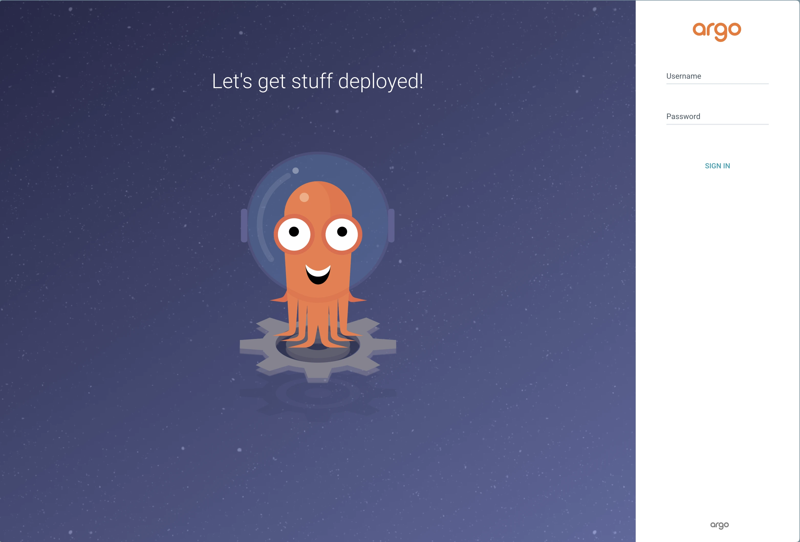
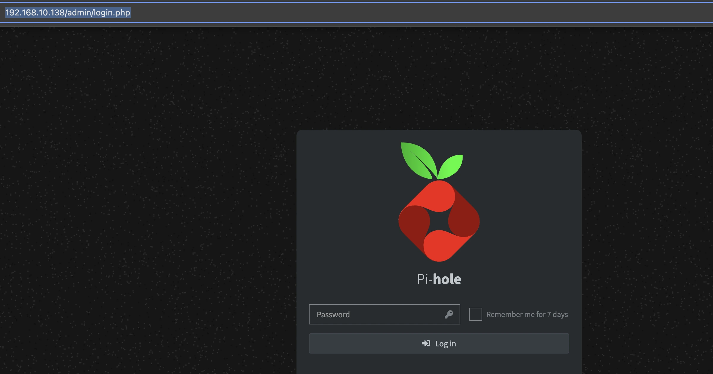

> Dans le [précédent article](https://mombe090.github.io/posts/opentofu-proxmox-talos/), nous avons vu comment installer et configurer un cluster kubernetes avec Talos Linux sur Proxmox avec OpenTofu.
{: .prompt-info }

## Prérequis :

- Un cluster kubernetes fonctionnel, (nous utiliserons `Talos` voir [l'article détaillé sur son installation ici](https://mombe090.github.io/posts/opentofu-proxmox-talos/))
- Un nom de domaine pour la génération de certificats ssl publiquement trust avec [let's encrypt](https://letsencrypt.org/docs/client-options/).
- Helm 3 installé sur votre machine. [installation ](https://helm.sh/docs/intro/install/)
- ArgoCD cli [optionnel](https://argo-cd.readthedocs.io/en/stable/cli_installation/)


## Contexte :
Que vous soyez dans votre `homelab` ou en `entreprise`, le service Domain Name Service `DNS` joue un rôle crucial. <br>

Il permet de résoudre les noms de domaine en adresses IP, ce qui est essentiel pour la communication sur Internet.
Exemple : aulieu de retenir l'IP `142.250.69.142` pour accéder à un service comme google, vous tapez juste `google.com` sur votre barre d'adresse. 
`Il est impossible de retenir toutes les adresses IP des services que vous utilisez, c'est pourquoi le DNS existe.`

Cependant, la gestion de l'enregistrement des hostnames et des adresses IP dans le `DNS` peut être complexe, surtout lorsque vous devez gérer plusieurs domaines et sous-domaines. 
Pour simplifier cette tâche, nous allons utiliser `ExternalDNS` pour automatiser la gestion des enregistrements DNS.

> La plupart des problèmes chez les grosses boites qui nous impactent sont souvent liées d'une manière à une autre à des problèmes de DNS.  Le dernier en date est chez `OpenAI`. <br />

## Objectif : 
todo

### Une petite présentation des outils utilisés :

_The package manager for Kubernetes_
  Helm est l'outil de gestion de paquets de facto pour Kubernetes. Il était là aux premières heures de kubernetes et aujourd'hui la plupart des outils tiers fournissent leurs solutions pour kubernets sous forme de helm chart.
  > Ces charts utilisent du go templating pour rendre les configurations dynamiques en passant des valeurs au moment de l'installation. <br />
  > Si vous avez eu la chance de faire des charts complexes, vous avez surement eu beaucoup de difficultés à faire vos templates à cause de go templating. 
  > Aujourd'hui il existe des solutions comme `kustomize` , `kcl`, `cue`, `timoni` etc... qui sont de plus en plus adapteés avec des langages de templating plus facile à utiliser mais helm reste encore le standard. <br />
  > [kcl](https://kcl-lang.io/) étant mon favori, il est en incubation à CNCF, jetez un coup d'œil 

- #### [ArgoCD](ArgoCD) :
  ArgoCD est un outil open-source de déploiement continue (CD) déclarative basé sur le principe de `GitOps`, il est gradué par la Cloud Native Computing Foundation [CNCF](https://www.cncf.io/) et largement adopté par les entreprises pour automatiser le déploiement de leurs applications sur des environnements Kubernetes. <br />
  Il propose une interface web très intuitive et permet facilement à un develeppeur voir l'ensemble des objets kubernetes son application et de se familiariser avec kubernetes. <br />
  C'est pas pour rien qu'il est l'outil `GitOps` qui a le plus `stars` sur github. <br />
  [FluxCD](https://fluxcd.io/) est l'autre outil `GitOps` aussi graudé par la `CNCF`, mais il est moins intuitif que ArgoCD, mais à mon humble avis plus pour les gars d'infra que de dev.
  
- ### [Metallb](https://metallb.universe.tf/)
  MetallB est une solution qui nous permet de créer des adresses IP virtuelles parmi une plage d'IPs de notre sous-reseau par exemple `192.168.10.0/26` ou range d'IPs `192.168.10.10-192.168.10.20` et de les assigner à des services de type `LoadBalancer` de kubernetes. <br />
  Il est surtout utilisé dans un environnement `onpremise` car les `cloud providers` ont leurs propres solutions pour les services kubernetes.

- ### [Cert-Manager](https://cert-manager.io/)
  Cert-Manager est une solution qui permet résoudre les casse-têtes de la gestion des certificats SSL aussi gradué lors du dernier `Kubecon NorthAmerica 2024` par la `CNCF`.
  Il permet de créer et de renouveler automatiquement les certificats SSL pour les services de type `Ingress`, le nouveau `httproute` de kubernete ... <br />

- ### [Istio](https://istio.io/) :
  Istio est l'une des solutions de `service mesh` les plus populaires dans le monde, il permet de sécuriser, de contrôler et de monitorer les communications entre les services d'une application distribuée. <br />
  Il est utilisé dans ce context juste pour son `ingress controleur` qui permet de créer des `ingress` et des `gateway api`. ***(nous verrons prochainement comment l'utiliser comme `service mesh`)***  <br />

- ### [Pi-Hole](https://pi-hole.net/) :
  Pi-Hole est un ensemble serveur dns, dhcp et peux être utilisé comme bloqueur de publicité sur les réseaux locaux, comme un `homelab`. <br />
  Il est populaire pour sa simplicité et son efficacité, je l'utilise dans ce article comme dns. <br />

- ### [External-DNS](https://github.com/kubernetes-sigs/external-dns) :
  Permet de synchroniser les enregistrements DNS avec les ressources kubernetes, comme les, `services`, `ingress` et les `httproute` avec un fournisseur dns (comme pi-hole dans notre cas). <br />
  Il enregistre les entrées `dns` automatiquement dans pihole une fois que vous définissez votre ingress ou httproute

- ### [Vault](https://www.vaultproject.io/) :
  Hachicorp vault est un outil de gestion des secrets, il est utilisé dans ce article à titre d'exemple. ***(nous verrons prochainement comment l'utiliser pour gérer les secrets sur kuernetes)***

### Ajustement du cluster :
Pour pouvoir supporter les services qui seront déployés sur le cluster, il faut ajuster ses ressources.
On avait juste provisionné le minimum réquis par `Talos`, sur le précedent article. <br />
  - Ajustement à 4 cores et 4Go de RAM et 25Go de stockage aux control-plane et worker-1. voir [04_control-plane.vm.tf](https://github.com/mombe090/blog-source-code/blob/argo-pihole-extd-certmanager/src/pve-talos-k8s/04_control-plane.vm.tf#L18) et [04_worker_01.vm.tf](https://github.com/mombe090/blog-source-code/blob/argo-pihole-extd-certmanager/src/pve-talos-k8s/05_worker_01.vm.tf#L24)         
  - Ajout d'un node [worker-02](https://github.com/mombe090/blog-source-code/blob/argo-pihole-extd-certmanager/src/pve-talos-k8s/05_worker_02.vm.tf) supplémentaire avec 4 cores, 4Go de RAM et 25Go de stockage pour mieux tenir le load.
  - Ajustement du fichier [06_talos.init.tf](https://github.com/mombe090/blog-source-code/blob/argo-pihole-extd-certmanager/src/pve-talos-k8s/06_talos.init.tf#L24-L43) pour autoriser le `NodePort` sur les nodes et pour éviter de tomber sur les érreurs de [rate limit du dockerhub](https://docs.docker.com/docker-hub/download-rate-limit/), il faut ajouter un serveur mirror pour les images hostés sur le `dockerhub`

### Install d'ArgoCD :
- Nous allons utiliser le [Helm chart](https://argoproj.github.io/argo-helm) pour installer `ArgoCD` .
    - ```bash
        # Ajout du repo au helm
        helm repo add argo https://argoproj.github.io/argo-helm 
        # install de argo dans un namespace argo-cd, créer s'il n'existe pas et change le nom du release prefixed par argo
        helm install argo-cd --namespace argo-cd  argo/argo-cd --version 7.7.16 --set fullnameOverride=argo --create-namespace
        
        # Vous dévriez avoir un output comme celui ci-dessous :
        namespace/argo-cd created
        "argo" already exists with the same configuration, skipping
        NAME: argo-cd
        LAST DEPLOYED: Sun Jan 26 13:45:15 2025
        NAMESPACE: argo-cd
        STATUS: deployed
        REVISION: 1
        TEST SUITE: None
        NOTES:
        In order to access the server UI you have the following options:
    
        1. kubectl port-forward service/argo-server -n argo-cd 8080:443
    
           and then open the browser on http://localhost:8080 and accept the certificate
    
        2. enable ingress in the values file `server.ingress.enabled` and either
           - Add the annotation for ssl passthrough: https://argo-cd.readthedocs.io/en/stable/operator-manual/ingress/#option-1-ssl-passthrough
           - Set the `configs.params."server.insecure"` in the values file and terminate SSL at your ingress: https://argo-cd.readthedocs.io/en/stable/operator-manual/ingress/#option-2-multiple-ingress-objects-and-hosts
    
    
        After reaching the UI the first time you can login with username: admin and the random password generated during the installation. You can find the password by running:
    
        kubectl -n argo-cd get secret argocd-initial-admin-secret -o jsonpath="{.data.password}" | base64 -d
    
        (You should delete the initial secret afterwards as suggested by the Getting Started Guide: https://argo-cd.readthedocs.io/en/stable/getting_started/#4-login-using-the-cli)
      ```
    - Assurez-vous que tous les pods sont en état `Running` dans le namespace `argo-cd` avant de continuer :
      - `kubectl get pods --namespace argo-cd`
- Comme les instructions ci-dessus le disent, vous pouvez accéder à l'interface web d'argo-cd en utilisant `kubectl port-forward` ou en activant l'ingress.
  On vas plutot patcher le service pour utiliser le `NodePort` pour le moment, on le changera en `ClusterIP` et utiliser le `httproute` plus tard pour rediriger dessus.
  - ```bash
    kubectl patch svc argo-server -n argo-cd -p '{"spec": {"type": "NodePort"}}'
    
    # Récupérer le port du NodePort
    kubectl get svc argo-server --namespace argo-cd
    
    NAME          TYPE       CLUSTER-IP     EXTERNAL-IP   PORT(S)                      AGE
    argo-server   NodePort   10.104.87.11   <none>        80:30221/TCP,443:31154/TCP   4h59m
    
    # Accéder à l'interface web d'argo-cd
    # http://<node-ip>:31154
    # si vous avez plusieurs nodes, vous pouvez utiliser l'ip de l'un d'eux, executer kubectl get nodes -o wide 
    
    # Si vous aviez installer argocd cli 
    argocd admin initial-password -n argo-cd
    
    #Sinon kubectl
    kubectl get secret argocd-initial-admin-secret --namespace argo-cd -o jsonpath='{.data.password}' | base64 --decode
    
    # le username est admin et password coller celui ci dessus sans % à la fin,
    ``` 
  - 

- > Note: vous pouvez retrouver toutes les valeurs possibles sur [artifacthub](https://artifacthub.io/packages/helm/argo/argo-cd)

### Création de l'application principale d'argoCD dans le projet default :
Nous allons utiliser le pattern `app-of-apps` décrit [ici](https://argo-cd.readthedocs.io/en/latest/operator-manual/cluster-bootstrapping/) pour gérer l'ensemble des sous applications de notre stack.

- A la racine de votre projet créer un fichier [main.argoapp.yaml](https://github.com/mombe090/blog-source-code/blob/argo-pihole-extd-certmanager/src/argocd/metalb-pihole-externald-certmanager/main.argoapp.yaml)
  ```yaml
    apiVersion: argoproj.io/v1alpha1
    kind: Application
    metadata:
      name: infra-app
      namespace: argo-cd
      labels:
        use-case: app-of-apps
    spec:
      destination:
        namespace: infra-apps
        server: https://kubernetes.default.svc
      project: default
      source:
        # à adapter, forker le repo si besoin
        repoURL: https://github.com/mombe090/blog-source-code.git
        # le nom de la branch sur github
        targetRevision: argo-pihole-extd-certmanager
        path: src/argocd/infra-apps
      syncPolicy:
        automated:
          prune: true
          # permet de spécifier si ArgoCD doit automatiquement re-synchroniser en cas de different entre le desire state. 
          selfHeal: true
  ```
  - > il est possible de créer l'application avec soit la cli argocd ou la Web UI, mais nous opterons le déclaratif pour rester 100% avec la phylosophie GitOps ou 99% puisque cette app principale, il faut manuellement la bootstrapper.
  - Pour créer l'application, vous remarquerez que le manifest ci-dessous ressemble beaucoup à un manifest k8s, c'est normal, car argoCD utiliser un CRD (Custom Resource Definition)  [voir la documentation](https://kubernetes.io/docs/concepts/extend-kubernetes/api-extension/custom-resources/), donc on peut utiliser kubectl.
    - ```shell
      kubectl apply -f https://raw.githubusercontent.com/mombe090/blog-source-code/refs/heads/argo-pihole-extd-certmanager/src/argocd/metalb-pihole-externald-certmanager/main.argoapp.yaml
      ```
    - Une fois que vous connectez à l'interface web d'argoCD, vous devriez voir l'application `main-argo-app`.

### Déploiement des applications de notre stack :
Etant donné que 100% des outils de notre stack sont des applications tiers, nous allons utiliser leurs helm charts pour les déployer via argoCD et `kustomize` pour mieux les organiser, mais au besoin il est possible d'utiliser des patch pour les differents stages .
 - Dans le dossier argo-apps, un fichier [kustomization.yaml](https://github.com/mombe090/blog-source-code/blob/argo-pihole-extd-certmanager/src/argocd/metalb-pihole-externald-certmanager/argo-apps/kustomization.yaml) est présent, il contient les informations sur les applications à déployer.
 - Les manifests de chaque application sont dans un dossier portant son nom  #todo
   - Chaque dossier contient un fichier `argoapp.yaml` et `kustomization.yaml` qui contient respectivement le manifest de creation de l'application argoCD avec les références vers le chart à utiliser et les différentes ressources à déployer ainsi que d'autres fichiers varier.
 - ```shell
    ├── argo-apps
    │   ├── bitnami-oci-charts.secret.yaml
    │   ├── cert-manager
    │   │   ├── argoapp.yaml
    │   │   ├── cluster-issuer.yaml
    │   │   └── kustomization.yaml
    │   ├── external-dns
    │   │   ├── argoapp.yaml
    │   │   └── kustomization.yaml
    │   ├── headlamp
    │   │   ├── argoapp.yaml
    │   │   ├── httproute.yaml
    │   │   └── kustomization.yaml
    │   ├── istio
    │   │   ├── argoapp.yaml
    │   │   ├── certificate.yaml
    │   │   ├── istio.gateway.yaml
    │   │   ├── k8s.gateway.yaml
    │   │   └── kustomization.yaml
    │   ├── kustomization.yaml
    │   ├── metallb
    │   │   ├── argoapp.yaml
    │   │   ├── ipaddresspool.metallb.yaml
    │   │   ├── kustomization.yaml
    │   │   ├── l2advertisement.metallb.yaml
    │   │   └── namespace.yaml
    │   └── pihole
    │       ├── argoapp.yaml
    │       └── kustomization.yaml
    └── main.argoapp.yaml

   ```
 - Tout les helm charts utilisés sont disponible sur [artifacthub.io](https://artifacthub.io/).


- #### MetallB 
  Dans ce article nous utiliserons ce chart : [metallb/metallb]( https://artifacthub.io/packages/helm/metallb/metallb), voir la documentation de metalLB pour plus d'informations (https://metallb.io/installation/#installation-with-helm)

    - [namespaces.yaml](https://github.com/mombe090/blog-source-code/blob/argo-pihole-extd-certmanager/src/argocd/metalb-pihole-externald-certmanager/argo-apps/metallb/namespace.yaml) : pour créer le namespace kuberentes avec les labels pour l'exempté de la securité PSA kubernetes appliqué par défaut par `Talos` car argoCD ne supporte pas encore l'ajout de labels lors de la créeation du namespace.
      - ```yaml 
           ***
           labels:
              pod-security.kubernetes.io/enforce: privileged
              pod-security.kubernetes.io/audit: privileged
              pod-security.kubernetes.io/warn: privileged
        
           ```
    - [argoapp.yaml](https://github.com/mombe090/blog-source-code/blob/argo-pihole-extd-certmanager/src/argocd/metalb-pihole-externald-certmanager/argo-apps/metallb/argoapp.yaml) :
      -  ```yaml
          apiVersion: argoproj.io/v1alpha1
          kind: Application
          metadata:
            name: metallb
            # toutes les Applications ArgoCD doivent être le namespace ou se trouve le controller, mais possible de le changer voir la doc.
            namespace: argo-cd 
          spec:
            destination:
              # namespace ou le chart sera déployé
              namespace: metallb-system
              server: https://kubernetes.default.svc
            # Le projet argoCD dans lequel se trouve l'application, le projet par defaut est "default" 
            project: default
            # information sur le chart, ref. artifacthub.io
            source:
              chart: metallb 
              repoURL: https://metallb.github.io/metallb
              targetRevision:  0.14.9
            # il arrive dès fois qu'on ai le besoin d'ignorer des différences, par exemple si on a un webhook qui change le caBundle du CRD, on peut l'ignorer avec cette option
            ignoreDifferences:
              - group: "apiextensions.k8s.io"
                kind: CustomResourceDefinition
                name: bgppeers.metallb.io
                jsonPointers:
                  - /spec/conversion/webhook/clientConfig/caBundle
              - group: "apiextensions.k8s.io"
                kind: CustomResourceDefinition
                name: addresspools.metallb.io
                jsonPointers:
                  - /spec/conversion/webhook/clientConfig/caBundle
            # comment les ressources sont synchronisées voir https://argo-cd.readthedocs.io/en/stable/user-guide/sync-options/ 
            syncPolicy:
              automated:
                prune: true
                selfHeal: true
              syncOptions:
                - ServerSideApply=true
                - RespectIgnoreDifferences=true
         ```
         
  Ajouter les references des 2 fichiers dans le fichier `kustomization.yaml` puis commit et push :

  ```yaml
      resources:
      - namespace.yaml
      - argoapp.yaml
  ``` 
  > **Optionnel** par défaut, argocd synchronize les applications toutes les 3 minutes,
  > vous pouvez changer cette valeur en modifiant le paramètre `configs.cm.timeout.reconciliation` dans les values à passer au helm chart. 
  > Exemple: --set configs.cm.timeout.reconciliation=10s # pour un cluster de teste seulement 
  > Ou utiliser la commande argocd pour forcer la synchronisation 
  
  ```shell
  #Premiere vous devez vous connecté
  argocd login 192.168.10.130:30221 --insecure  --username admin --password change-par-votre-mot-de-passe 
  # adaptez l'ip et le port à votre environnement, insecure puis que pour le moment notre certificat est auto-signé, mais une fois certmanager installé, il sera signé par let's encrypt.
  # puis forcer la synchronisation
  argocd app sync main-argo-app
  ```
    
  Si vous lister les applications, vous devriez en avoir 2 maintenants : `main-argo-app` et `metallb`  
  - ```shell
    argocd app list
    NAME                   CLUSTER                         NAMESPACE       PROJECT  STATUS  HEALTH   SYNCPOLICY  CONDITIONS  REPO                                              PATH                                                      TARGET
    argo-cd/main-argo-app  https://kubernetes.default.svc  argo-apps       default  Synced  Healthy  Auto-Prune  <none>      https://github.com/mombe090/blog-source-code.git  src/argocd/metalb-pihole-externald-certmanager/argo-apps  argo-pihole-extd-certmanager
    argo-cd/metallb        https://kubernetes.default.svc  metallb-system  default  Synced  Healthy  Auto-Prune  <none>      https://metallb.github.io/metallb                                                                           0.14.9
    ```   
  - Sur la ui de argo-cd, on peut voir que les applications sont synchronisées avec le cluster k8s.   
    - 

  Maintenant, vous pouvez ajoutez les CRDs de metallb pour définir les plages d'ip à utiliser pour les services de type LoadBalancer.
  - [ipaddresspool.metallb.yaml](https://github.com/mombe090/blog-source-code/blob/argo-pihole-extd-certmanager/src/argocd/metalb-pihole-externald-certmanager/argo-apps/metallb/ipaddresspool.metallb.yaml) :
    - Il sagit du CRD de metallb qui permet de définir les plages d'ip à utiliser pour les services de type LoadBalancer
    - ```yaml
          apiVersion: metallb.io/v1beta1
          kind: IPAddressPool
          metadata:
            name: blog-pool1
            namespace: metallb-system
          spec:
            addresses:
            - 192.168.10.135-192.168.10.140 #exemple de plage d'ip
        ```

  - [ipaddresspool.metallb.yaml](https://github.com/mombe090/blog-source-code/blob/argo-pihole-extd-certmanager/src/argocd/metalb-pihole-externald-certmanager/argo-apps/metallb/ipaddresspool.metallb.yaml) :
    - Il sagit du CRD de metallb qui permet de définir les plages d'ip à utiliser pour les services de type LoadBalancer
    - ```yaml
        apiVersion: metallb.io/v1beta1
        kind: L2Advertisement
        metadata:
          name: blog-avertisement-l2
          namespace: metallb-system
        spec:
          ipAddressPools:
          - blog-pool1
        ```
  > **Note** : ajoutez les reférences dans le fichier kustomization.yaml du dossier metallb puis commitez et push le tout sur votre repo git.
  
  Une fois la synchronisation terminée vous devriez avoir les 2 nouveaux objets dans l'application `main-argo-app` :
   
  
  Pour vérifier que metallb fonctionne correctement 
  nous allons re-patcher le service d'argo-server pour qu'il soit de type LoadBalancer :
  - ```shell
    kubectl patch service argo-server --namespace argo-cd -p '{"spec": {"type": "LoadBalancer"}}'
    service/argo-server patched
    
    #En exécutant la commande suivante
    #vous devriez voir une adresse IP externe attribuée à votre service argo-server .135 vue que c'est la première du range que nous avons défini ci-haut :
    kubectl get services --namespace argo-cd argo-server
    NAME          TYPE           CLUSTER-IP     EXTERNAL-IP      PORT(S)                      AGE
    argo-server   LoadBalancer   10.104.87.11   192.168.10.135   80:30221/TCP,443:31154/TCP   3d9h
    
    #Vous devriez maintenant être en mesure d'accéder à l'interface utilisateur d'argo-cd en utilisant l'adresse IP externe de votre service argo-server .
    #Nous allons l'utiliser jusqu'à ce qu'on ai notre gateway api en place.
    ``` 


- #### Cert-manager
  Dans ce article nous utiliserons ce chart : [cert-manager/cert-manager](https://artifacthub.io/packages/helm/cert-manager/cert-manager), [voir la documentation de metalLB pour plus d'informations](https://cert-manager.io/docs/installation/helm/)
  
```yaml
apiVersion: argoproj.io/v1alpha1
kind: Application
metadata:
  name: cert-manager
  namespace: argo-cd
spec:
  destination:
    namespace: cert-manager-system
    server: https://kubernetes.default.svc
  project: default
  source:
    chart: cert-manager
    repoURL: https://charts.jetstack.io
    targetRevision:  1.16.3
    helm:
      values: |
        crds:
          enabled: true
  syncPolicy:
    automated:
      prune: true
      selfHeal: true
    syncOptions:
      - ServerSideApply=true
      - CreateNamespace=true
```

- #### Génération du secret token pour cloudflare
  - Connectez-vous à votre compte Cloudflare .
  - Accédez à l'onglet user avec l'icône de profil en haut à droite de l'écran.
  - Cliquez sur My Profile dans le menu déroulant.
  - Sur le menu de gauche, cliquez sur API Tokens.
  - Cliquez sur Create Token.
  - Allez sur le menu `Custom token` et cliquez sur `Get Started`.
  - Donnez un nom à votre token.
  - Sur le menu `Permissions` cliquez sur `Account` et `Zone` puis sur le menu déroulant séléctionnez `Zone` puis sur le suivant  `Read`.
  - Cliquez sur le bouton `Add more` puis sélectonnez  `Zone`, `DNS` puis `Edit`.
  - Cliquez sur le bouton `Continue to summary`.
  - Cliquez sur le bouton `Create Token`.
  - Copiez le token généré et enregistrez-le dans un endroit sûr.
  -
- ### Créez un secret dans votre cluster kubernetes pour stocker le token cloudflare
  Pour créer le secret dans kubernetes avec argoCD [plusieurs options s'offrent à vous](https://argo-cd.readthedocs.io/en/stable/operator-manual/secret-management/) dont `external secrets operator` ou utiliser un `seal secret`, mais garder cet article plus simple nous allons créer le secret à la main avec kubectl.
  > Nous verrons dans un autre article comment utiliser `external secrets operator` ou `seal secret` pour gérer les secrets dans kubernetes.
  - ```shell
    kubectl create secret generic cloudflare-api-token \
    --namespace=cert-manager-system \
    --from-literal=api-token=<votre_token_cloudflare>
    ```

```yaml
apiVersion: cert-manager.io/v1
kind: ClusterIssuer
metadata:
  name: cloudflare-acme-issuer
spec:
  acme:
    email: yayamombeya090@gmail.com

    server: https://acme-v02.api.letsencrypt.org/directory
    #server: https://acme-staging-v02.api.letsencrypt.org/directory

    privateKeySecretRef:
      name: cloudflare-acme-issuer-tls-key

    solvers:
      - dns01:
          cloudflare:
            email: yayamombeya090@gmail.com
            apiTokenSecretRef:
              name: cloudflare-api-token #reference du secret kubernetes creer auparavent
              key: token
        selector:
          dnsZones:
            - 'mombesoft.com'
```

```shell
kubectl get clusterissuers.cert-manager.io
NAME                     READY   AGE
cloudflare-acme-issuer   True    8m14s
```

- #### Contour (Ingress Controller) :
  > Comme pour les autres, j'ai voulu utiliser le helm sur la documentation officielles de contour, mais le chart n'install pas le gateway-provisioner, qui est nécessaire pour utiliser le gateway api de kubernetes.

Nous allons plutot utiliser l'url fourni par le project contour pour install installer les CRDS 
Créer un dossiers `crds` fichier `kustomization.yaml`:
```yaml
namespace: contour-system

resources:
  - https://projectcontour.io/quickstart/contour.yaml
  - https://projectcontour.io/quickstart/contour-gateway-provisioner.yaml
```

Il crée un service de type loadbalancer, il faut donc que le cluster soit configuré pour que le service de type loadbalancer soit accessible depuis l'exterieur du cluster.
```shell
 kubectl get svc --namespace contour-system 
NAME            TYPE           CLUSTER-IP     EXTERNAL-IP      PORT(S)                      AGE
NAME                          TYPE           CLUSTER-IP      EXTERNAL-IP      PORT(S)         AGE
contour-contour-gateway-api   ClusterIP      10.110.167.48   <none>           8001/TCP        12m
envoy-contour-gateway-api     LoadBalancer   10.106.143.10   192.168.10.136   443:30395/TCP   12m
```

pour tester le ingress nous allons deployer un application nginx avec le ingress:
```bash
kubectl create deployment nginx --image=nginx --namespace=default
kubectl expose deployment nginx --port=80 --namespace=default
kubectl create ingress nginx-ingress --class=contour --rule="test.tuto.mombesoft.com/=nginx:80" --namespace default

#/etc/hosts
192.168.10.136 test.tuto.mombesoft.com

curl http://test.tuto.mombesoft.com

<!DOCTYPE html>
<html>
<head>
<title>Welcome to nginx!</title>
<style>
html { color-scheme: light dark; }
body { width: 35em; margin: 0 auto;
font-family: Tahoma, Verdana, Arial, sans-serif; }
</style>
</head>
<body>
<h1>Welcome to nginx!</h1>
<p>If you see this page, the nginx web server is successfully installed and
working. Further configuration is required.</p>

<p>For online documentation and support please refer to
<a href="http://nginx.org/">nginx.org</a>.<br/>
Commercial support is available at
<a href="http://nginx.com/">nginx.com</a>.</p>

<p><em>Thank you for using nginx.</em></p>
</body>
</html>
```

>Sachez qu'il existe le CRD `HTTPProxy` qui est plus simple  que l'ingress mais dédier au projet contour.

```bash
#suppression de nginx
kubectl delete deploy nginx -n default
kubectl delete svc nginx -n default
kubectl delete ingress nginx-ingress -n default
```

```bash
kubectl get ingress                          
NAME          CLASS     HOSTS                     ADDRESS   PORTS   AGE
mnginx-test   dontour   test.tuto.mombesoft.com             80      6s

#Ajouter l'entrée DNS dans votre /etc/hosts
192.168.10.136 test.tuto.mombesoft.com #IP de votre ingress controller
```

# Deploiement du certificates de cert-manager pour recupérer le certificat Let's Encrypt
Ajouter le fichier certificate.cert-manager.yaml dans le dossier contour-system


```bash
kubectl get challenges.acme.cert-manager.io --namespace contour-system
No resources found in contour-system namespace.

kubectl get orders.acme.cert-manager.io --namespace contour-system
NAME                                   STATE   AGE
blog-tutoriel-mombesoft-1-2700605529   valid   4m
```

```shell
kubectl get secrets --namespace contour-system
NAME                 TYPE                DATA   AGE
blog-tutoriels-tls   kubernetes.io/tls   2      2m31s
```

- #### Installation de pihole :
  Dans ce article nous utiliserons ce chart : [mojo2600/pihole](https://artifacthub.io/packages/helm/mojo2600/pihole), qui n'est pas officiel mais la communauté contibue activement au projet.
  Même [Jeff Geerling](https://www.youtube.com/watch?v=IafVCHkJbtI&t=2655s) en parle sur une de ces vidéos YouTube.

```yaml
apiVersion: argoproj.io/v1alpha1
kind: Application
metadata:
  name: pihole
  namespace: argo-cd
spec:
  destination:
    namespace: pihole-system
    server: https://kubernetes.default.svc
  project: default
  source:
    chart: pihole
    repoURL: https://mojo2600.github.io/pihole-kubernetes/
    targetRevision:  2.27.0
    helm:
      values: |
        #Je désactive le persistant volume claim pour le DNS, car sur ce cluster on a pas encore de persistance
        #nous utiliserons dans un autre article [longhorn](https://longhorn.io)
        persistentVolumeClaim:
          enabled: false

        #J'utilise la fonctionnalité de metallb pour par le même ip pour les service DNS et Web de pihole
        serviceWeb:
          loadBalancerIP: 192.168.10.138
          annotations:
            metallb.universe.tf/allow-shared-ip: pihole-svc
          type: LoadBalancer

        serviceDns:
          loadBalancerIP: 192.168.10.138
          annotations:
            metallb.universe.tf/allow-shared-ip: pihole-svc
          type: LoadBalancer

        #J'utilise un secret existant sur le namespace pour le mot de passe admin
        #le secret a été créé avec la commande suivante:
        #kubectl create secret generic pihole-admn-password-secret --from-literal=pihole_password='my_password' -n pihole-system
        admin:
          enabled: true
          existingSecret: pihole-admn-password-secret
          passwordKey: "pihole_password"

  syncPolicy:
    automated:
      prune: true
      selfHeal: true
    syncOptions:
      - ServerSideApply=true
      - CreateNamespace=true
```

> Attention, sur un cluster de prod , il est fortement recommandé de persister les données.
> Il faut que le secret existe d'abord dans le namespace, donc avant de lancer l'application argocd, vous pouvez créer le namespace et le secret avec kubectl:

```shell
k get svc -n pihole-system
NAME             TYPE           CLUSTER-IP      EXTERNAL-IP      PORT(S)                      AGE
pihole-dhcp      NodePort       10.108.65.231   <none>           67:30939/UDP                 2m45s
pihole-dns-tcp   LoadBalancer   10.103.40.237   192.168.10.138   53:32035/TCP                 2m45s
pihole-dns-udp   LoadBalancer   10.106.41.23    192.168.10.138   53:30318/UDP                 2m45s
pihole-web       LoadBalancer   10.101.35.44    192.168.10.138   80:30877/TCP,443:30264/TCP   2m45s
```

```shell
curl http://192.168.10.138/admin/login.php
```




> Mettez le mot de passe `123456` comme définit dans le secret ci-haut


- #### Installation d'external dns  :
Dans ce article nous utiliserons ce chart de bitnami pour external-dns. Pour plus de détail sur le chart de bitnami pour external-dns, vous pouvez consulter la documentation officielle [ici](https://github.com/bitnami/charts/tree/main/bitnami/external-dns)

```shell
apiVersion: argoproj.io/v1alpha1
kind: Application
metadata:
  name: external-dns
  namespace: argo-cd
spec:
  destination:
    namespace: external-dns
    server: https://kubernetes.default.svc
  project: default
  source:
    chart: external-dns
    path: external-dns
    repoURL: registry-1.docker.io/bitnamicharts
    targetRevision:  8.7.3
    helm:
      values: |
        fullnameOverride: external-dns
        logLevel: debug
        provider: pihole
        pihole:
          server: http://pihole-web.pihole-system.svc.cluster.local
          secretName: external-dns
        registry: noop
        policy: opsert-only
  syncPolicy:
    automated:
      prune: true
      selfHeal: true
    syncOptions:
      - ServerSideApply=true
      - CreateNamespace=true
```

> **Note** : ce chart utilise une chart oci (oci://registry-1.docker.io/bitnamicharts/bitnami), donc il est nécéssaire d'avoir un secret avec l'annotation `argocd : argocd.argoproj.io/secret-type` pour qu'argo puisse télécharger


```shell
apiVersion: v1
kind: Secret
metadata:
  labels:
    argocd.argoproj.io/secret-type: repository
  name: docker-io-helm-oci
  namespace: argo-cd
stringData:
  url: registry-1.docker.io/bitnamicharts
  name: bitnamicharts
  type: helm
  enableOCI: "true"
```


```yaml
kubectl apply -f - <<EOF
apiVersion: gateway.networking.k8s.io/v1
kind: HTTPRoute
metadata:
  name: http-filter-redirect
  namespace: contour-system
spec:
  parentRefs:
    - name: contour-gateway-api
      sectionName: http
  hostnames: ["podinfo.tuto.mombesoft.com"]
  rules:
    - filters:
        - type: RequestRedirect
          requestRedirect:
            scheme: https
            statusCode: 301
EOF
```


### Amusez-vous bien avec votre cluster k8s !

## Références :
- [https://www.proxmox.com/en/](https://www.proxmox.com/en/)
- [https://search.opentofu.org/provider/siderolabs/talos/latest](https://search.opentofu.org/provider/siderolabs/talos/latest)
- [https://www.talos.dev](https://www.talos.dev)
- [https://search.opentofu.org/provider/bpg/proxmox/latest](https://search.opentofu.org/provider/bpg/proxmox/latest)

##### L'ensemble du code source utilisé dans ce blog se trouve sur [github](https://github.com/mombe090/blog-source-code/tree/main/src/pve-talos-k8s)
