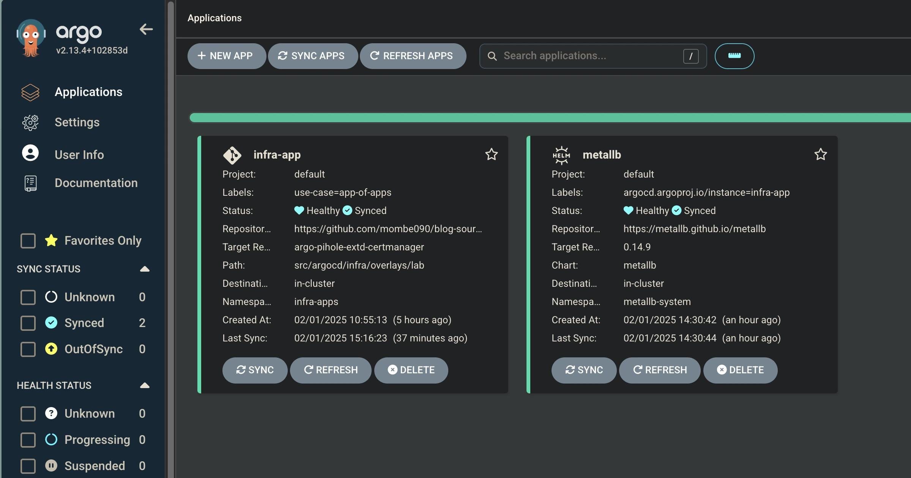

> Dans le [précédent article](https://mombe090.github.io/posts/opentofu-proxmox-talos/), nous avons vu comment installer et configurer un cluster kubernetes avec Talos Linux sur Proxmox avec OpenTofu.
> Ce qui suit a été testé sur Proxmox avec un cluster kubernetes basé sur Talos Linux, mais devrait fonctionner de la même manière dans d'autres environnements.
{: .prompt-info }

## Prérequis :

- Un cluster kubernetes fonctionnel, (nous utiliserons `Talos` voir [l'article détaillé sur son installation ici](https://mombe090.github.io/posts/opentofu-proxmox-talos/))
- Un nom de domaine pour la génération de certificats ssl publiquement `trust` avec [let's encrypt](https://letsencrypt.org/docs/client-options/) (***Note: Vous n'avez pas besoin d'un IP publique***).
- Un compte [Cloudflare](https://www.cloudflare.com/fr-fr/).
- [Kubectl](https://kubernetes.io/docs/tasks/tools/).
- [Helm 3  ](https://helm.sh/docs/intro/install/).
- [ArgoCD cli, optionnel](https://argo-cd.readthedocs.io/en/stable/cli_installation/).
- [Kustomize cli, optionnel](https://kustomize.io/).


## Contexte :
Que vous soyez dans votre `home lab` ou en `entreprise`, le Système de nom de domaine [DNS](https://fr.wikipedia.org/wiki/Domain_Name_System) joue un rôle crucial voir indispensable pour la gestion des services et applications. 

Il permet de résoudre les noms de domaine en adresses IP, ce qui est essentiel pour la communication sur Internet ou dans un réseau local.

> **Exemple** : aulieu de retenir l'IP `142.250.69.142` pour accéder à un service comme google, vous tapez juste `google.com` sur votre barre d'adresse. 
`Il est impossible de retenir toutes les adresses IP des services que vous utilisez, c'est pourquoi le DNS existe.`

Cependant, la gestion de l'enregistrement des nom d'hôtes et d'adresses IP dans le `DNS` peut être complexe, surtout lorsque vous devez gérer plusieurs domaines et sous-domaines. 
C'est pourquoi nous allons voir comment automatiser cette tâche ou la simplifier avec des outilis comme [ExternalDNS](https://github.com/kubernetes-sigs/external-dns) dans le context de kubernetes.

> La plupart des problèmes chez les grosses boites qui nous impactent sont souvent liées d'une manière à une autre à des problèmes de DNS.  Le dernier en date est chez [OpenAI](https://techcrunch.com/2024/12/13/openai-blames-its-massive-chatgpt-outage-on-a-new-telemetry-service/). <br />


## Présentation des outils utilisés :

_Le Gestionnaire de Paquets Kubernetes_

  [Helm](https://helm.sh/) est l'outil de gestion de paquets de facto pour Kubernetes. Il était présent dès les premières heures de kubernetes, et aujourd'hui, la plupart des outils tiers fournissent leurs solutions pour kubernetes sous forme de helm charts.
  > Ces charts utilisent du templating Go ainsi que la librairie [sprig](https://masterminds.github.io/sprig/) pour rendre les configurations dynamiques en passant des valeurs au moment de l'installation. <br />
  > Si vous avez eu l'occasion de faire des charts complexes, vous avez surement rencontré des difficultés avec le templating Go. 
  > Aujourd'hui, il existe des solutions comme `kustomize` , `kcl`, `cue`, `timoni` etc... qui sont de plus en plus adapteés avec des langages de templating plus faciles à utiliser, mais helm reste encore le standard. <br />
  > [kcl](https://kcl-lang.io/) qui est mon favori, est en incubation à CNCF, jetez-y un coup d'œil !


_Outils de configuration très populaire sur kuberenetes_

 [Kustomize](https://kustomize.io/) est un outil de gestion de configuration pour kubernetes. Il permet de gérer les configurations de manière déclarative, et de les appliquer de manière incrémentale. Il est très populaire, et est utilisé par de nombreuses entreprises. 


_L'outils GitOps le plus populaire pour Kubernetes_

  [ArgoCD](https://argo-cd.readthedocs.io/en/stable/) est un outil open-source de déploiement continu (CD) déclaratif basé sur le principe de `GitOps`, il est gradué par la Cloud Native Computing Foundation [CNCF](https://www.cncf.io/) et largement adopté par les entreprises pour automatiser le déploiement de leurs solutions sur des environnements Kubernetes. <br />
  Il propose une interface web très intuitive et permet à un develeppeur de voir facilement l'ensemble des objets son application et de se familiariser avec kubernetes. <br />

  
  _ C'est pas pour rien qu'il est l'outil `GitOps` qui a le plus `d'étoiles` sur github. _
  
 > [FluxCD](https://fluxcd.io/) est l'autre outil `GitOps` aussi graudé par la `CNCF`, mais il est moins intuitif qu'ArgoCD, mais à mon humble avis, il est plus puissant et beaucoup plus aimé par les gars d'infra que de dev.
 > Nous allons sûrement traduire cet article avec du FluxCD. 
  

_MetallB projet actuellement en phase de sandbox à la `CNCF`_

  [MetallB](https://metallb.universe.tf) est un loadbalancer pour clusteur `kubernetes` qui tourne sur des serveurs bare metal.
  Il permet de réserver des plages d'IP sur un réseau x pour les services de type `LoadBalancer`, `Ingress`, `Gateway` ... de kubernetes. 
  
  >Exemple : le sous-réseau `192.168.10.0/26` ou range d'IPs `192.168.10.135-192.168.10.140`.
  >Il est surtout utilisé dans des environnements `onpremise` car les `cloud providers` ont généralement leurs propres solutions pour les services kubernetes.


_Cert-Manager le gestionnaire de certificats TLS/SSL par excélence pour `kubernetes`_

  [Cert-Manager](https://cert-manager.io/)  est une solution qui permet résoudre les casse-têtes de gestion des certificats TLS/SSL, il a été gradué lors du dernier [Kubecon NorthAmerica 2024](https://cert-manager.io/announcements/2024/11/12/cert-manager-graduation/) par la `CNCF`.
  Il permet de créer et de renouveler automatiquement les certificats TLS/SSL pour les services de type `Ingress`, le nouveau [Gateway API](https://gateway-api.sigs.k8s.io/) de kubernete <br />


_Contour est un Ingress Controller pour kubernetes actuellement en incubation à la CNCF_

[Contour](https://projectcontour.io/) est un `ingress controller` basé sur le puissant proxy [Envoy](https://www.envoyproxy.io/),
il permet de gérer les requêtes entrantes dans votre cluster kubernetes et de les router vers les services en interne. <br />
Actuellement il supporte les 3 types configurations suivantes :
- [Ingress](https://kubernetes.io/docs/concepts/services-networking/ingress/) l'api la plus connue pour la gestion des routes dans kubernetes, il est actuellement gélée et ne recevra plus de nouvelles fonctionnalités  mais reste la plupart du temps le seul fournis dans les helms charts des vendors.
- [Gateway API](https://gateway-api.sigs.k8s.io/) qui est le nouveau standard, nous utiliserons cette api dans les prochains étapes.
- [HTTPProxy](https://projectcontour.io/docs/main/config/http-proxy/) Un custom CRD (Custom Resource Object) qui permet d'étandre les fonctionnaliés du kubernetes ingress tout en simplifiant la configuration.


_Le bloqueur de publicité et serveur DNS aimé par les homelab-(eurs/euses)._


[Pi-Hole](https://pi-hole.net/) est un ensemble serveur dns, dhcp et peux être utilisé comme bloqueur de publicité sur les réseaux locaux, comme dans un `homelab`. <br />
Il est populaire pour sa simplicité et son efficacité, nous l'utiliserons dans ce article comme DNS. <br />


_external-dns pour kubernetes_

[External-DNS](https://github.com/kubernetes-sigs/external-dns) permet d'ajouter automatiquements les enregistrements DNS des ressources kubernetes comme les `services (NodePort/LoabBalancer)`, `ingress`, `httproute` ... avec un serveur DNS externe (comme pi-hole dans notre cas). <br />

### Ré-ajustement de la configuration et des ressoruces du cluster kubernetes de l'article précedent :
Pour pouvoir supporter les nouveaux services qui seront déployés sur le cluster, nous allons ajouter quelques ressources.

Dans cet [article](https://mombe090.github.io/posts/opentofu-proxmox-talos/), on avions provisionné le juste minimum réquis par `Talos` pour faire quelques testes . <br />
Voici les nouvelles valeurs de `cpu` et `ram` pour les `workers` et le `control-plane` :
  - Ajustement aux control-plane et worker-1. voir [04_control-plane.vm.tf](https://github.com/mombe090/blog-source-code/blob/argo-pihole-extd-certmanager/src/opentofu/pve-talos-k8s/04_control-plane.vm.tf) et [04_worker_01.vm.tf](https://github.com/mombe090/blog-source-code/blob/argo-pihole-extd-certmanager/src/opentofu/pve-talos-k8s/05_worker_01.vm.tf)   :
    - 4 cores cpu
    - 4 Go de RAM
    - 25 Go de stockage        
  - Ajout d'un nouveau node [worker-02](https://github.com/mombe090/blog-source-code/blob/argo-pihole-extd-certmanager/src/opentofu/pve-talos-k8s/05_worker_02.vm.tf) supplémentaire avec les mêmes caractéristiques ci-dessus.
  - Ajustement du fichier [06_talos.init.tf](https://github.com/mombe090/blog-source-code/blob/argo-pihole-extd-certmanager/src/opentofu/pve-talos-k8s/06_talos.init.tf#L24-L42) :
    - pour autoriser l'accès à des services de type `NodePort` sur les [nodes du cluster ](https://github.com/mombe090/blog-source-code/blob/argo-pihole-extd-certmanager/src/opentofu/pve-talos-k8s/06_talos.init.tf#L35-L39)
    - Utilisation du serveur `mirror.gcr.io` pour les images du `docker.io` afin d'éviter de tomber sur les érreurs de [rate limit du dockerhub](https://docs.docker.com/docker-hub/download-rate-limit/).
> **Note** : tous les changements sont sur ce dépot sur la branch [argo-pihole-extd-certmanager](https://github.com/mombe090/blog-source-code/tree/argo-pihole-extd-certmanager)


### Installatiton d'ArgoCD :
Il existe plusieurs manières d'installer ArgoCD dans un cluster kubernetes, nous allons utiliser ce [Helm chart](https://argoproj.github.io/argo-helm) en mode standalone. 
>voir les autres méthodes d'installation [ici](https://argo-cd.readthedocs.io/en/stable/operator-manual/installation/).

- Ajout du repo helm d'argoCD et mise à jour des repos :
  ```shell
    helm repo add argo https://argoproj.github.io/argo-helm 
    helm repo update
   ```
- Création et installation d'Argo dans un namespace nommé argo-cd
- La version la plus récente, au moment de l’écriture de cet article, est la 7.7.22. Cependant, il est recommandé de toujours vérifier la dernière version disponible sur l'[Artifact Hub](https://artifacthub.io/packages/helm/argo/argo-cd) qui est le plus grand dépôt d'artefact opensource et cloud natives.
  ```shell
    helm install argo-cd --namespace argo-cd  argo/argo-cd --version 7.7.22 --set fullnameOverride=argo --create-namespace
    ```
  > Note: vous pouvez retrouver toutes les valeurs possibles à passer au chart pour le customiser sur [artifacthub](https://artifacthub.io/packages/helm/argo/argo-cd)
- Vous devriez avoir un output similaire à celui-ci :
  ```bash
    namespace/argo-cd created
    "argo" already exists with the same configuration, skipping
    NAME: argo-cd
    *
    *
    *
    (You should delete the initial secret afterwards as suggested by the Getting Started Guide: https://argo-cd.readthedocs.io/en/stable/getting_started/#4-login-using-the-cli)
    ```
- Assurez-vous que tous les pods sont en état `Running` dans le namespace `argo-cd` avant de continuer :
  - ```shell
      kubectl -n argo-cd get pods
    
      NAME                                             READY   STATUS    RESTARTS   AGE
      argo-application-controller-0                    1/1     Running   0          94s
      argo-applicationset-controller-947bb4b55-p9wwx   1/1     Running   0          95s
      argo-dex-server-795988f9b-k6qkb                  1/1     Running   0          95s
      argo-notifications-controller-5bfdd44f6-8x8kz    1/1     Running   0          95s
      argo-redis-cfd765899-h9bsh                       1/1     Running   0          95s
      argo-repo-server-7849579d44-lz5t6                1/1     Running   0          95s
      argo-server-787d566c79-9jtgg                     1/1     Running   0          95s
  ```
- Vous pouvez accéder à l'interface web d'argo-cd en utilisant `kubectl port-forward -n svc/argo-server 8080:443` et en accédant à l'URL `https://localhost:8080` dans votre navigateur.`

  On va plutôt `patcher` le service pour utiliser le `NodePort` pour le moment, on le changera en `ClusterIP` et après passer au `httproute` plus tard pour rediriger un traffic ssl dessus.
  ```bash
    kubectl patch svc argo-server -n argo-cd -p '{"spec": {"type": "NodePort"}}'
  ```
    
- Récupérer le port du NodePort associé 443 :
  ```shell 
  
     kubectl get svc argo-server --namespace argo-cd
  
    
     NAME          TYPE       CLUSTER-IP     EXTERNAL-IP   PORT(S)                      AGE
     argo-server   NodePort   10.104.87.11   <none>        80:30221/TCP,443:31154/TCP   4h59m
  ``` 
    
- Accéder à l'interface web d'argo-cd [http://192.168.10.130:31154](http://192.168.10.135:31154) (***changer par votre ip et port***)
  si vous avez plusieurs nodes, vous pouvez utiliser l'ip de l'un d'eux
  > exécuter `kubectl get nodes -o wide ` pour avoir la liste des nodes avec leur ip
  - 
  - Le **username** est `admin` et le **password** est récupérable avec :
    - Si vous aviez installer [argocd cli](https://argo-cd.readthedocs.io/en/stable/cli_installation/) : 
      `argocd admin initial-password -n argo-cd`

    - Sinon utiliser kubectl :
      ```shell
        kubectl get secret argocd-initial-admin-secret --namespace argo-cd -o jsonpath='{.data.password}' | base64 --decode
      ```
    ```shell
      # Vous pouvez vous connecter au serveur via la command argocd 
      # Çà vous permettra de faire des opérations sur le serveur sans passer forcement par la UI.
    
       argocd login 192.168.10.130:31628 --insecure --username admin --password  remplacer-par-password-par-defaut-obtnue-avec-la-commande-precedente
    
       'admin:login' logged in successfully
       Context '192.168.10.130:31628' updated
    ```


### Création des applications argo-cd de notres stack :

Pour déployer des applications sur `argo-cd`, il y a plusieurs patterns et best practises à prendre en compte [lire cet article de codefresh](https://codefresh.io/blog/how-to-structure-your-argo-cd-repositories-using-application-sets/), 

Argo-cd supporte différentes manières de définir vos manifest kubernetes :
  - Helm
  - Kustomize
  - un dossier avec des fichiers yaml/json/jsonnet
  - en utilisant le `custom config management tool`plugin.

La plupart des outils de notre stack peuvent être considéré comme des applications d'infras, généralement créer par les admins du cluster, il est une bonne pratique de séparer les manifests des apps d'infra de celles des applications métiers.

Nous allons utiliser le pattern `app-of-apps` décrit [ici](https://argo-cd.readthedocs.io/en/latest/operator-manual/cluster-bootstrapping/) pour gérer l'ensemble des sous applications de notre stack ([voir les application-sets pour votre productions qui est de plus en plus récomandé pour de grosses workloads sur plusieurs clusters](https://argo-cd.readthedocs.io/en/latest/user-guide/application-set/))

### Structure des dossiers :

```shell
├── argocd
│   ├── apps
│   │   ├── base
│   │   │   └── nginx
│   │   │       ├── argoapp.yaml
│   │   │       ├── httproute.yaml
│   │   │       └── kustomization.yaml
│   │   └── overlays
│   │       └── lab
│   │           └── kustomization.yaml
│   ├── buisness-apps.yaml
│   ├── infra
│   │   ├── base
│   │   │   ├── cert-manager
│   │   │   │   ├── cluster-issuer.yaml
│   │   │   │   └── kustomization.yaml
│   │   │   ├── common
│   │   │   │   ├── argocd.httproute.yaml
│   │   │   │   ├── docker-io-helm-oci.secret.yaml
│   │   │   │   ├── kustomization.yaml
│   │   │   │   └── pi-hole.httproute.yaml
│   │   │   ├── contour
│   │   │   │   ├── certificates.cert-manager.yaml
│   │   │   │   ├── gateway.yaml
│   │   │   │   ├── gatewayclass.yaml
│   │   │   │   └── kustomization.yaml
│   │   │   └── metallb
│   │   │       ├── ipaddresspool.yaml
│   │   │       ├── kustomization.yaml
│   │   │       └── l2advertisement.yaml
│   │   ├── components
│   │   │   ├── cert-manager
│   │   │   │   ├── argoapp.yaml
│   │   │   │   └── kustomization.yaml
│   │   │   ├── contour
│   │   │   │   ├── argoapp.yaml
│   │   │   │   ├── gateway-provider-crds
│   │   │   │   │   ├── contour-gateway-provisioner.yaml
│   │   │   │   │   └── kustomization.yaml
│   │   │   │   └── kustomization.yaml
│   │   │   ├── external-dns
│   │   │   │   ├── argoapp.yaml
│   │   │   │   └── kustomization.yaml
│   │   │   ├── metallb
│   │   │   │   ├── argoapp.yaml
│   │   │   │   ├── kustomization.yaml
│   │   │   │   └── namespace.yaml
│   │   │   └── pi-hole
│   │   │       ├── argoapp.yaml
│   │   │       └── kustomization.yaml
│   │   └── overlays
│   │       └── lab
│   │           └── kustomization.yaml
│   └── infra-apps.yaml
├── kubernetes
│   └── plain-yaml
│       └── nginx
│           ├── configmap.yaml
│           ├── deployment.yaml
│           ├── namespace.yaml
│           └── service.yaml
└── opentofu
    └── pve-talos-k8s
        ├── 01_main.tf
        ├── 02_variables.tf
        ├── 03_talos-image.tf
        ├── 04_control-plane.vm.tf
        ├── 05_worker_01.vm.tf
        ├── 05_worker_02.vm.tf
        ├── 06_talos.init.tf
        ├── 07_worker.init.tf
        ├── output.tf
        ├── script.sh
```

[src/argocd/infra-apps.yaml](https://raw.githubusercontent.com/mombe090/blog-source-code/refs/heads/argo-pihole-extd-certmanager/src/argocd/infra-apps.yaml) est l'application ArgoCD qui va déployer les autres applications infra ArgoCD.
  ```yaml
    apiVersion: argoproj.io/v1alpha1
    kind: Application
    metadata:
      name: infra-app
      namespace: argo-cd
      labels:
        use-case: app-of-apps
    spec:
      project: default
      
      source:
        # à adapter, forker le repo si besoin
        repoURL: https://github.com/mombe090/blog-source-code.git
        # le nom de la branch sur github
        targetRevision: argo-pihole-extd-certmanager
        path: src/argocd/infra/overlays/lab 
      
      destination:
        namespace: infra-apps
        server: https://kubernetes.default.svc
  
      syncPolicy:
        automated:
          # permet de spécifier si ArgoCD doit automatiquement re-synchroniser en cas de different entre le desire state. 
          selfHeal: true
  ```

[src/argocd/infra/overlays/lab/kustomization.yaml](https://raw.githubusercontent.com/mombe090/blog-source-code/refs/heads/argo-pihole-extd-certmanager/src/argocd/infra/overlays/lab/kustomization.yaml), qui permet de spécifier les ressources et les composants à déployer. [Documentation kustomize](https://kustomize.io/)
```yaml
  resources: []
```
  Pour le moment, il n'y a aucune resource à déployer, mais on va en ajouter une par une.
 
- > il est possible de créer l'application avec soit la cli argocd ou la Web UI, mais nous opterons pour le déclaratif pour rester 100% avec la phylosophie GitOps ou 99% puisque cette app principale, il faut manuellement la bootstrapper et après elle créera les autres apps.
- > vous remarquerez que le manifest ci-dessus ressemble beaucoup à un manifest k8s, c'est normal, car argoCD utiliser un CRD (Custom Resource Definition)  [voir la documentation](https://kubernetes.io/docs/concepts/extend-kubernetes/api-extension/custom-resources/), donc on peut utiliser kubectl.

```shell
  kubectl apply -f src/argocd/infra-apps.yaml
```

> Une fois que vous connectez à l'interface web d'argoCD, vous devriez voir l'application `infra-app`.

### Déploiement des applications de notre stack :
Etant donné que 100% des outils de notre stack sont des applications tiers, nous allons utiliser leurs helm charts pour les déployer via argoCD et `kustomize` pour mieux les organiser.
 - Dans le dossier `src/argocd/infra/overlays/lab`, un fichier `kustomization.yaml` est présent, il contient les informations sur les resources à déployer pour l'environnement de `lab`.
 - Au même niveau que `overlays`, il y `base` et `components` qui contiennent respectivement less objets kubernetes issus des CRD et les composants de notre stack (metallb, cert-manager, etc...)
 - Les manifests de chaque application sont dans un dossier portant son nom.


>Tous les charts utilisés sont disponibles sur l'[artifacthub](https://artifacthub.io/). <br />
>Par défaut le nouveau standard de sécurity kubernetes  **Pod Security Admission** [PSA](https://kubernetes.io/docs/concepts/security/pod-security-admission/) est activé sur [Talos](https://www.talos.dev/v1.9/kubernetes-guides/configuration/pod-security/) à baseline enforce, ce qui empêche des conteneurs, d'avoir certains privilèges, il est nécessaire de définir les niveaux de sécurité pour chaque application.
>Il y a quelques namespaces sur lesquels on doit faire exception pour le PSA, car leurs pods ont besoin de ces privilèges pour fonctionner, comme metallb, kube-system, etc. 


- #### Déploiement de MetallB : 
  Chart utilisé : [metallb/metallb]( https://artifacthub.io/packages/helm/metallb/metallb), voir [la documentation de metalLB pour plus d'informations](https://metallb.io/installation/#installation-with-helm)

    - [src/infra/components/metallb/namespace.yaml](https://raw.githubusercontent.com/mombe090/blog-source-code/refs/heads/argo-pihole-extd-certmanager/src/argocd/infra/components/metallb/namespace.yaml) : 
    - ```yaml 
        apiVersion: v1
        kind: Namespace
        metadata:
          name: metallb-system
          # Exceptions pour le PSA
          labels:
            pod-security.kubernetes.io/enforce: privileged
            pod-security.kubernetes.io/audit: privileged
            pod-security.kubernetes.io/warn: privileged
        
      ```
    - [src/infra/components/metallb/argoapp.yaml](https://raw.githubusercontent.com/mombe090/blog-source-code/refs/heads/argo-pihole-extd-certmanager/src/argocd/infra/components/metallb/argoapp.yaml) :
      -  ```yaml
          apiVersion: argoproj.io/v1alpha1
          kind: Application
          metadata:
            name: metallb
            # toutes les Applications ArgoCD doivent être le namespace ou se trouve le controller, mais possible de le changer voir la doc.
            namespace: argo-cd 
          spec:
            
            # Le projet argoCD dans lequel se trouve l'application, le projet par defaut est "default" 
            project: default
            # information sur le chart, ref. artifacthub.io
            source:
              chart: metallb 
              repoURL: https://metallb.github.io/metallb
              targetRevision:  0.14.9
         
            destination:
              # namespace dans lequel, le chart sera déployé
              namespace: metallb-system
              #le cluster kubernetes surl argoCD appliquera le déploiement
              server: https://kubernetes.default.svc
         
            # il arrive dès fois qu'on est le besoin d'ignorer des différences, par exemple si on a un webhook qui change le caBundle du CRD, on peut l'ignorer avec cette option
            ignoreDifferences:
              - group: "apiextensions.k8s.io"
                kind: CustomResourceDefinition
                name: bgppeers.metallb.io
                jsonPointers:
                  - /spec/conversion/webhook/clientConfig/caBundle
              - group: "apiextensions.k8s.io"
                kind: CustomResourceDefinition
                name: addresspools.metallb.io
                jsonPointers:
                  - /spec/conversion/webhook/clientConfig/caBundle
         
            # comment les ressources sont synchronisées voir https://argo-cd.readthedocs.io/en/stable/user-guide/sync-options/ 
            syncPolicy:
              automated:
                prune: true # Supprime les ressources qui ne sont plus dans le repo
                selfHeal: true # Si une ressource est modifiée manuellement, elle sera réappliquée
              syncOptions:
                - ServerSideApply=true 
                - RespectIgnoreDifferences=true
                - CreateNamespace=true
         ```

      [src/argocd/infra/components/metallb/kustimization.yaml](https://raw.githubusercontent.com/mombe090/blog-source-code/refs/heads/argo-pihole-extd-certmanager/src/argocd/infra/components/metallb/kustomization.yaml) :

      ```yaml
        apiVersion: kustomize.config.k8s.io/v1alpha1
        kind: Component

        resources:
        - namespace.yaml
        - argoapp.yaml
      ```

      [src/argocd/infra/overlays/lab/kustimization.yaml](https://raw.githubusercontent.com/mombe090/blog-source-code/refs/heads/argo-pihole-extd-certmanager/src/argocd/infra/overlays/lab/kustomization.yaml) :

      ```yaml
        resources: []
        # Décommenter cette ligne pour installer metallb une fois MetalLB est installé avec tous les CRDS
        # - ../../base/metallb 

        components:
        - ../../components/metallb
      ```
    **Commit et push vos changements dans le dépôt git**

- Synchronisation des applications :
Par défaut, argocd synchronize les applications toutes les 3 minutes, vous pouvez changer cette valeur en modifiant le paramètre `configs.cm.timeout.reconciliation` dans les values à passer au helm chart .
- Exemple: `--set configs.cm.timeout.reconciliation=10s`
- Ou utiliser la commande argocd pour forcer la synchronisation

    ```shell
    #Premierement, vous devez vous connecté
    argocd login ip:node-port --insecure  --username admin --password change-par-votre-mot-de-passe 
  
    # adaptez l'ip et le port à votre environnement, insecure puis que pour le moment notre certificat est auto-signé, mais une fois certmanager installé, il sera signé par let's encrypt.
    # puis forcer la synchronisation
    argocd app sync infra-app
    ```
    
    Si vous listez les applications, vous devriez en avoir 2 maintenants : `infra-app` et `metallb`  
    - ```shell
      argocd app list
      
      NAME                   CLUSTER                         NAMESPACE       PROJECT  STATUS  HEALTH   SYNCPOLICY  CONDITIONS  REPO                                              PATH                                                      TARGET
      argo-cd/infra-app      https://kubernetes.default.svc  argo-apps       default  Synced  Healthy  Auto-Prune  <none>      https://github.com/mombe090/blog-source-code.git  src/argocd/metalb-pihole-externald-certmanager/argo-apps  argo-pihole-extd-certmanager
      argo-cd/metallb        https://kubernetes.default.svc  metallb-system  default  Synced  Healthy  Auto-Prune  <none>      https://metallb.github.io/metallb                                                                           0.14.9
      ```   
    - Sur le dashboard d'ArgoCd, on peut voir que les applications sont synchronisées avec le cluster k8s.   
      - 

    Maintenant, vous pouvez ajoutez les CRDs de metallb pour définir les plages d'ip à utiliser pour les services de type LoadBalancer.
    - [src/argocd/infra/base/metallb/ipaddresspool.yaml](https://raw.githubusercontent.com/mombe090/blog-source-code/refs/heads/argo-pihole-extd-certmanager/src/argocd/infra/base/metallb/ipaddresspool.yaml) :
      Qui permet de définir les plages d'IP à utiliser pour les services de type LoadBalancer
      - ```yaml
            apiVersion: metallb.io/v1beta1
            kind: IPAddressPool
            metadata:
              name: blog-pool1
              namespace: metallb-system
            spec:
              addresses:
              - 192.168.10.135-192.168.10.140 #exemple de plage d'ip
          ```

    - [src/argocd/infra/base/metallb/l2advertisement.yaml](https://raw.githubusercontent.com/mombe090/blog-source-code/refs/heads/argo-pihole-extd-certmanager/src/argocd/infra/base/metallb/l2advertisement.yaml) :
      Qui permet d'annoncer les IP du pool au réseau et éventuellement faire des restrictions sur des nodes, des interfaces réseaux etc...
      - ```yaml
          apiVersion: metallb.io/v1beta1
          kind: L2Advertisement
          metadata:
            name: blog-avertisement-l2
            namespace: metallb-system
          spec:
            ipAddressPools:
            - blog-pool1
          ```
    - [src/argocd/infra/base/metallb/kustomization.yaml](https://raw.githubusercontent.com/mombe090/blog-source-code/refs/heads/argo-pihole-extd-certmanager/src/argocd/infra/base/metallb/kustomization.yaml) :
      - ```yaml

          resources:
          - ipaddresspool.yaml
          - l2advertisement.yaml
        
        ```
   **Commit et push vos changements dans le dépôt git**
        
    - Une fois la synchronisation terminée, vous devriez avoir les 2 nouveaux objets dans l'application `infra-app` :
     
  
    - Pour vérifier que metallb fonctionne correctement, nous allons re-patcher le service d'argo-server pour qu'il soit de type LoadBalancer :
    ```shell
      kubectl patch service argo-server --namespace argo-cd -p '{"spec": {"type": "LoadBalancer"}}'
    ```
    En exécutant la commande suivante, vous devriez voir une adresse IP externe attribuée à votre service argo-server .135 vue que c'est la première du range que nous avons défini ci-haut :
    - ```shell
      kubectl get services --namespace argo-cd argo-server
      
      NAME          TYPE           CLUSTER-IP      EXTERNAL-IP      PORT(S)                      AGE
      argo-server   LoadBalancer   10.106.72.117   192.168.10.135   80:30512/TCP,443:31934/TCP   25h
      ```
   Vous devriez maintenant être en mesure d'accéder à l'interface utilisateur d'argo-cd en utilisant l'adresse IP externe de votre service argo-server .
   > Nous allons l'utiliser jusqu'à ce qu'on ai notre gateway api en place.
   > [https://192.168.10.135](https://192.168.10.135)
      


- #### Déploiement de Cert-manager
  **Chart utilisé** : [cert-manager/cert-manager](https://artifacthub.io/packages/helm/cert-manager/cert-manager), vous pouvez [voir la documentation de metalLB pour plus d'informations](https://cert-manager.io/docs/installation/helm/)

  - [src/infra/components/cert-manager/argoapp.yaml](https://raw.githubusercontent.com/mombe090/blog-source-code/refs/heads/argo-pihole-extd-certmanager/src/argocd/infra/components/cert-manager/argoapp.yaml)  
    ```yaml
    apiVersion: argoproj.io/v1alpha1
    kind: Application
    metadata:
      name: cert-manager
      namespace: argo-cd
    spec:
      project: default
    
      source:
        chart: cert-manager
        repoURL: https://charts.jetstack.io
        targetRevision:  1.16.3
        helm:
          valuesObject: 
            crds:
              enabled: true
    
      destination:
        namespace: cert-manager-system
        server: https://kubernetes.default.svc
    
      syncPolicy:
        automated:
          prune: true
          selfHeal: true
        syncOptions:
          - ServerSideApply=true
          - CreateNamespace=true
    ```
    
  - [src/infra/components/cert-manager/kustomization.yaml](https://raw.githubusercontent.com/mombe090/blog-source-code/refs/heads/argo-pihole-extd-certmanager/src/argocd/infra/components/cert-manager/kustomization.yaml) :
    ```yaml
    apiVersion: kustomize.config.k8s.io/v1alpha1
    kind: Component

    resources:
    - argoapp.yaml
    ``` 
    
  - Ajouter cette ligne au fichier [src/argocd/infra/overlays/lab/kustomization.yaml](https://raw.githubusercontent.com/mombe090/blog-source-code/refs/heads/argo-pihole-extd-certmanager/src/argocd/infra/overlays/lab/kustomization.yaml) dans la section `components` :
    ```yaml
    
    components:
    - ../../components/metallb
    - ../../components/cert-manager
    ```
  **Commit et push vos changements dans le dépôt git** 
  - Après la synchronisation :
    - ```shell
      argocd app list
      
      NAME                  CLUSTER                         NAMESPACE            PROJECT  STATUS  HEALTH   SYNCPOLICY  CONDITIONS  REPO                                              PATH                           TARGET
      argo-cd/cert-manager  https://kubernetes.default.svc  cert-manager-system  default  Synced  Healthy  Auto-Prune  <none>      https://charts.jetstack.io                                                       1.16.3
      argo-cd/infra-app     https://kubernetes.default.svc  infra-apps           default  Synced  Healthy  Auto-Prune  <none>      https://github.com/mombe090/blog-source-code.git  src/argocd/infra/overlays/lab  argo-pihole-extd-certmanager
      argo-cd/metallb       https://kubernetes.default.svc  metallb-system       default  Synced  Healthy  Auto-Prune  <none>      https://metallb.github.io/metallb                                                0.14.9
      ```

  - #### Création d'un [ClusterIssuer](https://cert-manager.io/docs/configuration/acme/#dns-names) pour cloudflare
    **Cert-manager** prend en charge plusieurs type d'**Issuer** pour génération de certifats. 
    Dans cet article, il est configuré avec le type **ACME**, utilise **Cloudflare** comme **DNS provider** et let's encrypt comme Certificat Authority **CA**.
  
  - #### Génération du secret token sur [Cloudflare](https://dash.cloudflare.com/) :
    - Connectez-vous à votre compte.
    - Accédez à l'onglet user avec l'icône de profil en haut à droite de l'écran.
    - Cliquez sur **My Profile** dans le menu déroulant.
    - Sur le menu de gauche, cliquez sur **API Tokens**.
    - Cliquez sur **Create Token**.
    - Allez sur le menu **Custom token** et cliquez sur **Get Started**.
    - Donnez un nom à votre token.
    - Sur le menu **Permissions** cliquez sur **Account** et **Zone** puis sur le menu déroulant séléctionnez **Zone** puis sur le suivant  **Read**.
    - Cliquez sur le bouton **Add more** puis sélectonnez  **Zone**, **DNS** puis **Edit**.
    - Cliquez sur le bouton **Continue to summary**.
    - Cliquez sur le bouton **Create Token**.
    - Copiez le token généré et enregistrez-le dans un endroit sûr.

  - ### Création du secret kubernetes pour stocker le secret token généré sur cloudflare :
  Pour créer le secret dans kubernetes avec argoCD, [plusieurs options s'offrent à vous](https://argo-cd.readthedocs.io/en/stable/operator-manual/secret-management/) dont `external secrets operator` ou utiliser un `seal secret`, mais pour garder cet article moins complexe, nous allons créer le secret à la main avec kubectl.
  > Nous verrons dans un autre article comment utiliser `external secrets operator` ou `seal secret` pour gérer les secrets dans kubernetes.
  - ```shell
    kubectl create secret generic cloudflare-api-token \
    --namespace=cert-manager-system \
    --from-literal=api-token=<votre_token_cloudflare>
    ```
  Une fois le secret crée, nous pouvons créer le cluster-issuer  :
  - [src/argocd/infra/base/cert-manager/cluster-issuer.yaml](https://raw.githubusercontent.com/mombe090/blog-source-code/refs/heads/argo-pihole-extd-certmanager/src/argocd/infra/base/cert-manager/cluster-issuer.yaml) :
      ```yaml
      apiVersion: cert-manager.io/v1
      kind: ClusterIssuer
      metadata:
        name: cloudflare-acme-issuer
      spec:
        acme:
          email: remplacez@par.votre.email
    
          server: https://acme-v02.api.letsencrypt.org/directory
          # utiliser le serveur de staging de letsencrypt pour tester
          # car après 5 requêtes, le serveur de production bloque les requêtes pour 24h ou plus
          #server: https://acme-staging-v02.api.letsencrypt.org/directory 
    
          privateKeySecretRef:
            # Secret kubernetes qui contient la clé privée de l'issuer
            name: cloudflare-acme-issuer-tls-key
    
          # Nous utilisons le DNS-01 challenge avec cloudflare comme provideur
          solvers:
            - dns01:
                cloudflare:
                  email: #votre email
                  apiTokenSecretRef:
                    name: cloudflare-api-token #reference du secret kubernetes creer auparavent
                    key: token
              selector:
                dnsZones:
                  - 'domain.domain' #votre domaine    
      ```
  - [src/argocd/infra/base/cert-manager/kustomization.yaml](https://raw.githubusercontent.com/mombe090/blog-source-code/refs/heads/argo-pihole-extd-certmanager/src/argocd/infra/base/cert-manager/kustomization.yaml) :
    ```yaml
    
    resources:
    - cluster-issuer.yaml
    ```
    
  - [src/argocd/infra/overlays/lab/kustomization.yaml](https://raw.githubusercontent.com/mombe090/blog-source-code/refs/heads/argo-pihole-extd-certmanager/src/argocd/infra/overlays/lab/kustomization.yaml) :
      ```yaml
    
      resources:
      - ../../base/metallb
      - ../../base/cert-manager

      components:
      - ../../components/metallb
      - ../../components/cert-manager
      ```
    **Commit et push vos changements dans le dépôt git**
  
    - Après la synchronisation, vous pouvez voir le cluster-issuer  :
      ```shell
      
      kubectl get clusterissuers.cert-manager.io
      
      NAME                     READY   AGE
      cloudflare-acme-issuer   True    104s
      ```

- #### Déploiment de Contour :
  **Chart utilisé** : [bitnami/contour](https://artifacthub.io/packages/helm/bitnami/contour) voir la [documentation officielle option 2](https://projectcontour.io/getting-started/). <br />
 
  Ce chart n'install pas le **gateway-provisioner** qui est nécessaire pour utiliser le *Gateway API* de kubernetes que nous souhaitons pour le routage mais install bien l'**ingress controler** <br />
  >   **Note:** <br />
  >    Surement sera ajouter dans une prochaine version du chart. <br />

    Donc, on va aller avec les manifests kubernetes fournis par contour **Option 3: Contour Gateway Provisioner** sur la documentation.
    Je vais télécharger le fichier [contour-gateway-provisioner.yaml](https://github.com/projectcontour/contour/blob/main/examples/render/contour-gateway-provisioner.yaml) et le mettre dans ce dossier ` src/argocd/infra/components/contour/gateway-provider-crds` et créer un fichier `kustomization.yaml`:
    - [src/argocd/infra/components/contour/gateway-provider-crds/contour-gateway-provisioner.yaml](https://raw.githubusercontent.com/mombe090/blog-source-code/refs/heads/argo-pihole-extd-certmanager/src/argocd/infra/components/contour/gateway-provider-crds/contour-gateway-provisioner.yaml)
    - [src/argocd/infra/components/contour/gateway-provider-crds/kustomization.yaml](https://raw.githubusercontent.com/mombe090/blog-source-code/refs/heads/argo-pihole-extd-certmanager/src/argocd/infra/components/contour/gateway-provider-crds/kustomization.yaml).
  
    Nous allons utiliser le multi-sourcing d'argocd pour référencer le helmchart qui créer va l'ingress controller et ses CRDs et le manifest du gateway provider, on vas le customizer pour enlever les crds déjà ajouter et maintenu par le chart ci-haut.
    - [src/argocd/infra/components/contour/argoapp.yaml](https://raw.githubusercontent.com/mombe090/blog-source-code/refs/heads/argo-pihole-extd-certmanager/src/argocd/infra/components/contour/argoapp.yaml) :
  
    ```yaml
  
      apiVersion: argoproj.io/v1alpha1
      kind: Application
      metadata:
        name: contour
        namespace: argo-cd
        labels:
          use-case: ingress-controller
      spec:
        project: default
    
        sources:
          - repoURL: registry-1.docker.io/bitnamicharts
            chart: contour
            targetRevision: 19.5.4
            path: contour
    
          - repoURL: https://github.com/mombe090/blog-source-code.git
            targetRevision: argo-pihole-extd-certmanager
            path: src/argocd/infra/components/contour/gateway-provider-crds
    
        destination:
          namespace: contour-system
          server: https://kubernetes.default.svc
    
        syncPolicy:
          automated:
            prune: true
            selfHeal: true
          syncOptions:
            - CreateNamespace=true
    ```
  
    - > **Note** : Le fichier [src/infra/base/common/docker-io-helm-oci.secret.yaml](https://raw.githubusercontent.com/mombe090/blog-source-code/refs/heads/argo-pihole-extd-certmanager/src/argocd/infra/base/common/docker-io-helm-oci.secret.yaml) créer un secret avec les informations de connexion à l'OCI Docker Registry, car bitnami utilise un oci chart pour contour.
      > Aussi on aurai pu utiliser juste le gateway mais, comme dit ci-haut son adoption est toujours encours et l'ingress reste encore majoritaire.
  
    - [src/argocd/infra/components/contour/kustomization.yaml](https://raw.githubusercontent.com/mombe090/blog-source-code/refs/heads/argo-pihole-extd-certmanager/src/argocd/infra/components/contour/kustomization.yaml) :
      ```yaml
    
      apiVersion: kustomize.config.k8s.io/v1alpha1
      kind: Component

      resources:
      - argoapp.yaml

      ```

  - [src/argocd/infra/overlays/lab/kustomization.yaml](https://raw.githubusercontent.com/mombe090/blog-source-code/refs/heads/argo-pihole-extd-certmanager/src/argocd/infra/overlays/lab/kustomization.yaml) :
    ```yaml
  
      resources:
      - ../../base/metallb
      - ../../base/cert-manager

      components:
      - ../../components/metallb
      - ../../components/cert-manager
    ```
    
    **Commit et push vos changements dans le dépôt git**
    - Après la synchronisation :
  
    Il crée un service de type loadbalancer, et automatique **Metallb** va attribuer une adresse IP à ce service.
    ```shell
     kubectl get svc --namespace contour-system 
  
     NAME            TYPE           CLUSTER-IP     EXTERNAL-IP      PORT(S)                      AGE
     contour         ClusterIP      10.98.134.77   <none>           8001/TCP                     26m
     contour-envoy   LoadBalancer   10.103.16.48   192.168.10.136   80:30365/TCP,443:31731/TCP   26m
    
     # Il créer aussi un ingressclass contour
     kubectl get ingressclasses.networking.k8s.io
    
     NAME      CONTROLLER                                         PARAMETERS   AGE
     contour   projectcontour.io/contour-system/contour-contour   <none>       3m31s
    ```

   - Pour tester l'ingress nous allons deployer une application nginx :
    ```bash
  
      kubectl create deployment nginx --image=nginx --namespace=default
      kubectl expose deployment nginx --port=80 --namespace=default
      kubectl create ingress nginx-ingress --class=contour --rule="remplacer-par-votre-domaine.com/=nginx:80" --namespace default
    ```
    - Editer votre `/etc/hosts` sur mac ou linux et windows sur `C:\Windows\System32\drivers\etc\hosts` pour ajouter l'entrée suivante
      `192.168.10.136 remplacer-par-votre-domaine.com`

    - Exécuter la commande curl curl [http://remplacer-par-votre-domaine.com](http://remplacer-par-votre-domaine.com) ou sur votre navigateur web .
    

    - >Sachez que contoure a son propre crd [HTTPProxy](https://projectcontour.io/docs/1.30/config/fundamentals/) qui est plus simple que l'Ingress mais seulement dédier au projet contour.
    - Supprimez les ressources non utils pour la suite et aussi l'entrée dns dans votres hosts file:
    ```bash
    #suppression de nginx
      kubectl delete deploy nginx -n default
      kubectl delete svc nginx -n default
      kubectl delete ingress nginx-ingress -n default
    ```

- ### Deployment du `certificates.cert-manager.io` pour l'obtention du certificat tls :
Maintenant qu'on a installé cert-manager, un ingress controller et le gateway provider, nous allons générer un certificat TLS pour notre domaine.

> **Note** : L'objet certificates.cert-manager.io est celui qui va créer le secret kubernetes qui contiendra le certificat TLS après que les challenges soit reussi au niveau du CA, donc il faut que ce dernier soit dans le même namespace que l'ingress ou le gateway api.

  - [src/argocd/infra/base/contour/certifactes.cert-manager.yaml](https://raw.githubusercontent.com/mombe090/blog-source-code/refs/heads/argo-pihole-extd-certmanager/src/argocd/infra/base/contour/certificates.cert-manager.yaml) : 
    Ci-dessous, nous faisons le challenge pour génerer un certifcat pour tous les sous domaine de notre sous-domain-x, on peux aussi choisir un certificat par domaine,
    mais dans un home-lab, je trouve ça plus simple.
  
    ```yaml
      apiVersion: cert-manager.io/v1
      kind: Certificate
      metadata:
        name: blog-tutoriel-mombesoft
        namespace: contour-system
      spec:
        secretName: blog-tutoriels-tls
        issuerRef:
          name: cloudflare-acme-issuer
          kind: ClusterIssuer
        commonName: "*.tuto.domain.com"
        dnsNames:
          - "tuto.domain.com"
          - "*.tuto.domain.com"
    ```
  - [src/argocd/infra/base/contour/kustomization.yaml](https://raw.githubusercontent.com/mombe090/blog-source-code/refs/heads/argo-pihole-extd-certmanager/src/argocd/infra/base/contour/kustomization.yaml) :
    ```yaml
    
    resources:
    - certificates.cert-manager.yaml
    ```
    
  - [src/argocd/infra/overlays/lab/kustomization.yaml](https://raw.githubusercontent.com/mombe090/blog-source-code/refs/heads/argo-pihole-extd-certmanager/src/argocd/infra/overlays/lab/kustomization.yaml) :
    ```yaml
    
    resources:
    - ../../base/common
    - ../../base/metallb
    - ../../base/cert-manager
    - ../../base/contour

    components:
    - ../../components/metallb
    - ../../components/cert-manager
    - ../../components/contour
    ```

    **Commit et push vos changements dans le dépôt git**
    - Après la synchronisation vous devez voir les challenges de certificats :
      - Sur le dashboard d'argocd :
      
      - Avec la commande kubectl :
      
      ```bash
      
        kubectl get challenges.acme.cert-manager.io -n contour-system
      
        NAMESPACE        NAME                                              STATE     DOMAIN         AGE
        contour-system   blog-tutoriel-domaine-1-2700605529-1937736000     valid   domain-domaine   107s
        contour-system   blog-tutoriel-domaine-1-2700605529-3704828440             domain-domaine   107s
      
        # on peut voir les orders 
        kubectl get orders.acme.cert-manager.io -n contour-system
        NAME                                   STATE   AGE
        blog-tutoriel-mombesoft-1-2700605529   valid   3m
      ```
    - > Le challenge peut durer quelques minutes. Vous pouvez vérifier l'état du challenge faisant la description du challenge et l'ordre généré par cert-manager :
    - > `kubectl describe challenges.acme.cert-manager.io nom-du-challenge  --namespace contour-system`
    - > `kubectl describe ordes.acme.cert-manager.io nom-de-lordre --namespace contour-system`
      
    Si le challenge est validé, vous devriez avoir votre nouveau secret kubernetes contenent votre certificat.
    - > `kubectl get secrets --namespace contour-system`
    
- ### Déploiement de Pihole :
  Chart utilisé : [mojo2600/pihole](https://artifacthub.io/packages/helm/mojo2600/pihole), il n'y pas pas un chart officiel mais, la communauté contribue activement à ce chart.
  > Même [Jeff Geerling](https://www.youtube.com/watch?v=IafVCHkJbtI&t=2655s) en parle sur une de ces vidéos YouTube.
  - [src/infra/argocd/infra/components/pi-hole/argoapp.yaml](https://raw.githubusercontent.com/mombe090/blog-source-code/refs/heads/argo-pihole-extd-certmanager/src/argocd/infra/components/pi-hole/argoapp.yaml) :
  ```yaml
  
    apiVersion: argoproj.io/v1alpha1
    kind: Application
    metadata:
      name: pi-hole
      namespace: argo-cd
    spec:
      destination:
        namespace: pihole-system
        server: https://kubernetes.default.svc
      project: default
      source:
        chart: pihole
        repoURL: https://mojo2600.github.io/pihole-kubernetes/
        targetRevision:  2.27.0
        helm:
          valuesObject: 
            #Je désactive le persistant volume claim pour le DNS, car sur ce cluster on a pas encore de persistance
            #nous verons commment monter un volume persistant avec [longhorn](https://longhorn.io)
            persistentVolumeClaim:
              enabled: false
    
            #J'utilise la fonctionnalité de metallb pour par le même ip pour les service DNS et Web de pihole
            serviceWeb:
              loadBalancerIP: 192.168.10.138
              annotations:
                metallb.universe.tf/allow-shared-ip: pihole-svc
              type: LoadBalancer
    
            serviceDns:
              loadBalancerIP: 192.168.10.138
              annotations:
                metallb.universe.tf/allow-shared-ip: pihole-svc
              type: LoadBalancer
    
            #J'utilise un secret existant sur le namespace pour le mot de passe admin
            #le secret a été créé avec la commande suivante:
            #kubectl create secret generic pihole-admin-password-secret --from-literal=pihole_password='my_password' -n pihole-system
            admin:
              enabled: true
              existingSecret: pihole-admn-password-secret
              passwordKey: "pihole_password"
    
      syncPolicy:
        automated:
          prune: true
          selfHeal: true
        syncOptions:
          - ServerSideApply=true
          - CreateNamespace=true
  ```
  - > Attention, sur un cluster de prod, il est fortement recommandé d'avoir un système de persistance de données.

  - [src/infra/argocd/infra/components/pi-hole/argoapp.yaml](https://raw.githubusercontent.com/mombe090/blog-source-code/refs/heads/argo-pihole-extd-certmanager/src/argocd/infra/components/pi-hole/kustomization.yaml) :
    ```yaml
  
      apiVersion: kustomize.config.k8s.io/v1alpha1
      kind: Component

      resources:
      - argoapp.yaml
    ```
  - [src/argocd/infra/overlays/lab/kustomization.yaml](https://raw.githubusercontent.com/mombe090/blog-source-code/refs/heads/argo-pihole-extd-certmanager/src/argocd/infra/overlays/lab/kustomization.yaml) :
  ```yaml
  
    resources:
    - ../../base/common
    - ../../base/metallb
    - ../../base/cert-manager
    - ../../base/contour

    components:
    - ../../components/metallb
    - ../../components/cert-manager
    - ../../components/contour
    - ../../components/pi-hole
  ```
  
  Nous utilisons un secret kubernetes existant pour le mot de passe admin de pihole, il faut donc le créer, le namespace n'existe pas encore, on le créer en premier.
  - ```shell
    kubectl create namespace pihole-system
    kubectl create secret generic pihole-admin-password-secret --from-literal=pihole_password=123456 -n pihole-system
    ```

  **Commit et push vos changements dans le dépôt git**
  - Après la synchronisation vous devriez voir les services kubernetes de pihole ainsi que son pod :

  ```shell
  
  kubectl get svc -n pihole-system
  
  NAME             TYPE           CLUSTER-IP      EXTERNAL-IP      PORT(S)                      AGE
  pihole-dhcp      NodePort       10.108.65.231   <none>           67:30939/UDP                 2m45s
  pihole-dns-tcp   LoadBalancer   10.103.40.237   192.168.10.138   53:32035/TCP                 2m45s
  pihole-dns-udp   LoadBalancer   10.106.41.23    192.168.10.138   53:30318/UDP                 2m45s
  pihole-web       LoadBalancer   10.101.35.44    192.168.10.138   80:30877/TCP,443:30264/TCP   2m45s
  
  kubectl get pods -n pihole-system
  
  NAME                              READY   STATUS    RESTARTS   AGE
  pi-hole-pihole-79dbf7cdbf-8lm7p   1/1     Running   0          10m
  ```
  
  - Accéder au dashboard de pihole via l'ip de votre que vous avez définit :
  


  - > Mettez le mot de passe `123456` comme définit dans le secret ci-haut
   
    

- ### Déploiement d'External-Dns  :
  Chart utilisé : [external-dns](https://artifacthub.io/packages/helm/bitnami/external-dns), vous pouvez consulter la documentation officielle [ici](https://github.com/bitnami/charts/tree/main/bitnami/external-dns)

  Créer un secret avec le mot de passe admin de pihole pour permettre à **external-dns** d'ajouter les entrées : <br />
  Le namespace n'existe pas encore, il faut le créer

  ```shell
  
    kubectl create namespace external-dns
    kubectl create secret generic pihole-admin-password-secret --from-literal pihole_password=123456 --namespace external-dns 
  ```
  
  - [src/argocd/components/external-dns/argoapp.yaml](https://raw.githubusercontent.com/mombe090/blog-source-code/refs/heads/argo-pihole-extd-certmanager/src/argocd/infra/components/external-dns/argoapp.yaml) :
  ```yaml
  
      apiVersion: argoproj.io/v1alpha1
      kind: Application
      metadata:
        name: external-dns
        namespace: argo-cd
      spec:
        destination:
          namespace: external-dns
          server: https://kubernetes.default.svc
      
        project: default
      
        source:
          chart: external-dns
          path: external-dns
          repoURL: registry-1.docker.io/bitnamicharts
          targetRevision:  8.7.3
          helm:
            valuesObject:
              fullnameOverride: external-dns
              logLevel: debug
              provider: pihole
              pihole:
                server: http://pi-hole-pihole-web.pihole-system.svc.cluster.local
                secretName: pihole-admin-password-secret
              registry: noop
              policy: upsert-only
              
              # les httproutes sont pas pris en charge par défaut, il faut passer la en extraArgs
              extraArgs:
                source:
                  - gateway-httproute
      
        syncPolicy:
          automated:
            prune: true
            selfHeal: true
          syncOptions:
            - ServerSideApply=true
            - CreateNamespace=true
  ```
  
  - [src/argocd/components/external-dns/kustomization.yaml](https://raw.githubusercontent.com/mombe090/blog-source-code/refs/heads/argo-pihole-extd-certmanager/src/argocd/infra/components/external-dns/kustomization.yaml) :
  ```yaml
  
    apiVersion: kustomize.config.k8s.io/v1alpha1
    kind: Component

    resources:
    - argoapp.yaml
  ```

  - [src/argocd/infra/overlays/lab/kustomization.yaml](https://raw.githubusercontent.com/mombe090/blog-source-code/refs/heads/argo-pihole-extd-certmanager/src/argocd/infra/overlays/lab/kustomization.yaml) :
  ```yaml
  
    resources:
    - ../../base/common
    - ../../base/metallb
    - ../../base/cert-manager
    - ../../base/contour

    components:
    - ../../components/metallb
    - ../../components/cert-manager
    - ../../components/contour
    - ../../components/pi-hole
    - ../../components/external-dns
  ```

  **Commit et push vos changements dans le dépôt git**
  
- ### Création du Gateway pour exposer les services :
Il faut dans un premier temps qu'on crée un gateway class pour contour, suivez les étapes ci-dessous :

- Appliquez les CRDs du gateway API (voir [https://gateway-api.sigs.k8s.io/](Kubernetes Gateway Api)) :
  - ici je vais choisir [la chaine expérimentale](https://gateway-api.sigs.k8s.io/guides/#install-experimental-channel) qui inclut des fonctionnalité: TCPRoute, TLSRoute, UDPRoute and GRPCRoute.
  ```yaml
    kubectl apply -f https://github.com/kubernetes-sigs/gateway-api/releases/download/v1.2.0/experimental-install.yaml
   ```

- [src/argocd/infra/base/contour/gatewayclass.yaml](https://raw.githubusercontent.com/mombe090/blog-source-code/refs/heads/argo-pihole-extd-certmanager/src/argocd/infra/base/contour/gatewayclass.yaml) :
  ```yaml
  
  kind: GatewayClass
  apiVersion: gateway.networking.k8s.io/v1
  metadata:
    name: contour
    namespace: contour-system
  spec:
    controllerName: projectcontour.io/gateway-controller
  ```

- [src/argocd/infra/base/contour/gateway.yaml](https://raw.githubusercontent.com/mombe090/blog-source-code/refs/heads/argo-pihole-extd-certmanager/src/argocd/infra/base/contour/gateway.yaml) :
  ```yaml
  
  apiVersion: gateway.networking.k8s.io/v1
  kind: Gateway
  metadata:
    name: contour-gateway-api
    namespace: contour-system
  spec:
    gatewayClassName: contour
    listeners:
      - name: http
        hostname: "*.sous-domaine-x.sous-domaine.com"
        protocol: HTTP
        port: 80
      - name: https
        hostname: "*.sous-domaine-x.sous-domaine.com"
        port: 443
        protocol: HTTPS
        tls:
          mode: Terminate
          certificateRefs:
            - name: blog-tutoriels-tls
        allowedRoutes:
          namespaces:
            from: All
  ```

- [src/argocd/infra/base/contour/kustomization.yaml](https://github.com/mombe090/blog-source-code/blob/argo-pihole-extd-certmanager/src/argocd/infra/base/contour/kustomization.yaml) :
  ```yaml
  
    resources:
    - certificates.cert-manager.yaml
    - gatewayclass.yaml
    - gateway.yaml
  ```

  **Commit et push vos changements dans le dépôt git**

- Une fois la synchronisation terminée :
 - Assurez que le gateway class, vient avec l'attribue `ACCEPTED` à True :
  ```shell

    kubectl get gatewayclasses.gateway.networking.k8s.io
  
    NAME      CONTROLLER                             ACCEPTED   AGE
    contour   projectcontour.io/gateway-controller   True       7m23s
  ```
 - Ensuite, le gateway dans le namespace contour-system à aussi son attribut `PROGRAMMED` à  True, sinon faites la description sur les resources pour voir les erreurs et les corrigés.
  ```shell
    kubectl get gateways.gateway.networking.k8s.io --namespace contour-system
  
    NAME                  CLASS     ADDRESS          PROGRAMMED   AGE
    contour-gateway-api   contour   192.168.10.137   True         9m8s
  ```

# Accès aux dashboards d'argo et pi-hole via le gateway :
Maintenant qu'on a le gateway prêt : 

- nous allons re-patch le service d'argo-server à `ClusterIP`, plus besoin du **NodePort** ou **port-forward** :
  - ```bash
    kubectl patch svc argo-server -n argo-cd -p '{"spec": {"type": "ClusterIP"}}'
    #vous allez plus pouvoir accéder à argocd via l'IP ou le nodePort
    ```
- Ajout de l'IP du serveur DNS **Pi-hole** à la configuration réseau de votre ordinateur pour le mettre comme l'un des DNS principale :

  

- ### ArgoCD Dashboard : 
  Par défaut, argocd-server est déployée avec un certificat auto-signé et expose son interface utilisateur (UI) sur le port 443. <br />
  - Désormais, la Gateway sera le point d'entrée principal du cluster, et il est sécurisée, nous allons patcher la config map **argocd-cmd-params-cm** pour mettre la **server.secure=false** pour éviter une redirection infinie entre le gateway le service argo-server.
    - ```shell
       kubectl -n argo-cd patch cm argocd-cmd-params-cm --type='json' -p='[{"op": "replace", "path": "/data/server.insecure", "value": "true"}]'
     
       #Pour redeployer argocd-server avec le nouveau paramètre.
       kubectl rollout restart deployment -n argo-cd argo-server
      ```

  - [src/argocd/infra/base/common/argocd.httproute.yaml](https://raw.githubusercontent.com/mombe090/blog-source-code/refs/heads/argo-pihole-extd-certmanager/src/argocd/infra/base/common/argocd.httproute.yaml) :
       ```yaml
       apiVersion: gateway.networking.k8s.io/v1
       kind: HTTPRoute
       metadata:
         name: argo-ui
         namespace: argo-cd
       spec:
         parentRefs:
           - name: contour-gateway-api
             namespace: contour-system
         hostnames: ["argocd.tuto.domaine.com"]
         rules:
           - matches:
               - path:
                   type: PathPrefix
                   value: /
             backendRefs:
               - name: argo-server
                 port: 443
       ```

  - [src/argocd/infra/base/common/kustomization.yaml](https://raw.githubusercontent.com/mombe090/blog-source-code/refs/heads/argo-pihole-extd-certmanager/src/argocd/infra/base/common/kustomization.yaml) :
    ```yaml
    
       resources:
       - docker-io-helm-oci.secret.yaml
       - argocd.httproute.yaml
    ```

  **Commit et push vos changements dans le dépôt git**

  > Aussi la synchronisation terminée, vous devriez voir ceci dans les logs d'external-dns qui confirme que l'ajout automatique de l'entrée dns de votre host est bien fait:
  > kubectl logs -n external-dns deployments/external-dns

  > time="2025-02-02T09:27:50Z" level=debug msg="Endpoints generated from HTTPRoute argo-cd/argo-ui: [argocd.tuto.domain.com 0 IN A  192.168.10.137 []]"
  > time="2025-02-02T09:27:50Z" level=info msg="add argocd.tuto.domaine.com IN A -> 192.168.10.137"

  Sur dashboard de pihole `local DNS -> DNS Records` :

  
     
    
      
  - Maintenant si vous accédez à la [https://argocd.tuto.domain.com](https://argocd.tuto.domain.com) vous allez être redirigé sur une page https sécurisé :
    
  - On peut voir que let certificat est bien généré par lets encrypte et que la page est bien servie en **https**
    
      
      
### Pi-hole Dashboard :
Ajout l'objet **httproute** avec la configuration ci-dessous :

  - [src/argocd/infra/common/pihole.httproute.yaml](https://raw.githubusercontent.com/mombe090/blog-source-code/refs/heads/argo-pihole-extd-certmanager/src/argocd/infra/base/common/pi-hole.httproute.yaml) : 
    ```yaml
    apiVersion: gateway.networking.k8s.io/v1
    kind: HTTPRoute
    metadata:
      name: pihole-ui
      namespace: pihole-system
    spec:
      parentRefs:
        - name: contour-gateway-api
          namespace: contour-system
      hostnames: ["pihole.tuto.domaine.com"]
      rules:
        - matches:
            - path:
                type: PathPrefix
                value: /
          backendRefs:
            - name: pi-hole-pihole-web
              port: 80
    ```

  **Commit et push vos changements dans le dépôt git**

  - [src/argocd/infra/base/common/kustomization.yaml](https://raw.githubusercontent.com/mombe090/blog-source-code/refs/heads/argo-pihole-extd-certmanager/src/argocd/infra/base/common/kustomization.yaml) :
    ```yaml
    
       resources:
       - docker-io-helm-oci.secret.yaml
       - argocd.httproute.yaml
       - pi-hole.httproute.yaml
    ```
   


# Déploiement d'une application métier :
Les outils de base pour l'infrastructure sur Kubernetes sont prêts. Maintenant, passons au déploiement d'un exemple d'application métier. <br />
Pour cela, nous allons déployer une application nginx avec une page html custom. 

- [src/argocd/apps/base/nginx/kustomization.yaml](https://raw.githubusercontent.com/mombe090/blog-source-code/refs/heads/argo-pihole-extd-certmanager/src/argocd/apps/base/nginx/argoapp.yaml) :

  ```yaml
  
  apiVersion: argoproj.io/v1alpha1
  kind: Application
  metadata:
    name: nginx
    namespace: argo-cd
    labels:
      use-case: buisness-app
  
  spec:
    project: default
  
    source:
      repoURL: https://github.com/mombe090/blog-source-code.git
      targetRevision: argo-pihole-extd-certmanager
      path: src/kubernetes/plain-yaml/nginx
  
    destination:
      namespace: nginx
      server: https://kubernetes.default.svc
  
    syncPolicy:
      automated:
        prune: true
        selfHeal: true
      syncOptions:
        - ServerSideApply=true
        - CreateNamespace=true
  ```

- [src/argocd/apps/base/nginx/httproute.yaml](https://raw.githubusercontent.com/mombe090/blog-source-code/refs/heads/argo-pihole-extd-certmanager/src/argocd/apps/base/nginx/httproute.yaml) :
  ```yaml
  apiVersion: gateway.networking.k8s.io/v1
  kind: HTTPRoute
  metadata:
    name: nginx-ui
    namespace: nginx
  spec:
    parentRefs:
      - name: contour-gateway-api
        namespace: contour-system
    hostnames: ["myapp.tuto.domain.com"]
    rules:
      - matches:
          - path:
              type: PathPrefix
              value: /
        backendRefs:
          - name: nginx
            port: 80
  
  ```

- [src/argocd/apps/base/nginx/kustomization.yaml](https://raw.githubusercontent.com/mombe090/blog-source-code/refs/heads/argo-pihole-extd-certmanager/src/argocd/apps/base/nginx/kustomization.yaml) :
  ```yaml
  
  resources:
  - argoapp.yaml
  - httproute.yaml
  
  ```

- [src/argocd/apps/overlays/lab/kustomization.yaml](https://raw.githubusercontent.com/mombe090/blog-source-code/refs/heads/argo-pihole-extd-certmanager/src/argocd/apps/overlays/lab/kustomization.yaml) :
  ```yaml
  
  resources:
  - ../../base/nginx
  ```

- [src/argocd/buisness-app.app-of-apps.yaml](https://raw.githubusercontent.com/mombe090/blog-source-code/refs/heads/argo-pihole-extd-certmanager/src/argocd/buisness-apps.yaml) :
  ```yaml
  apiVersion: argoproj.io/v1alpha1
  kind: Application
  metadata:
    name: buisness-app
    namespace: argo-cd
    labels:
      use-case: app-of-apps
  spec:
    project: default
  
    source:
      repoURL: https://github.com/mombe090/blog-source-code.git
      targetRevision: argo-pihole-extd-certmanager
      path: src/argocd/apps/overlays/lab
  
    destination:
      namespace: buisness-apps
      server: https://kubernetes.default.svc
  
    syncPolicy:
      automated:
        prune: true
        selfHeal: true
  ```
  
 > Vous pouvez les objets kubernetes de l'application sur le même [dépôt github](https://github.com/mombe090/blog-source-code/tree/argo-pihole-extd-certmanager/src/kubernetes/plain-yaml/nginx)

Maintenant qu'on a une app-of-apps, il faut la boostraper manuellement :
```shell
kubectl apply -f src/argocd/buisness-apps.yaml
```

- Sur le dashboard d'argocd :
  - voici la nouvelle app qui gère les applications buisness : 
    
  - L'application métier s'appelle nginx et voici tous ces objets bien déployé et sync :
    

### Acceder à l'application nginx sur le [https://myapp.tuto.votre-domaine.com](https://myapp.tuto.votre-domaine.com) :


# Réferences :
- [https://argo-cd.readthedocs.io/en/stable/](https://argo-cd.readthedocs.io/en/stable/)
- [https://helm.sh/docs/](https://helm.sh/docs/)
- [https://kustomize.io/](https://kustomize.io/)
- [https://metallb.io/installation/](https://metallb.io/installation/)
- [https://cert-manager.io/docs/configuration/acme/dns01/cloudflare/](https://cert-manager.io/docs/configuration/acme/dns01/cloudflare/)
- [https://projectcontour.io/getting-started/](https://projectcontour.io/getting-started/)
- [https://github.com/MoJo2600/pihole-kubernetes/tree/main/charts/pihole](https://github.com/MoJo2600/pihole-kubernetes/tree/main/charts/pihole)
- [https://github.com/kubernetes-sigs/external-dns](https://github.com/kubernetes-sigs/external-dns)
- [https://gateway-api.sigs.k8s.io/reference/spec/#gateway.networking.k8s.io%2fv1.GatewayTLSConfig](https://gateway-api.sigs.k8s.io/reference/spec/#gateway.networking.k8s.io%2fv1.GatewayTLSConfig)


### Amusez-vous bien et faites des feedbacks, si ça jamais, il y a un problème avec les étapes ci-haut !

##### L'ensemble du code source utilisé dans ce blog se trouve sur [github](https://github.com/mombe090/blog-source-code/tree/argo-pihole-extd-certmanager)
