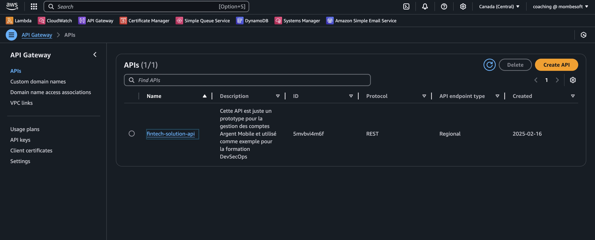
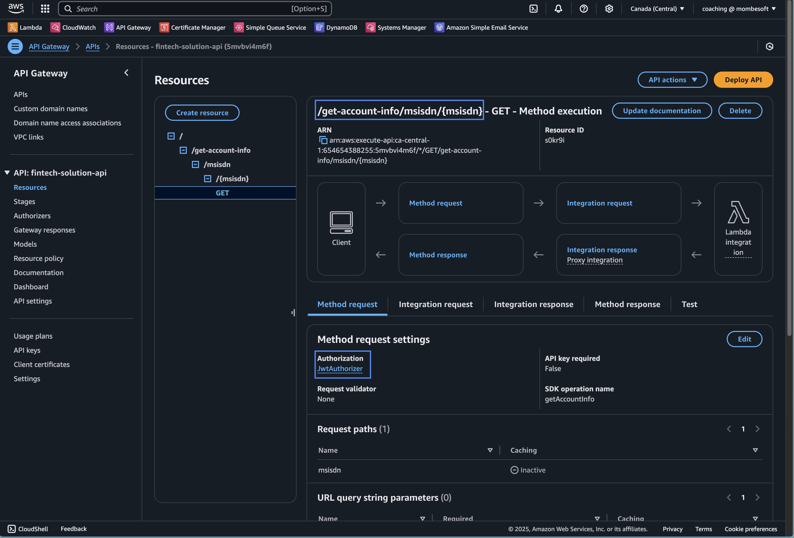
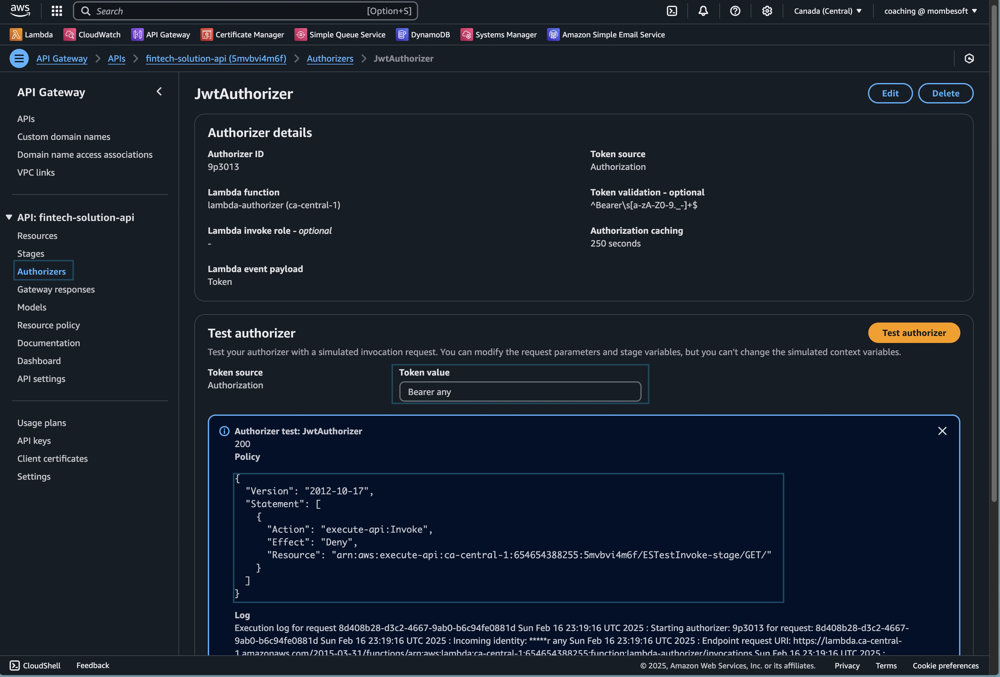
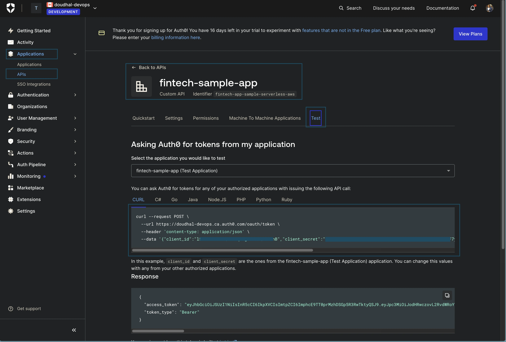
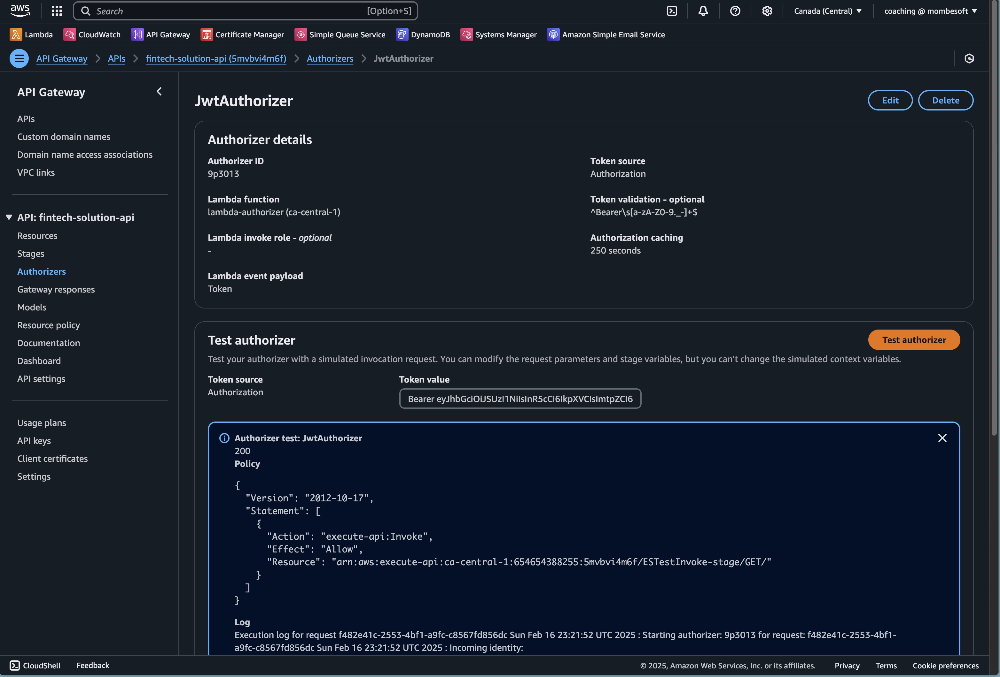
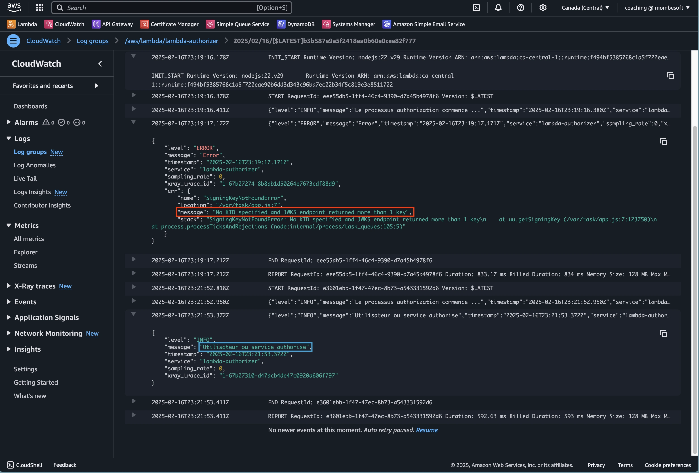
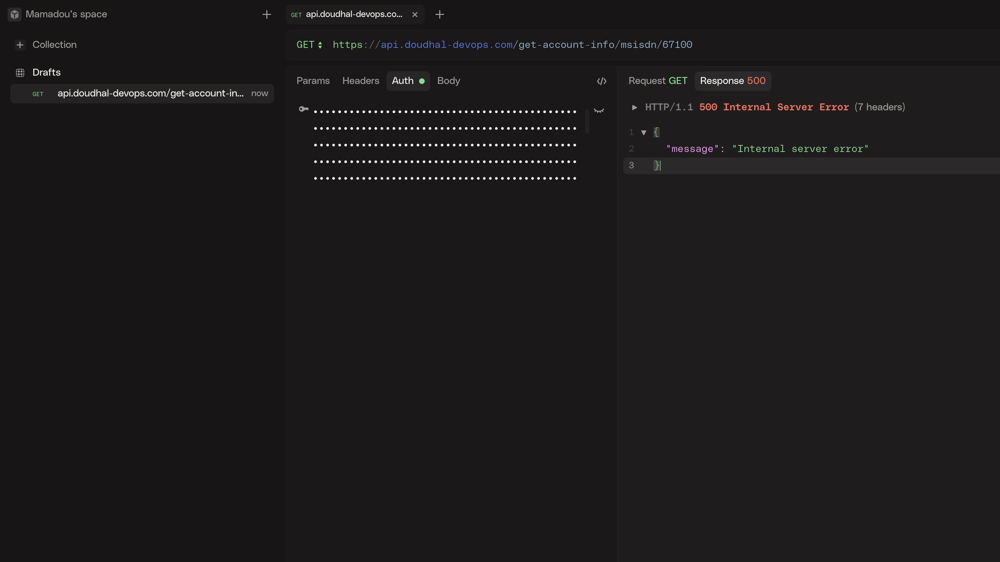
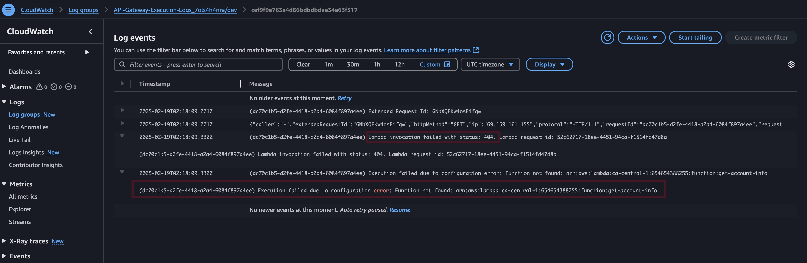

## Introduction :
A la fin de cette série d'articles, vous aurez appris à utiliser l'`infra-as-code` avec `Terraform` pour configurer et déployer : <br /> 
- un Api Gateway sécurisé avec une `Lambda Authorizer` qui utilise un service d'authentication externe comme Auth0 <br />
- des fonctions Lambda pour gérer les 3 trois types de transactions suivants :
  - Vérification de solde
  - Dépôt
  - Retrait
- une base de donnée `DynamoDB` <br />
- une file `SQS` pour enregistrer les transactions et les traiter plus tard de manière asynchrone, <br />
- La configuration de la journalisation (logging) avec `CloudWatch` pour surveiller et déboguer les fonctions Lambda <br />.
- Notification des utilisateurs :
  - Par SMS avec un service externe `Nimba SMS`
  - Par email en utilisant Amazon `Simple Email Service` (SES).

## Architecture :
Voici l'infrastructure que nous allons créer :

_Infrastructure Serverless Pour l'Application Fintech Imaginaire_

## Prérequis :
- [Terraform](https://learn.hashicorp.com/tutorials/terraform/install-cli) version 1.10.0 ou supérieure
- [Nodejs](https://nodejs.org/en/download/) version 20 ou supérieure
- [Yarn](https://classic.yarnpkg.com/en/docs/install)) / [Npm](https://nodejs.org/en/download/)
- Compte AWS :
  - avec un utilisateur ayant le droit d'administrateur. [voir créer un compte AWS](https://docs.aws.amazon.com/accounts/latest/reference/manage-acct-creating.html)
  - > **Note** : Une carte de crédit est nécessaire pour la vérification d’identité. La plupart des ressources utilisées dans ce tutoriel sont serverless et ne génèrent des coûts que si elles sont utilisées avec un certain volume.
- Avoir un compte Auth0 (j'utilise un compte gratuit) [voir créer un compte Auth0](https://auth0.com/signup).

- **Optionnel** : 
  - Avoir un compte `NimbaSMS`  avec un pack sms active (ou un autre fournisseur de sms quelque soit le pays). [Créer un compte NimbaSMS](https://www.nimbasms.com/) ou autre fournisseur de sms.

  - Avoir un nom de domaine acheté sur AWS ou un autre fournisseur. [Mais l'intégration est plus simple si le domaine est AWS](https://docs.aws.amazon.com/Route53/latest/DeveloperGuide/domain-register.html).
    > Par défaut, l’API Gateway génère un domaine pour vos APIs. Si vous disposez d’un nom de domaine, vous pouvez le mapper à votre API Gateway au lieu d’utiliser le domaine par défaut.
  - Outils recommandés pour le développement :
    Pour faciliter le développement local et le cycle de déploiement, les outils suivants sont recommandés :

    - [Devbox](https://www.jetpack.io/devbox) : pour configurer des environnements de développement isolés.
    - [Taskfile](https://taskfile.dev/) : pour automatiser les tâches de déploiement et de développement.
    - [AWS CLI](https://docs.aws.amazon.com/cli/latest/userguide/install-cliv2.html) : utiliser pour créer le backend S3 de terraform.
    - [Direnv](https://direnv.net/docs/installation.html) : pour gérer les variables d'environnement le dossier dev 
    - [Aws SAM ](https://docs.aws.amazon.com/serverless-application-model/latest/developerguide/install-sam-cli.html) : pour générer un projet typescript prêt.
  
    
## Contexte :
Aujourd’hui, on peut dire que la transition des datacenters traditionnels vers le cloud est en plein essor. La plupart des entreprises ont choisi de suivre cette tendance en l’adoptant pour bénéficier des avantages qu’il apporte. Pour en savoir plus sur les avantages du cloud, [consulter cet article de GCP](https://cloud.google.com/learn/advantages-of-cloud-computing?hl=fr). <br>

[Amazon](https://amazon.com) a été le premier à se lancer dans le cloud computing avec son service EC2 (Elastic Compute Cloud) en 2006, suivi de S3 (Simple Storage Service) en 2007. Aujourd’hui, AWS (Amazon Web Services) est devenu une entreprise à part entière, offrant une pléthore de services.

Avec un modèle d’affaires basé sur la facturation à l’heure pour l’utilisation des ressources, des services comme EC2 se sont rapidement imposés comme des solutions incontournables. Désormais, au lieu de gérer des serveurs physiques, on peut louer des serveurs virtuels sur AWS pour une durée déterminée.

Cependant, après plusieurs années d’utilisation de ce modèle, les entreprises ont commencé à se poser une question essentielle : pourquoi payer pour des ressources qui ne sont pas utilisées en permanence ? Par exemple, lors des périodes de faible activité comme les nuits, les weekends, etc.

En 2014, AWS a lancé un nouveau modèle Serverless de Facturation et service (Function as a Service) qui permet de ne payer que ce qu'on utilise avec [AWS Lambda](https://aws.amazon.com/fr/lambda/).
Les lambdas sont des fonctions qui peuvent être déclenchées par des événements comme la réception d'un fichier sur S3, un changement de status sur un serveur, ou encore par un appel HTTP etc. <br>

> Il faut noter qu'AWS est le leader du marché du cloud devant des concurents comme Azure (Microsoft Azure) et GCP (Google Cloud Platform). <br>

## Présentation des outils utilisés :

### Auth0 :
[Auth0](https://auth0.com) est une plateforme d'authentification et d'autorisation qui permet aux développeurs de sécuriser leurs applications web, mobiles et API. <br>
Il permet par exemple dans notre cas, de sécuriser l'API qu'on s'apprête à déployer. <br>

### Nimba SMS :
[Nimba SMS](https://www.nimbasms.com/) est une plateforme de notification par SMS à moindre coût. <br>
Excellente documentation avec une integration très simple, c'est du niveau de **Twilio** mais avec un coût bien inférieur. <br>


### Services AWS :

Ci-dessous la liste des services AWS utilisés dans ce projet avec leurs rôles et coûts respectifs :


| Nom         | Rôle                                 | Coût sur Canada Central                                                                                                                                                                                 |
|-------------|--------------------------------------|---------------------------------------------------------------------------------------------------------------------------------------------------------------------------------------------------------|
| API Gateway | Création d'API                       | $3.50/333 M requêtes / mois  [Documentation](https://aws.amazon.com/fr/api-gateway/pricing/)                                                                                                            |
| Lambda      | Function contenant la logique Métier | $0.20/1 M requêtes / mois  [Documentation](https://aws.amazon.com/fr/lambda/pricing/)                                                                                                                   |
| CloudWatch  | Monitoring des logs et des erreurs   | 0,55 USD par Go / mois  [Documentation](https://aws.amazon.com/fr/cloudwatch/pricing/)                                                                                                                  |
| Route 53    | DNS                                  | 0,50 $ / zone hébergée / mois  [Documentation](https://aws.amazon.com/fr/route53/pricing/)                                                                                                              | |
| DynamoDB    | Base de données                      | en fonction du mode de stockage et du nombre de requêtes  [Documentation](https://aws.amazon.com/fr/dynamodb/pricing/)                                                                                  |
| Sqs         | File d'attente                       | 0,40 $ file standard, de  1 million à 100 milliards de demandes/mois   [Documentation](https://aws.amazon.com/fr/sqs/pricing/)                                                                          |
| KMS         | Chiffrement des données              | 0,03 $ pour 10 000 demandes  [Documentation](https://aws.amazon.com/fr/kms/pricing/)                                                                                                                    |
| SSM         | Gestion des parametres et secrets    | grattuit pour le standard et 0,05 USD par paramètre avancé par mois (au prorata horaire si le paramètre est stocké moins d'un mois) [Documentation](https://aws.amazon.com/fr/systems-manager/pricing/) |
| SES         | Envoie et reception d'Email          | 0,10 $/1 000 e-mails  [Documentation](https://aws.amazon.com/fr/ses/pricing/)                                                                                                                           |
| IAM         | Gestion des utilisateurs et roles    | Gratuit   [Documentation](https://aws.amazon.com/fr/iam/pricing/) 


### Structure du projet :

Voici à quoi pourrai ressembler la structure finale du projet :
```shell
├── infra-as-code
│   ├── environments
│   │   └── dev
│   └── modules
│       └── common
├── lambda-src
│   ├── authorizer
│   │   ├── src
│   │   ├── tests
│   │   │   └── unit
│   ├── get-account-info
│   │   ├── src
│   │   ├── tests
│   │   │   └── unit
│   └── init-user-account
│       ├── src
│       ├── tests
│       │   └── unit
```

Pour reprendre la structure ci-haut, exécuter les commandes suivantes :

```shell
    # Dossier des environnements de votre infrastructure. Si vous avez plusieurs environnements
    # (dev, test, prod, etc.), vous pouvez les créer manuellement ou utiliser Terragrunt pour
    # générer les environnements dynamiquement.
    mkdir -p infra-as-code/environments/dev/

    # Dossier utilisé pour stocker le template de la spécification OpenAPI de l'API Gateway.
    # Ce template servira de base pour définir les endpoints et les configurations de l'API.
    mkdir -p infra-as-code/modules/common/templates/
    
    # Dossier utilisé pour stocker les projets Node.js des fonctions Lambda.
    # Chaque sous-dossier correspondra au code source d'une fonction Lambda spécifique.
    mkdir -p lambda-src/
```

# Installation des outils nécessaires :
Dans cet article, j'utilise [devbox](https://www.jetpack.io/devbox/) pour installer les différents outils dans un environnement isolé, il est basé sur [nix](https://nixos.org/).
Vous pouvez utiliser votre gestionnaire de paquet préféré pour installer les outils nécessaires ou télécharger les binaires ou les scripts d'installation directement sur le site officiel de chaque outil.

> **Note** : L’un des avantages majeurs d’un outil comme Devbox est sa capacité à créer des environnements isolés et reproductibles. Cela est particulièrement utile pour les projets open source ou les projets qui doivent être partagés avec d’autres développeurs. En quelque sorte, Devbox est à la gestion des paquets ce que Docker est à la gestion des conteneurs.


```shell
# Cette commande permet d'initialiser devbox dans le projet en créant un fichier de configuration devbox.json
devbox init 

# Ajout des différents paquets nécessaires
devbox add git
devbox add terraform@1.10.5
devbox add devenv@1.4 
devbox add nodejs_22
devbox add aws-sam-cli@1.132.0 
devbox add go-task@3.41.0
devbox add yarn@1.22.22
```

L'installation des paquets peut prendre un certain temps si c'est la première fois que vous utilisez devbox, nix ou un gestionnaire de paquet similaire.
Une fois l'installation terminée, vous pouvez lancer la commande suivante pour activer l'environnement virtuel.

```shell
devbox shell

# exit pour sortir de l'environnement virtuel
```
### Création de l'infrastructure :

Pour faire du serverless sur AWS, il existe plusieurs outils et frameworks sur le marché dont [CloudFormation](https://aws.amazon.com/fr/cloudformation/), AWS CDK, [AWS SAM](https://aws.amazon.com/fr/serverless/sam/) maintenue par AWS et d'autres comme [Serverless Framework](https://www.serverless.com/), [Terraform](https://www.terraform.io/)/[OpenTofu](https://opentofu.org/) etc. <br>

Nous allons utiliser terraform, l'outil de provisionnement d'infrastructure que nous avons installé précédemment pour provisionner notre infrastructure. <br>
> Terraform 1.10.5 est la version utilisé dans cet article, il supporte l'utilisation de S3 comme backend pour stocker l'état de l'infrastructure avec le lock dynamique native de S3 sans utiliser de base de données comme dynamodb.
> D'habitude, on utilise opentofu mais la dernière version d'opentofu ne supporte pas encore l'utilisation de S3 comme backend avec le lock dynamique native.
> Suivre l'issue sur le repo d'opentofu pour le support du lock_file native de S3 : https://github.com/opentofu/opentofu/issues/599

Nous allons utiliser un bucket s3 comme backend pour stocker l'état de l'infrastructure, il faut donc créer un bucket s3 avant de pouvoir créer l'infrastructure. <br />

Pour communiquer avec l'API d'AWS via la CLI ou Terraform, nous avons besoin de configurer les credentials. <br />
J'utilise l'outil **direnv** pour gérer les variables d'environnement,  [Voir comment configurer les credentials AWS avec votre OS](https://docs.aws.amazon.com/cli/latest/userguide/cli-configure-envvars.html) <br />

- Si vous optez pour l'outil direnv, vous devez créer un fichier `.envrc` dans le dossier `[infra-as-code/environments/dev/.envrc]() et rajouter le contenu suivant :
 
```shell
export AWS_ACCESS_KEY_ID=votre-access-key-id
export AWS_SECRET_ACCESS_KEY=votre-secret-access-key
export AWS_DEFAULT_REGION=votre-region
```

Puis une fois dans le dossier **infra-as-code/environments/dev** : `direnv allow` pour activer les variables d'environnement.
> **Note** : Le fichier `.envrc` doit être ignoré par git, donc il faut ajouter une ligne dans le fichier `.gitignore` : `*.envrc **/.envrc`
 
- Maintenant que les crédentials sont configurés, nous pouvons créer le bucket s3 qui vas servir de backend pour terraform: 
- > **Note** : Terraform offre Terraform Cloud et Terraform Enterprise pour gérer les états des infrastructures. 

  ```shell
    BUCKET_NAME="aws-serverless-fintech-solution-statefile-bucket-xsxd3"
    
    REGION="ca-central-1" # remplacer par la région la plus proche de vous
    
    # Creation du bucket s3
    aws s3api create-bucket \
      --bucket $BUCKET_NAME \
      --region $REGION \
      --create-bucket-configuration LocationConstraint=$REGION
    
    # Activer le versioning sur le bucket s3
    aws s3api put-bucket-versioning \
      --bucket $BUCKET_NAME \
      --versioning-configuration Status=Enabled
      
    #List buckets pour verifier que le bucket a bien été créé
    aws s3api list-buckets
  ```
- Avec la Console Web d'AWS :
  Sur le champ de recherche, tapez `s3` et cliquez sur dessus, puis sur le button jaune `create bucket`, remplissez le champ `bucket name` avec le nom du bucket que vous avez choisi, sur la section `Bucket Versioning` cliquez sur `Enable` puis sur `create bucket`.
  > Activer le versioning sur le bucket s3 est une bonne pratique pour éviter la perte de données ou en cas corruption du statefile de terraform on peut revenir à une version antérieure.


## Création des différents composants de l'infrastructure et leurs intégrations :

- ## Création d'une clé de cryptage (AWS KMS) :
  Nous allons créer une clé de cryptage unique pour l'ensemble des ressources de notre infrastructure (AWS KMS).

  [infra-as-code/modules/common/00-kms.tf](https://github.com/mombe090/blog-source-code/blob/fintech-solution/src/aws-serverless-architecture/mobile-money-transfer/infra-as-code/modules/common/00-kms.tf) :
  
  ```terraform
  
  #Récupère l'ID du compte AWS
  data "aws_caller_identity" "current" {}
  
  data "aws_iam_policy_document" "kms_policy_document" {
    statement {
      sid    = uuidv5("dns", "kms_policy_document_root")
      effect = "Allow"
      actions = [
        "kms:*"
      ]
      resources = [
        "*"
      ]
      principals {
        type = "AWS"
        identifiers = [
          "arn:aws:iam::${data.aws_caller_identity.current.account_id}:root",
        ]
      }
    }
  }
  
  resource "aws_kms_key" "this" {
    description = "Cle d'encryption pour les données"
    policy      = data.aws_iam_policy_document.kms_policy_document.json
  }
  
  resource "aws_kms_alias" "this" {
    name          = "alias/fintech-solution"
    target_key_id = aws_kms_key.this.key_id
  }
  ```
  

- ## Api Gateway :
  Aws support 4 types d'Api Gateway :
  - REST API
  - HTTP API
  - WebSocket API
  - Rest API Private

  `Rest API` est celui qu'on vas utiliser pour ce projet, vous pouvez lire cette [documentation](https://docs.aws.amazon.com/apigateway/latest/developerguide/http-api-vs-rest.html?icmpid=apigateway_console_help) pour mieux faire le choix entre les 4 types.

  - AWS support la spécificaton OpenApi 3.0 pour la définition des endpoints de l'Api Gateway, donc c'est ce que j'utiliserai.
  - [infra-as-code/modules/common/templates/endpoints.oas.yaml](https://github.com/mombe090/blog-source-code/blob/fintech-solution/src/aws-serverless-architecture/mobile-money-transfer/infra-as-code/modules/common/templates/endpoints.oas.yaml) :

  ```yaml
  openapi: 3.0.3
  
  info:
    title: API Argent Mobile
    description: Cette API est juste un prototype pour la gestion des comptes Argent Mobile et utilisé comme exemple pour la formation DevSecOps
    version: 1.0.0
  servers:
    - url: "https://api.doudhal-devops.com/v1"
  
  components:
    # Utilisation de l'authentification JWT pour sécuriser les endpoints
    securitySchemes:
      JwtAuthorizer:
        type: apiKey
        name: Authorization
        in: header
        x-amazon-apigateway-authtype: "custom"
        x-amazon-apigateway-authorizer:
          type: "token"
          
          # L'ARN de la fonction Lambda qui va vérifier le token JWT (lambda-authorizer)
          authorizerUri: "arn:aws:apigateway:${aws_region}:lambda:path/2015-03-31/functions/${jwt_authorizer_lambda_arn}/invocations"
          authorizerResultTtlInSeconds: 250
          identitySource: "method.request.header.Authorization"
          identityValidationExpression: "^Bearer\\s[a-zA-Z0-9._-]+$"
  
  paths:
    /get-account-info/msisdn/{msisdn}:
      get:
        operationId: getAccountInfo
        description: Obtenir les informations sur la solde d'argent mobile d'un numéro de téléphone
        
        # Pour protéger cette route, on ajoute la sécurité JwtAuthorizer défini plus haut
        security:
          - JwtAuthorizer: []
  
        # Cette prend juste en path paramètre le numéro de téléphone du client
        parameters:
          - name: msisdn
            in: path
            required: true
            description: Le numéro de telephone du client
            schema:
              type: string
        
        # Cette section reserve pour l'intégration avec le backend (ici une lambda get-account-info) 
        # https://docs.aws.amazon.com/apigateway/latest/developerguide/api-gateway-swagger-extensions-integration.html
        x-amazon-apigateway-integration:
          credentials: "${api_gateway_role_arn}"
          uri: "arn:aws:apigateway:${aws_region}:lambda:path/2015-03-31/functions/${get_account_info_lambda_arn}/invocations"
          passthroughBehavior: "when_no_match"
          httpMethod: "POST"
          
          # Vue le get-account-info est sensible, le client veut toute de suite voir son solde, on met cette intégration synchrnone
          type: "aws_proxy"
          
        responses:
          "200":
            description: OK
            content: {}
            
        # Pour les autres codes d'erreur, on renvoie une réponse par défaut
  
  ```

  - Le terraform associé est dans [infra-as-code/modules/common/01-gateway-api.tf](https://github.com/mombe090/blog-source-code/blob/fintech-solution/src/aws-serverless-architecture/mobile-money-transfer/infra-as-code/modules/common/01-gateway-api.tf) :
  
  ```terraform
  locals {
    api_gw_name = "fintech-solution-api"
    get_acount_info_lambda_name = "get-account-info"
  }
  
  data "aws_iam_policy_document" "api_gw_assume_role" {
    #Section de définition du rôle assumption pour le service API Gateway
    statement {
      effect = "Allow"
  
      principals {
        type        = "Service"
        identifiers = ["apigateway.amazonaws.com"]
      }
  
      actions = ["sts:AssumeRole"]
    }
  }
  
  data "aws_iam_policy_document" "api_gw_policy_document" {
    #Section de définition des permissions pour le service API Gateway, pour toutes intégrations que l'on va créer
    statement {
      effect = "Allow"
  
      actions = [
        "logs:CreateLogGroup",
        "logs:CreateLogStream",
        "logs:DescribeLogGroups",
        "logs:DescribeLogStreams",
        "logs:PutLogEvents",
        "logs:GetLogEvents",
        "logs:FilterLogEvents",
      ]
  
      resources = ["*"]
    }
  
    statement {
      effect = "Allow"
  
      actions = [
        "lambda:InvokeFunction"
      ]
  
      resources = [
        "arn:aws:lambda:${var.aws_region}:${var.aws_account_id}:function:${local.get_acount_info_lambda_name}"
      ]
    }
  }
  
  data "template_file" "endpoints" {
    # Conversion du fichier endpoints.oas.yaml en template terraform
    template = file("${path.module}/templates/endpoints.oas.yaml")
  
    vars = {
      api_gateway_role_arn        = aws_iam_role.gateway_rest_api_role.arn
      jwt_authorizer_lambda_arn   = aws_lambda_function.lambda_authorizer.arn
      get_account_info_lambda_arn = "arn:aws:lambda:${var.aws_region}:${var.aws_account_id}:function:${local.get_acount_info_lambda_name}"
      aws_region                  = var.aws_region
    }
  }
  
  # Création du role aws pour l'api gateway
  resource "aws_iam_role" "gateway_rest_api_role" {
    name               = "${local.api_gw_name}-role"
    assume_role_policy = data.aws_iam_policy_document.api_gw_assume_role.json
  }
  
  #Création de la policy pour l'api gateway
  resource "aws_iam_policy" "api_gw_policy" {
    name   = "${local.api_gw_name}-policy"
    policy = data.aws_iam_policy_document.api_gw_policy_document.json
  }
  
  # Attachement de la policy au role de l'api gateway
  resource "aws_iam_policy_attachment" "api_gw_policy_attachment" {
    name = "${local.api_gw_name}-policy-attachment"
    roles = [
      aws_iam_role.gateway_rest_api_role.name
    ]
    policy_arn = aws_iam_policy.api_gw_policy.arn
  }
  
  # Création des logs d'exécution de l'api gateway dans cloudwatch
  resource "aws_cloudwatch_log_group" "this" {
    name              = "API-Gateway-Execution-Logs_${aws_api_gateway_rest_api.this.id}/dev"
    retention_in_days = 1
  }
  
  # Création de l'api gateway account l'autoriser à pusher les logs dans cloudwatch
  resource "aws_api_gateway_account" "this" {
    cloudwatch_role_arn = aws_iam_role.gateway_rest_api_role.arn
  }
  
  # Création de l'api gateway avec le l'OpenApi Spec
  resource "aws_api_gateway_rest_api" "this" {
    body = data.template_file.endpoints.rendered
  
    name = local.api_gw_name
  
    endpoint_configuration {
      # On utilise un endpoint regional pour éviter les coûts supplémentaires, mais vous voulez aller large et utiliser un endpoint edge
      types = ["REGIONAL"]
    }
  }
  
  # Activation des métriques et le log level à INFO, si vous voulez moins de logs, vous pouvez mettre ERROR ou OFF
  resource "aws_api_gateway_method_settings" "this" {
    rest_api_id = aws_api_gateway_rest_api.this.id
    stage_name  = aws_api_gateway_stage.this.stage_name
    method_path = "*/*"
  
    settings {
      metrics_enabled = true
      logging_level   = "INFO"
    }
  }
  
  # Déploiement de l'api gateway, on s'assure qu'a chaque fois l'OAS change, le déploiement se fait
  resource "aws_api_gateway_deployment" "this" {
    rest_api_id = aws_api_gateway_rest_api.this.id
  
    triggers = {
      redeployment = sha1(jsonencode(aws_api_gateway_rest_api.this.body))
    }
  
    lifecycle {
      create_before_destroy = true
    }
  }
  
  # Création du stage de l'api gateway, ici j'utilise dev mais vous pouvez utiliser prod, staging, etc.
  resource "aws_api_gateway_stage" "this" {
    deployment_id = aws_api_gateway_deployment.this.id
    rest_api_id   = aws_api_gateway_rest_api.this.id
    stage_name    = "dev"
  
    # On active les logs au format json, il y a d'autres formats disponibles
    # https://docs.aws.amazon.com/apigateway/latest/developerguide/set-up-logging.html#set-up-access-logging-permissions
    access_log_settings {
      destination_arn = aws_cloudwatch_log_group.this.arn
      format          = jsonencode({ "requestId":"$context.requestId", "extendedRequestId":"$context.extendedRequestId","ip": "$context.identity.sourceIp", "caller":"$context.identity.caller", "user":"$context.identity.user", "requestTime":"$context.requestTime", "httpMethod":"$context.httpMethod", "resourcePath":"$context.resourcePath", "status":"$context.status", "protocol":"$context.protocol", "responseLength":"$context.responseLength" })
    }
  
    depends_on = [aws_api_gateway_account.this, aws_cloudwatch_log_group.this]
  }
  
  # Création du domaine personnalisé pour l'api gateway, si seulement vous avez un domaine.
  resource "aws_api_gateway_domain_name" "this" {
    count = var.apply_custom_domain ? 1 : 0
  
    domain_name              = "api.${var.domain}"
    regional_certificate_arn = aws_acm_certificate.this[0].arn
  
    endpoint_configuration {
      types = ["REGIONAL"]
    }
  
    # On ajoute le certificat ssl pour le domaine personnalisé avec l'Authority Certificate Manager (ACM) d"AWS qui est truster par la plupart des navigateurs et outils modernes.
    # On doit valider le certificat avec ACM avant de pouvoir l'utiliser avec API Gateway.
    #voir le fichier 02-route53.tf
    depends_on = [aws_acm_certificate.this, aws_acm_certificate_validation.this]
  }
  
  #Association du domaine personnalisé avec l'API Gateway.
  resource "aws_api_gateway_base_path_mapping" "this" {
    count = var.apply_custom_domain ? 1 : 0
  
    api_id      = aws_api_gateway_rest_api.this.id
    stage_name  = aws_api_gateway_stage.this.stage_name
    domain_name = aws_api_gateway_domain_name.this[0].domain_name
  }
  
  ```

  - Ajout d'un sous domaine et son certificat ssl [infra-as-code/modules/common/02-route53.tf](https://github.com/mombe090/blog-source-code/blob/fintech-solution/src/aws-serverless-architecture/mobile-money-transfer/infra-as-code/modules/common/02-route53.tf) :

  ```terraform
  data "aws_route53_zone" "this" {
    count = var.apply_custom_domain ? 1 : 0
  
    name         = var.domain
  }
  
  # Création de ligne du nom de domaine dans la zone DNS route53 et le target est l'api gateway (Regional)
  # https://registry.terraform.io/providers/hashicorp/aws/latest/docs/resources/api_gateway_domain_name#regional-acm-certificate
  resource "aws_route53_record" "this" {
    count = var.apply_custom_domain ? 1 : 0
  
    name    = "api.${var.domain}"
    type    = "A"
    zone_id = data.aws_route53_zone.this[0].zone_id
  
    alias {
      evaluate_target_health = true
      name                   = aws_api_gateway_domain_name.this[0].regional_domain_name
      zone_id                = aws_api_gateway_domain_name.this[0].regional_zone_id
    }
  }
  
  resource "aws_acm_certificate" "this" {
    count = var.apply_custom_domain ? 1 : 0
  
    domain_name               = "api.${var.domain}"
    subject_alternative_names = ["api.${var.domain}"]
    validation_method         = "DNS"
  }
  
  resource "aws_acm_certificate_validation" "this" {
    certificate_arn   = aws_acm_certificate.this[0].arn
  }
  
  ```

  - ### Définition de lambda authorizer (Infra et Code Source ) :

    Les lambdas sont des resources particulières, en plus du terraform pour la déployer, elle requiert aussi du code applicatif pour la logique métier qu'elle doit faire, on le verra dans la section suivante. 

  - le code infra : [infra-as-code/modules/common/03-lambda-authorizer.lambda.tf](https://github.com/mombe090/blog-source-code/blob/fintech-solution/src/aws-serverless-architecture/mobile-money-transfer/infra-as-code/modules/common/03-lambda-authorizer.lambda.tf) :

  ```terraform
      locals {
        authorizer_lambda_name = "lambda-authorizer"
      }
      
      data "aws_iam_policy_document" "lambda_authorizer_assume_role" {
        statement {
          effect = "Allow"
      
          principals {
            type        = "Service"
            identifiers = ["lambda.amazonaws.com"]
          }
      
          actions = ["sts:AssumeRole"]
        }
      }
      
      data "aws_iam_policy_document" "lambda_authorizer_policy_document" {
        statement {
          effect = "Allow"
      
          actions = [
            "logs:CreateLogGroup",
            "logs:CreateLogStream",
            "logs:PutLogEvents"
          ]
      
          resources = [
            "arn:aws:logs:${var.aws_region}:${var.aws_account_id}:log-group:/aws/lambda/${local.authorizer_lambda_name}:*"
          ]
        }
      }
      
      resource "aws_iam_policy" "lambda_authorizer_policy" {
        name   = "${local.authorizer_lambda_name}-policy"
        policy = data.aws_iam_policy_document.lambda_authorizer_policy_document.json
      }
      
      resource "aws_iam_role" "lambda_authorizer_role" {
        name               = "${local.authorizer_lambda_name}-role"
        assume_role_policy = data.aws_iam_policy_document.lambda_authorizer_assume_role.json
      }
      
      resource "aws_iam_policy_attachment" "lambda_authorizer_policy_attachment" {
        name       = "${local.authorizer_lambda_name}-policy-attachment"
        roles      = [aws_iam_role.lambda_authorizer_role.name]
        policy_arn = aws_iam_policy.lambda_authorizer_policy.arn
      }
      
      resource "aws_lambda_function" "lambda_authorizer" {
        filename      = "${path.module}/dist/authorizer.zip"
        function_name = local.authorizer_lambda_name
        role          = aws_iam_role.lambda_authorizer_role.arn
        handler       = "app.lambdaHandler"
        kms_key_arn = aws_kms_key.this.arn
      
        source_code_hash = filebase64sha256("${path.module}/dist/authorizer.zip")
      
        runtime = "nodejs22.x"
      
        environment {
          variables = {
            ISSUER_URI           = var.issuer_uri,
            JWKS_URI             = var.jwks_uri,
            AUDIENCE             = var.audience,
            POWERTOOLS_LOG_LEVEL = "INFO"
          }
        }
      }
      
      resource "aws_lambda_permission" "allow_api_gw_to_invoke_authorizer" {
        action        = "lambda:InvokeFunction"
        function_name = aws_lambda_function.lambda_authorizer.function_name
        principal     = "apigateway.amazonaws.com"
        source_arn    = "${aws_api_gateway_rest_api.this.execution_arn}/*"
      }
  
    ``` 

  - ### Initialisation du code de la lambda authorizer :
  Nous allons utiliser TypeScript (avec Node.js) comme langage de programmation pour ce projet. Pour démarrer rapidement, nous utiliserons AWS SAM (Serverless Application Model) afin de générer un code de base incluant quelques bonnes pratiques et configurations essentielles, telles que :

   - tsconfig : pour la configuration de TypeScript,

   - Prettier : pour le formatage du code,

   - ESLint : pour la vérification de la qualité du code.

   Une fois ce code de départ généré, nous le modifierons pour utiliser Terraform comme outil de déploiement.

  ```shell
  
  cd lambda-src
  sam init --runtime nodejs22.x --dependency-manager npm  --package-type Zip  --name tmp-sam
  Which template source would you like to use?
          1 - AWS Quick Start Templates
          2 - Custom Template Location
  Choice: 1
  
  Choose an AWS Quick Start application template
          1 - Hello World Example
          2 - GraphQLApi Hello World Example
          3 - Hello World Example with Powertools for AWS Lambda
          4 - Multi-step workflow
          5 - Standalone function
          6 - Scheduled task
          7 - Data processing
          8 - Serverless API
          9 - Full Stack
          10 - Lambda Response Streaming
  Template: 1
  
  Select your starter template
          1 - Hello World Example
          2 - Hello World Example TypeScript
  Template: 2
  
  Would you like to enable X-Ray tracing on the function(s) in your application?  [y/N]: n
  
  Would you like to enable monitoring using CloudWatch Application Insights?
  For more info, please view https://docs.aws.amazon.com/AmazonCloudWatch/latest/monitoring/cloudwatch-application-insights.html [y/N]: n
  
  Would you like to set Structured Logging in JSON format on your Lambda functions?  [y/N]: y
  Structured Logging in JSON format might incur an additional cost. ....
  
  ```
  Une fois que la génération est terminée, récupérer le dossier projet typescript généré :

  ```bash
  #Suppression des fichiers dont on a pas besoin
  rm -f tmp-sam/.gitignore  tmp-sam/samconfig.toml  tmp-sam/README.md tmp-sam/template.yaml
  cp -r tmp-sam/* .
  rm -rf tmp-sam
  
  # Renommer le projet, créer un dossier src et y déplacer le fichier app.ts
  mv hello-world authorizer
  cd authorizer && mkdir src && mv app.ts src
  
  # L'arborescence ressemble à ça :
  ├── jest.config.ts
  ├── package-lock.json
  ├── package.json
  ├── src
  │   └── app.ts
  ├── tests
  │   └── unit
  │       └── test-handler.test.ts
  └── tsconfig.json
  
  # Installation des différents dépendances :
  yarn add @aws-lambda-powertools/logger jsonwebtoken jwks-rsa
  ou 
  npm install @aws-lambda-powertools/logger jsonwebtoken jwks-rsa
  
  ```

  Au final le `package.json` ressemble à ça, j'ai rajouté dans la section scripts, un script `build` qui utilise `esbuild` pour transpiler le code typescript en javascript.
  ```json
  {
    "name": "authorizer",
    "version": "1.0.0",
    "description": "Lambda charger de l'authorization",
    "main": "src/app.js",
    "repository": "https://github.com/mombe090/blog-source-code.git ",
    "author": "Mamadou Yaya DAILLO @generated-with-sam-cli",
    "license": "MIT",
    "scripts": {
      "build": "esbuild src/app.ts --sourcemap --bundle --platform=node --target=es2020 --minify --external:aws-sdk --outfile=dist/app.js ",
      "unit": "jest",
      "lint": "eslint 'src/**/*.ts' --quiet --fix",
      "compile": "tsc",
      "test": "npm run compile && npm run unit"
    },
    "dependencies": {
      "@aws-lambda-powertools/logger": "^2.13.1",
      "esbuild": "^0.14.14",
      "jsonwebtoken": "^9.0.2",
      "jwks-rsa": "^3.1.0"
    },
    "devDependencies": {
      "@jest/globals": "^29.2.0",
      "@types/aws-lambda": "^8.10.92",
      "@types/jest": "^29.2.0",
      "@types/node": "^20.5.7",
      "@typescript-eslint/eslint-plugin": "^5.10.2",
      "@typescript-eslint/parser": "^5.10.2",
      "eslint": "^8.8.0",
      "eslint-config-prettier": "^8.3.0",
      "eslint-plugin-prettier": "^4.0.0",
      "jest": "^29.2.1",
      "prettier": "^2.5.1",
      "ts-jest": "^29.0.5",
      "ts-node": "^10.9.1",
      "typescript": "^4.8.4"
    }
  }
  
  ```

  Pour le code de la lambda elle-même, pour simplifier, j'ai choisi de mettre le code dans un seul fichier [lambda-src/authorizer/src/app.ts](), mais AWS récommande d'utiliser une architecture hexagonale pour les lambdas. [Lire](https://aws.amazon.com/blogs/compute/developing-evolutionary-architecture-with-aws-lambda/)
  
  ```typescript
    import { APIGatewayAuthorizerResult, APIGatewayTokenAuthorizerEvent } from 'aws-lambda';
    import jwt from 'jsonwebtoken';
    import jwksClient from 'jwks-rsa';
    import { Logger } from '@aws-lambda-powertools/logger';
    
    // Initialisation du logger avec la librairie installée précédemment aws-lambda-powertools
    const logger = new Logger({ serviceName: 'lambda-authorizer' });
    
    // Définition de la fonction lambdaHandler qui sera appelée par l'API Gateway
    export const lambdaHandler = async (event: APIGatewayTokenAuthorizerEvent): Promise<APIGatewayAuthorizerResult> => {
      logger.info('Le processus authorization commence ...');
    
      // Vérification des variables d'environnement nécessaires pour le processus d'authorization, elles sont définies dans le fichier [infra-as-code/modules/common/03-lambda-authorizer.lambda.tf]().
      if (
        process.env.AUDIENCE === undefined ||
        process.env.JWKS_URI === undefined ||
        process.env.ISSUER_URI === undefined
      ) {
        throw new Error("La variable d'environnement doit contenir AUDIENCE ou JWKS_URI ou ISSUER_URI ");
      }
    
      // Récupération du token d'authentification depuis l'événement
      logger.debug('Event', { event });
      const token = event.authorizationToken.replace('Bearer ', '');
    
      // Initialisation du client JWKS avec l'URI JWKS
      const client = jwksClient({ jwksUri: process.env.JWKS_URI });
    
      try {
        // On commence par décoder le token pour récupérer les informations nécessaires pour la vérification
        const decodedToken = jwt.decode(token, { complete: true });
        logger.debug('Decoded Token', { decodedToken });
    
        // Récupération de l'audience et de l'issuer depuis le token décodé
        const audience: string = decodedToken?.['payload']['aud'];
        const issuer: string = decodedToken?.['payload']['iss'];
    
        // Récupération de la clé publique depuis le JWKS avec l'ID de la clé (kid)
        const key = await client.getSigningKey(decodedToken?.['header']['kid']);
    
        // Vérification du token avec la clé publique
        jwt.verify(token, key.getPublicKey());
    
        // On vérifie que l'audience et l'issuer sont corrects, il est possible de pousser encore plus loin en vérifiant les scopes ou les rôles
        if (audience !== process.env.AUDIENCE) {
          throw new Error('Invalid audience');
        } else if (issuer !== process.env.ISSUER_URI) {
          throw new Error('Invalid issuer');
        }
    
        // Avec le principe de lambda Authorizer, l'Api attend après une réponse de type IAM Policy
      } catch (err) {
        logger.error('Error', { err });
    
        return {
          principalId: 'user',
          policyDocument: {
            Version: '2012-10-17',
            Statement: [
              {
                Action: 'execute-api:Invoke',
                Effect: 'Deny',
                Resource: event.methodArn,
              },
            ],
          },
        };
      }
    
      logger.info('Utilisateur ou service authorise');
      return {
        principalId: 'user',
        policyDocument: {
          Version: '2012-10-17',
          Statement: [
            {
              Action: 'execute-api:Invoke',
              Effect: 'Allow',
              Resource: event.methodArn,
            },
          ],
        },
      };
    };
  
  
  ```
  
  - Maintenant, nous allons créer un fichier [infra-as-code/modules/common/variables.tf]()  qui va contenir les variables utilisées ci-dessus :
  
  ```terraform
  variable "apply_custom_domain" {
    type    = bool
    default = false
    description = "Utiliser pour s'avoir si on map l'api gateway à votre domaine via la Route53"
  }
  
  variable "domain" {
    type = string
    description = "Le domaine que vous voulez utiliser pour votre api gateway"
  }
  
  variable "aws_region" {
    type        = string
    default     = "ca-central-1"
    description = "AWS Region, changez par la région de votre choix"
  }
  
  variable "aws_account_id" {
    type = string
    description = "Le numéro de compte AWS que vous utilisez, vous pouvez le trouver en haut à droite de la console AWS"
  }
  
  variable "issuer_uri" {
    type        = string
    description = "L'url du serveur d'authentification (Auth0/github/entraID) par exemple"
  }
  
  variable "jwks_uri" {
    type        = string
    description = "Le lien vers le fichier jwks.json de votre serveur d'authentification, qui contient les informations de vos clés publiques"
  }
  
  variable "audience" {
    type = string
    description = "L'audience de votre serveur d'authentification, nous ferons une validation de l'audience dans les tokens JWT"
  }
  ```


  - Le fichier [infra-as-code/modules/common/outputs.tf]() est utilisé pour définir les sorties de notre module. Nous allons définir les sorties suivantes :

  ```terraform
  output "gateway_api_role" {
    value = {
      name = aws_iam_role.gateway_rest_api_role.name
      arn  = aws_iam_role.gateway_rest_api_role.arn
    }
  }
  output "gateway_api_rest" {
    value = {
      name          = aws_api_gateway_rest_api.this.name
      id            = aws_api_gateway_rest_api.this.id
      execution_arn = aws_api_gateway_rest_api.this.execution_arn
      stage_name    = aws_api_gateway_stage.this.stage_name
      domain_name   = var.apply_custom_domain ? aws_api_gateway_domain_name.this[0].domain_name : null
    }
  }
  
  output "route53_record" {
    value = var.apply_custom_domain ? {
      hostname = aws_route53_record.this[0].fqdn
      records  = aws_route53_record.this[0].records
      type     = aws_route53_record.this[0].type
    } : null
  }
  
  output "acm_certificate" {
    value = var.apply_custom_domain ? {
      certificate_arn       = aws_acm_certificate.this[0].arn
      certificate_authority = aws_acm_certificate.this[0].certificate_authority_arn
    } : null
  }
  ```

- ### Initialisation de l'environnement de dev : 

  Pour chaque environnement, on peut avoir un dossier dans lequel on va initialiser le terraform et appliquer les configurations :
  Par exemple pour dev on : 
  - [infra-as-code/environments/dev/main.tf](https://github.com/mombe090/blog-source-code/blob/fintech-solution/src/aws-serverless-architecture/mobile-money-transfer/infra-as-code/environments/dev/main.tf) :

  ```terraform
  terraform {
    # Utilisation du provider AWS avec la version 5.86.0
    required_providers {
      aws = {
        source  = "hashicorp/aws"
        version = "5.86.0"
      }
    }
  
    # On utilise le backend S3 pour stocker l'état de notre infrastructure avec le bucket S3 aws-serverless-fintech-solution-statefile-bucket-xsxd3 crée précédemment.
    backend "s3" {
      bucket = "aws-serverless-fintech-solution-statefile-bucket-xsxd3" # remplace par votre bucket
      key    = "serverless-app-statefile/default/terraform.tfstate"
      region = "ca-central-1"
  
      #Vous devez avec terraform 1.10.0 et hashicorp/aws 5.86.0 ou plus pour utiliser le verrouillage
      # Lire la documentation pour plus d'informations : https://developer.hashicorp.com/terraform/language/upgrade-guides#s3-native-state-locking
      use_lockfile = true
    }
  }
  
  module "this" {
    source = "../../modules/common"
  
    aws_account_id = var.aws_account_id #remplacez par votre numéro de compte AWS
    aws_region     = var.aws_region     #remplacez par la region AWS de votre choix
  
    issuer_uri = var.issuer_uri
    jwks_uri   = var.jwks_uri
  
    sms_provider_api_url       = "https://api.nimbasms.com/v1/messages"
    sms_provider_client_id     = var.sms_provider_client_id
    sms_provider_client_secret = var.sms_provider_client_secret
  
    //remplacez par 'ON' pour activer les notifications SMS
    enable_sms_notifications   = "OFF"
  
    //remplacez par 'OFF' pour ne pas activer les notifications EMAIL
    enable_email_notifications = "ON"
  
    //remplacez par votre domaine si apply_custom_domain est true
    domain                     = var.domain
    apply_custom_domain        = true //remplacez par false si vous ne souhaitez pas appliquer de domaine personnalisé
  
    test_destination_email     = var.test_email
  }
  
  ```

- ### Builder le projet de la Lambda Authorizer  :

  Pour builder, zipper et déplacer le zip dans le bon repertoire du module commun, j'utiliserai l'outil [Taskfile](https://taskfile.dev/usage/)
  
  Le script `build-and-deploy-dev`, permet de builder, package en zip et le déposer dans le dossier commun des modules terraform dans un dossier dist pour que terraform puisse le deployer.
  
 [Taskfile.yml](https://github.com/mombe090/blog-source-code/blob/fintech-solution/Taskfile.yaml) :

  ```yaml
  version: '3'
  
  env:
    # Remplacer par les valeurs de votre environnement
    # Lectures variables d'environnement definies dans le fichier .envrc et definition de nouvelles prefixer TF_VAR_ pour terraform
    TF_VAR_domain: "{{ .FINTECH_SOLUTION_DOMAINE }}"
    TF_VAR_issuer_uri: "{{ .FINTECH_SOLUTION_ISSUER_URI }}"
    TF_VAR_jwks_uri: "{{ .FINTECH_SOLUTION_JWKS_URI }}"
    TF_VAR_audience: "{{ .FINTECH_SOLUTION_AUDIENCE }}"
  
  tasks:
  
    build-and-deploy-dev:
      cmds:
        - task: build-authorizer
        - task: tf-plan-dev
        - task: tf-apply-dev
  
    tf-plan-dev:
      dir: "infra-as-code/environments/dev"
      cmds:
        - terraform init
        - terraform plan
  
    build-authorizer:
      dir: "lambda-src/authorizer"
      cmds:
        - yarn run build
        - cd dist && zip -r authorizer.zip .
        - mkdir -p ../../infra-as-code/modules/common/dist
        - cp dist/authorizer.zip ../../infra-as-code/modules/common/dist/authorizer.zip
  
    tf-apply-dev:
      dir: "infra-as-code/environments/dev"
      cmds:
        - pwd
        - terraform fmt -recursive
        - terraform apply -auto-approve
  
    tf-destroy-dev:
      dir: "infra-as-code/environments/dev"
      cmds:
        - terraform destroy -auto-approve
  
  ```

  Pour build la lambda et déployer toutes les resources terraform, exécutez la commande suivante :

  ```shell
  task build-and-deploy-dev
  
  *
  *
  *
  Apply complete! Resources: 21 added, 0 changed, 0 destroyed.
  
  Outputs:
  
  module_common = {
    "acm_certificate" = {
      "certificate_arn" = "arn:aws:acm:ca-central-1:654654388255:certificate/7b76c99c-b3b6-43ab-9f9d-f120cac9b326"
      "certificate_authority" = ""
    }
    "gateway_api_rest" = {
      "domain_name" = "api.doudhal-devops.com"
      "execution_arn" = "arn:aws:execute-api:ca-central-1:654654388255:mcgh1l274d"
      "id" = "mcgh1l274d"
      "name" = "fintech-solution-api"
      "stage_name" = "dev"
    }
    "gateway_api_role" = {
      "arn" = "arn:aws:iam::654654388255:role/fintech-solution-api-role"
      "name" = "fintech-solution-api-role"
    }
    "lambda_authorizer" = {
      "arn" = "arn:aws:lambda:ca-central-1:654654388255:function:lambda-authorizer"
      "execution_role_arn" = "arn:aws:iam::654654388255:role/lambda-authorizer-role"
      "name" = "lambda-authorizer"
    }
    "route53_record" = {
      "hostname" = "api.doudhal-devops.com"
      "records" = toset(null) /* of string */
      "type" = "A"
    }
  }
  
  ```

- ## Vérification des resources créer sur la console web d'AWS :

Assurez-vous d'avoir sélectionner la bonne region  puis rechercher api gateway



Selectionnez parmi la liste `fintech-solution-api` ou le nom que vous avez donner à votre api gateway :


Sur l'interface à votre menu de gauche, cliquez sur `authorizers` puis sur `JwtAuthorizer`et remplisser le champ `Token value`et cliquez sur `Test Authorizer`


_On voit que la lambda retourne une policy avec un effet de Deny_

Recupération d'un bon token sur **Auth0** :

Connectez-vous sur https://auth0.com puis sur le menu de gauche `Applications -> Apis -> Selectionnez le nom de votre application créer ci-haut -> Parmi les onglets, choissez Test -> Copiez l'output du curl et executez-le sur un terminal`



Maintenant coller le token obtenu ci-haut juste après le **Bearer **


_On voit cette fois-ci la lambda retour une policy avec un effet de Allow_

Afficher les logs de l'authorizer dans cloud watch :
Sur le champs de recherche, tapez `cloud-watch` :


_On voit une erreur sur la première invocation et tous se passe bien pour la séconde._

### Tester l'Api Gateway via un client http :


_Normal pour le moment l'intégration entre l'Api Gateway et la lambda get-account-info n'est pas fait_

### Affichage des logs de l'Api pour vérifier le message d'erreur :


## Maintenant on vas ajouter la lambda charger de retourner le solde du compte client avec ses intégrations avec les autres services AWS :


- ### Ajout de la function lambda get account info

[infra-as-code/modules/common/06-get-account-info.lambda.tf](https://github.com/mombe090/blog-source-code/blob/fintech-solution/src/aws-serverless-architecture/mobile-money-transfer/infra-as-code/modules/common/06-get-account-info.lambda.tf)
```terraform
  locals {
    get_account_info_name = "get-account-info"
  }
  
  data "aws_iam_policy_document" "get_account_info_lambda_assume_role" {
    statement {
      effect = "Allow"
  
      principals {
        type        = "Service"
        identifiers = ["lambda.amazonaws.com"]
      }
  
      actions = ["sts:AssumeRole"]
    }
  }
  
  data "aws_iam_policy_document" "get_account_info_lambda_policy_document" {
    statement {
      effect = "Allow"
  
      #Autorisation de créer des logs group, stream et d'envoyer des logs
      actions = [
        "logs:CreateLogGroup",
        "logs:CreateLogStream",
        "logs:PutLogEvents"
      ]
  
      resources = [
        "arn:aws:logs:${var.aws_region}:${var.aws_account_id}:log-group:/aws/lambda/${local.get_account_info_name}:*"
      ]
    }
  
    statement {
      effect = "Allow"
  
      #Autorisation de décrypter les données avec la clé KMS
      actions = [
        "kms:Decrypt",
      ]
  
      resources = [
        aws_kms_key.this.arn
      ]
    }
  
    statement {
      effect = "Allow"
  
      #Autorisation de lire les données dans dynamoDB
      actions = [
        "dynamodb:GetItem",
      ]
  
      resources = [
        aws_dynamodb_table.this.arn
      ]
    }
  
    statement {
      effect = "Allow"
  
      #Autorisation d'envoyer des messages dans la SQS
      actions = [
        "sqs:SendMessage",
      ]
  
      resources = [
        aws_sqs_queue.this.arn
      ]
    }
  }
  
  resource "aws_iam_policy" "get_account_info_lambda_policy" {
    name   = "${local.get_account_info_name}-policy"
    policy = data.aws_iam_policy_document.get_account_info_lambda_policy_document.json
  }
  
  resource "aws_iam_role" "get_account_info_lambda_role" {
    name               = "${local.get_account_info_name}-role"
    assume_role_policy = data.aws_iam_policy_document.get_account_info_lambda_assume_role.json
  }
  
  resource "aws_iam_policy_attachment" "get_account_info_lambda_policy_attachment" {
    name       = "${local.get_account_info_name}-policy-attachment"
    roles      = [aws_iam_role.get_account_info_lambda_role.name]
    policy_arn = aws_iam_policy.get_account_info_lambda_policy.arn
  }
  
  #Déclaration de la fonction lambda avec le code source zip
  resource "aws_lambda_function" "get_account_info" {
    filename      = "${path.module}/dist/get-account-info.zip"
    function_name = local.get_account_info_name
    role          = aws_iam_role.get_account_info_lambda_role.arn
    handler       = "app.lambdaHandler"
  
    source_code_hash = filebase64sha256("${path.module}/dist/get-account-info.zip")
  
    runtime = "nodejs22.x"
  
    environment {
      variables = {
        aws_region             = var.aws_region
        TABLE_NAME             = aws_dynamodb_table.this.name,
        INIT_ACCOUNT_QUEUE_URL = aws_sqs_queue.this.url
        POWERTOOLS_LOG_LEVEL   = "DEBUG"
      }
    }
  }

```

- [lambda-src/get-account-info/src/app.ts](https://github.com/mombe090/blog-source-code/blob/fintech-solution/src/aws-serverless-architecture/mobile-money-transfer/infra-as-code/modules/common/06-get-account-info.lambda.tf) :

```typescript
  import { APIGatewayProxyEvent, APIGatewayProxyResult } from 'aws-lambda';
  import type { GetItemOutput } from '@aws-sdk/client-dynamodb';
  import { DynamoDBClient, GetItemCommand } from '@aws-sdk/client-dynamodb';
  import type { SendMessageResult } from '@aws-sdk/client-sqs';
  import { SendMessageCommand, SQSClient } from '@aws-sdk/client-sqs';
  import * as process from 'node:process';
  import { Logger } from '@aws-lambda-powertools/logger';
  
  const logger = new Logger({ serviceName: 'get-account-info' });
  
  const awsConfig = {
    region: process.env.REGION,
  };
  
  export const lambdaHandler = async (event: APIGatewayProxyEvent): Promise<APIGatewayProxyResult> => {
    logger.debug('evenement recu', { event });
  
    try {
      const msisdn: string = event.pathParameters?.msisdn;
  
      // Validation de la presence du numero de telephone dans la requete
      if (!msisdn) {
        logger.error('Le numero de telephone est requis');
        return getApiGatewayProxyResult(400, { message: 'Le numero de telephone est requis' });
      }
  
      // Verification si le numéro existe en base de données
      const accountInfo = await getAccountInfo(msisdn);
  
      if (!accountInfo.Item) {
        logger.debug('aucun de compte pour ce numero', { msisdn });
        logger.debug('Ajout de message a la queue de creation de compte', { msisdn });
  
        // Ajouter les informations pour initialiser le compte dans la file d'attente, s'il n'existe pas
        await putMessageToInitAccountQueue(getCloudEventFromContext(event));
  
        logger.debug('Message ajoute avec succes', { msisdn });
  
        return getApiGatewayProxyResult(200, {
          message:
            "Vous n'avez pas encore de compte de Paiement Mobile, un message vous sera envoye par SMS pour l'initialiser",
        });
      }
  
      return getApiGatewayProxyResult(200, {
        message: 'account info',
        data: accountInfo.Item,
      });
    } catch (err) {
      logger.error(err);
      return getApiGatewayProxyResult(500, {
        message: "Une erreur s'est produite lors de la recuperation des informations du compte",
      });
    }
  };
  
  # Fonction charger de recuperer les informations du compte dans la table dynamoDB
  export const getAccountInfo = async (msisdn: string): Promise<GetItemOutput> => {
    const client = new DynamoDBClient(awsConfig);
  
    const command = new GetItemCommand({
      TableName: process.env.TABLE_NAME,
      Key: {
        msisdn: { S: msisdn },
      },
    });
    return await client.send(command);
  };
  
  #Fonction chargée d'envoyer un message à la file d'attente SQS pour la création de compte
  export const putMessageToInitAccountQueue = async (body: any): Promise<SendMessageResult> => {
    const client = new SQSClient({ awsConfig });
  
    const command = new SendMessageCommand({
      QueueUrl: process.env.INIT_ACCOUNT_QUEUE_URL,
      DelaySeconds: 10,
      MessageAttributes: {
        author: {
          DataType: 'String',
          StringValue: 'Mombesoft',
        },
        blogUrl: {
          DataType: 'String',
          StringValue: 'https://mombe090.github.io',
        },
      },
      MessageBody: JSON.stringify(body),
    });
  
    return await client.send(command);
  };
  
  # On utilise cloudEvent pour passer les messages entre les services
  # voir https://github.com/cloudevents/spec/blob/v1.0.2/cloudevents/spec.md#example
  export const getCloudEventFromContext = (event: APIGatewayProxyEvent) => {
    const date = new Date(event.requestContext.requestTimeEpoch);
  
    return {
      specversion: '1.0',
      type: 'gn.mombesoft.fintech-solution.get-account-info',
      source: 'https://github.com/mombe090/fintech-solution/spec/pull' #remplacer par votre spec,
      subject: 'get account info',
      id: event.requestContext.requestId,
      time: date.toISOString(),
      datacontenttype: 'application/json',
      data: {
        msisdn: event.pathParameters?.msisdn,
      },
    };
  };
  
  export const getApiGatewayProxyResult = (statusCode: number, body: any): APIGatewayProxyResult => {
    return {
      statusCode,
      body: JSON.stringify(body),
    };
  };

```

- ### Ajout de la Table Dynamodb qui vas stocker les informations sur le compte client :

[infra-as-code/modules/common/04-accounts.dynamodb.tf](https://github.com/mombe090/blog-source-code/blob/fintech-solution/src/aws-serverless-architecture/mobile-money-transfer/infra-as-code/modules/common/04-accounts.dynamodb.tf)
```terraform
resource "aws_dynamodb_table" "this" {
  name         = "user-account-table"
  billing_mode = "PAY_PER_REQUEST"
  hash_key     = "msisdn" # numéro de telephone

  server_side_encryption {
    enabled     = true
    kms_key_arn = aws_kms_key.this.arn
  }

  attribute {
    name = "msisdn"
    type = "S"
  }
}

```

- ### Ajout de la File SQS pour stocker les messages d'ajout de nouveaux clients :

[infra-as-code/modules/common/04-accounts.dynamodb.tf](https://github.com/mombe090/blog-source-code/blob/fintech-solution/src/aws-serverless-architecture/mobile-money-transfer/infra-as-code/modules/common/05-init-account.sqs.tf) :

```terraform
locals {
  init_user_account_queue_name = "init-user-account"
}

resource "aws_sqs_queue" "this" {
  name = local.init_user_account_queue_name
}

data "aws_iam_policy_document" "init_user_account_queue_policy_document" {
  statement {
    sid    = uuidv5("dns", "init-user-account-queue-policy-document")
    effect = "Allow"

    principals {
      type        = "AWS"
      identifiers = ["*"]
    }

    actions   = ["sqs:SendMessage"]
    resources = [aws_sqs_queue.this.arn]
    
    #Autorisation pour la lambda get_account_info à envoyer des message dans la queue
    condition {
      test     = "ArnEquals"
      variable = "aws:SourceArn"
      values   = [aws_lambda_function.get_account_info.arn]
    }
  }
}

resource "aws_sqs_queue_policy" "this" {
  queue_url = aws_sqs_queue.this.id
  policy    = data.aws_iam_policy_document.init_user_account_queue_policy_document.json
}

```
- ### Ajout Secret Store Parameter pour enregistrer le client Id et Secret du sms provider 

[infra-as-code/modules/common/07-secret-store.tf](https://github.com/mombe090/blog-source-code/blob/fintech-solution/src/aws-serverless-architecture/mobile-money-transfer/infra-as-code/modules/common/07-secret-store.tf) :

```terraform
resource "aws_ssm_parameter" "sms_provider_credentials" {
  name   = "sms_provider_credentials"
  type   = "String"
  key_id = aws_kms_key.this.id
  value = jsonencode({
    "client_id" : var.sms_provider_client_id
    "client_secret" : var.sms_provider_client_secret
    "url" : var.sms_provider_api_url
  })
}

```

- ### Ajout du service de notification par email  :

[infra-as-code/modules/common/08-ses.tf]() :

```terraform
// Creation de l'identité du domaine dans AWS SES
resource "aws_ses_domain_identity" "domain_identity" {
  count = var.apply_custom_domain ? 1 : 0

  domain = var.domain
}

// Creation de l'identité du domaine dans AWS SES
resource "aws_ses_domain_dkim" "this" {
  count = var.apply_custom_domain ? 1 : 0

  domain = aws_ses_domain_identity.domain_identity[0].domain
}

# Enregistrement des enregistrements DKIM dans la zone DNS
resource "aws_route53_record" "ses_dkim_record" {
  count = var.apply_custom_domain ? 3 : 0

  zone_id = aws_route53_record.this[0].zone_id
  name    = "${aws_ses_domain_dkim.this[0].dkim_tokens[count.index]}._domainkey"
  type    = "CNAME"
  ttl     = "600"
  records = ["${aws_ses_domain_dkim.this[0].dkim_tokens[count.index]}.dkim.amazonses.com"]
}

# Verification de l'identité du domaine dans AWS SES
resource "aws_ses_domain_identity_verification" "this" {
  count = var.apply_custom_domain ? 1 : 0

  domain     = aws_ses_domain_identity.domain_identity[0].id
  depends_on = [aws_route53_record.ses_dkim_record]
}

# Ajout de l'identité de l'email de destination 
resource "aws_ses_email_identity" "email_identity" {
  email = var.test_destination_email
}

```

## Ajout de la lambda pour initialiser un nouveau compte avec 1000 GNF :

[infra-as-code/modules/common/09-init-account.lambda.tf](https://github.com/mombe090/blog-source-code/blob/fintech-solution/src/aws-serverless-architecture/mobile-money-transfer/infra-as-code/modules/common/09-init-account.lambda.tf) :

```terraform
locals {
  init_account_name = "init-user-account"
}

data "aws_iam_policy_document" "init_account_lambda_assume_role" {
  statement {
    effect = "Allow"

    principals {
      type        = "Service"
      identifiers = ["lambda.amazonaws.com"]
    }

    actions = ["sts:AssumeRole"]
  }
}

data "aws_iam_policy_document" "init_account_lambda_policy_document" {
  statement {
    effect = "Allow"

    actions = [
      "logs:CreateLogGroup",
      "logs:CreateLogStream",
      "logs:PutLogEvents"
    ]

    resources = [
      "arn:aws:logs:${var.aws_region}:${var.aws_account_id}:log-group:/aws/lambda/${local.init_account_name}:*"
    ]
  }

  statement {
    effect = "Allow"

    actions = [
      "kms:Decrypt",
    ]

    resources = [
      aws_kms_key.this.arn
    ]
  }

  statement {
    effect = "Allow"

    actions = [
      "dynamodb:PutItem",
    ]

    resources = [
      aws_dynamodb_table.this.arn
    ]
  }

  statement {
    effect = "Allow"

    actions = [
      "sqs:ReceiveMessage",
      "sqs:GetQueueAttributes",
      "sqs:DeleteMessage",
    ]

    resources = [
      aws_sqs_queue.this.arn
    ]
  }

  statement {
    effect = "Allow"

    actions = [
      "ssm:GetParameter",
    ]

    resources = [
      aws_ssm_parameter.sms_provider_credentials.arn
    ]
  }

  statement {
    effect = "Allow"

    actions = [
      "ses:SendEmail",
    ]

    resources = [
      aws_ses_domain_identity.domain_identity[0].arn,
      aws_ses_email_identity.email_identity.arn
    ]
  }
}

resource "aws_iam_policy" "init_account_lambda_policy" {
  name   = "${local.init_account_name}-policy"
  policy = data.aws_iam_policy_document.init_account_lambda_policy_document.json
}

resource "aws_iam_role" "init_account_lambda_role" {
  name               = "${local.init_account_name}-role"
  assume_role_policy = data.aws_iam_policy_document.init_account_lambda_assume_role.json
}

resource "aws_iam_policy_attachment" "init_account_lambda_policy_attachment" {
  name       = "${local.init_account_name}-policy-attachment"
  roles      = [aws_iam_role.init_account_lambda_role.name]
  policy_arn = aws_iam_policy.init_account_lambda_policy.arn
}

resource "aws_lambda_function" "init_account_lambda" {
  filename      = "${path.module}/dist/${local.init_account_name}.zip"
  function_name = local.init_account_name
  role          = aws_iam_role.init_account_lambda_role.arn
  handler       = "app.lambdaHandler"

  source_code_hash = filebase64sha256("${path.module}/dist/${local.init_account_name}.zip")

  runtime = "nodejs22.x"

  environment {
    variables = {
      aws_region                                  = var.aws_region
      TABLE_NAME                                  = aws_dynamodb_table.this.name,
      SMS_PROVIDER_API_CREDENTIALS_PARAMETER_NAME = aws_ssm_parameter.sms_provider_credentials.name,
      ENABLE_SMS_NOTIFICATIONS                    = var.enable_sms_notifications,
      ENABLE_EMAIL_NOTIFICATIONS                  = var.enable_email_notifications,
      DOMAIN_NAME                                 = var.domain,
      DESTINATION_EMAIL_EMAIL                     = var.test_destination_email,
      POWERTOOLS_LOG_LEVEL                        = "DEBUG"
    }
  }
}

resource "aws_lambda_event_source_mapping" "this" {
  event_source_arn = aws_sqs_queue.this.arn
  function_name    = aws_lambda_function.init_account_lambda.arn
}

resource "aws_lambda_permission" "allow_sqs_to_invoke_lambda" {
  action        = "lambda:InvokeFunction"
  function_name = aws_lambda_function.init_account_lambda.function_name
  principal     = "sqs.amazonaws.com"
  source_arn    = aws_sqs_queue.this.arn
}

```

- [lambda-src/init-user-account/src/app.ts](https://github.com/mombe090/blog-source-code/blob/fintech-solution/src/aws-serverless-architecture/mobile-money-transfer/lambda-src/init-user-account/src/app.ts) :

```typescript
import { SSMClient, GetParameterCommand, GetParameterResult } from '@aws-sdk/client-ssm';
import { DynamoDBClient, PutItemCommand, PutItemOutput } from '@aws-sdk/client-dynamodb';
import { SESClient, SendEmailCommand } from '@aws-sdk/client-ses';
import * as process from 'node:process';
import { Logger } from '@aws-lambda-powertools/logger';
import type { SendEmailRequest, SendEmailResponse } from '@aws-sdk/client-ses';

const logger = new Logger({ serviceName: 'get-account-info' });

const awsConfig = {
    region: process.env.REGION,
};

export interface SQSRecord {
    messageId: string;
    receiptHandle: string;
    body: string;
    attributes: SQSRecordAttributes;
    messageAttributes: SQSMessageAttributes;
    md5OfBody: string;
    md5OfMessageAttributes?: string;
    eventSource: string;
    eventSourceARN: string;
    awsRegion: string;
}

export interface SQSEvent {
    Records: SQSRecord[];
}

export const lambdaHandler = async (event: SQSEvent): any => {
    try {
        const records = event.Records;

        for (const record of records) {
            const body = JSON.parse(record.body);

            logger.debug('information sur le nouveau compte', { body });

            const response = await addNewAccount(body.data.msisdn);

            logger.debug('compte créé avec succès !', { response });

            logger.info(
                'var envs : ',
                process.env.ENABLE_SMS_NOTIFICATIONS,
                process.env.ENABLE_EMAIL_NOTIFICATIONS,
                '',
            );

            if (process.env.ENABLE_SMS_NOTIFICATIONS === 'ON') {
                const credential = await getSmsProviderApiCredentials();

                const notification = await sendSmsNotificationToUser(body.data.msisdn, null, credential);
                logger.debug('notification envoyée avec succès !', { notification });
            }

            if (process.env.ENABLE_EMAIL_NOTIFICATIONS === 'ON') {
                const message = `Merci de rejoindre notre service ! Nous sommes ravis de vous avoir à bord. <br />`;

                const notification = await sendEmailNotificationToUser(
                    body.data.msisdn,
                    'Bienvenue sur notre service',
                    message,
                );

                if (notification.$metadata.httpStatusCode !== 200) {
                    logger.error(notification);
                    throw new Error("Erreur lors de l'envoi de la notification", { notification });
                } else {
                    logger.debug('notification envoyée avec succès !', { notification });
                }
            }
        }
    } catch (error) {
        logger.error({ error });
        throw new Error(error);
    }
};

export const addNewAccount = async (msisdn: string): Promise<PutItemOutput> => {
    const client = new DynamoDBClient(awsConfig);

    logger.debug("ajout d'un nouvel utilisateur avec le msisdn suivant : ", { msisdn });
    // https://github.com/aws/aws-sdk-js-v3/blob/main/lib/lib-dynamodb/README.md
    const input = {
        Item: {
            msisdn: {
                S: msisdn,
            },
            balance: {
                N: '1000000',
            }, // Montant initial en GNF
            createdAt: {
                S: new Date().toISOString(),
            },
        },
        TableName: process.env.TABLE_NAME,
    };

    return await client.send(new PutItemCommand(input));
};

export const getSmsProviderApiCredentials = async (): Promise<any> => {
    const client = new SSMClient(awsConfig);
    const command = new GetParameterCommand({
        Name: process.env.SMS_PROVIDER_API_CREDENTIALS_PARAMETER_NAME,
        WithDecryption: true,
    });

    logger.info('Récupération des credentials SMS_PROVIDER_API_KEY et SMS_PROVIDER_API_SECRET');

    const response: GetParameterResult = await client.send(command);

    const { client_id, client_secret, url } = JSON.parse(response.Parameter.Value);

    if (!client_id || !client_secret || !url) {
        throw new Error('le client_id ou client_secret ou url est manquant dans le paramètre SSM');
    }

    return { client_id, client_secret, url };
};

export const sendSmsNotificationToUser = async (msisdn: string, message: string, credential): Promise<any> => {
    logger.debug(`Envoi de notification à l'utilisateur ${msisdn} avec le message ${message} via ${credential.url}`);
    const response = await fetch(credential.url, {
        method: 'POST',
        headers: {
            'Content-Type': 'application/json',
            Authorization: `Basic ${Buffer.from(`${credential.client_id}:${credential.client_secret}`).toString(
                'base64',
            )}`,
        },
        body: JSON.stringify({
            to: [msisdn],
            sender_name: 'SMS 9080',
            message:
                message ||
                `Bonjour ceci est just un message de test, votre compte esssaie serverless fintech est active, avec un solde de 10000 frs, vous pouvez commencer à utiliser votre compte.`,
        }),
    });

    if (!response.ok) {
        logger.error(response.body);
        throw new Error('Erreur lors de l envoi de notification' + response.body);
    }

    logger.debug('Server response', { response: await response.json() });

    return await response.json();
};

export const sendEmailNotificationToUser = async (
    msisdn: string,
    title: string,
    message: string,
): Promise<SendEmailResponse> => {
    logger.debug(`Envoi de l email de notification à l'utilisateur ${msisdn} avec le message ${message} `);

    const client = new SESClient(awsConfig);

    const input: SendEmailRequest = {
        Source: `mombe090-github-io-blog@${process.env.DOMAIN_NAME}`,
        Destination: {
            ToAddresses: [process.env.DESTINATION_EMAIL_EMAIL],
        },
        Message: {
            Subject: {
                Data: 'Test from mombe090.github.io blog',
                Charset: 'UTF-8',
            },
            Body: {
                Html: {
                    Data: `
                    <!DOCTYPE html>
                        <html lang="en">
                        <head>
                            <meta charset="UTF-8">
                            <meta name="viewport" content="width=device-width, initial-scale=1.0">
                            <title>Mombe090.github.io blog serverless fintech mobile money tranfert sample</title>
                        </head>
                        <body style="font-family: Arial, sans-serif; background-color: #f4f4f4; margin: 0; padding: 0;">
                            <div style="width: 100%; max-width: 600px; margin: 0 auto; background-color: #ffffff; padding: 20px; box-shadow: 0 0 10px rgba(0, 0, 0, 0.1);">
                                <div style="text-align: center; padding: 20px 0; background-color: #007bff; color: #ffffff;">
                                    <h1 style="margin: 0; font-size: 24px;">${title}</h1>
                                </div>
                                <div style="padding: 20px;">
                                    <h2 style="color: #333333; font-size: 20px; margin-top: 0;">Bonjour numéro ${msisdn},</h2>
                                    <p style="color: #666666; font-size: 16px; line-height: 1.6;"></p>
                                    <p>
                                    ${message}
                                    </p>
                                    <ul style="color: #666666; font-size: 16px; line-height: 1.6;">
                                        <li>Username: nom complet </li>
                                        <li>Email : votre email</li>
                                        
                                    </ul>
                                    <a href="https://mombe0909.github.io" target="_blank" rel="noopener noreferrer" title="https://mombe0909.github.io" style="display: inline-block; padding: 10px 20px; background-color: #007bff; color: #ffffff; text-decoration: none; border-radius: 5px; margin-top: 20px;">Lisez d'autres articles sur le blog.</a>
                                </div>
                                <div style="text-align: center; padding: 20px 0; background-color: #f8f9fa; color: #6c757d;">
                                    <p style="margin: 0; font-size: 14px;">&copy; 2025 Learn, Share, Grow. All rights reserved.</p>
                                </div>
                            </div>
                        </body>
                        </html>
                    `, // required
                    Charset: 'UTF-8',
                },
            },
        },
    };

    return await client.send(new SendEmailCommand(input));
};

```

- [infra-as-code/modules/common/output.tf](https://github.com/mombe090/blog-source-code/blob/fintech-solution/src/aws-serverless-architecture/mobile-money-transfer/infra-as-code/modules/common/outputs.tf) :

```terraform
output "gateway_api_role" {
  value = {
    name = aws_iam_role.gateway_rest_api_role.name
    arn  = aws_iam_role.gateway_rest_api_role.arn
  }
}
output "gateway_api_rest" {
  value = {
    name          = aws_api_gateway_rest_api.this.name
    id            = aws_api_gateway_rest_api.this.id
    execution_arn = aws_api_gateway_rest_api.this.execution_arn
    stage_name    = aws_api_gateway_stage.this.stage_name
    domain_name   = var.apply_custom_domain ? aws_api_gateway_domain_name.this[0].domain_name : null
  }
}

output "route53_record" {
  value = var.apply_custom_domain ? {
    hostname = aws_route53_record.this[0].fqdn
    records  = aws_route53_record.this[0].records
    type     = aws_route53_record.this[0].type
  } : null
}

output "acm_certificate" {
  value = var.apply_custom_domain ? {
    certificate_arn       = aws_acm_certificate.this[0].arn
    certificate_authority = aws_acm_certificate.this[0].certificate_authority_arn
  } : null
}

output "lambda_authorizer" {
  value = {
    name               = aws_lambda_function.lambda_authorizer.function_name
    arn                = aws_lambda_function.lambda_authorizer.arn
    execution_role_arn = aws_iam_role.lambda_authorizer_role.arn

  }
}

output "dynamo_db_table" {
  value = {
    name = aws_dynamodb_table.this.name
    arn  = aws_dynamodb_table.this.arn
  }
}

output "init_account_sqs_queue" {
  value = {
    name = aws_sqs_queue.this.name
    arn  = aws_sqs_queue.this.arn
    url  = aws_sqs_queue.this.url
  }
}

output "get_account_info_lambda" {
  value = {
    name               = aws_lambda_function.get_account_info.function_name
    arn                = aws_lambda_function.get_account_info.arn
    execution_role_arn = aws_iam_role.get_account_info_lambda_role.arn
  }
}

output "init_account_lambda" {
  value = {
    name               = aws_lambda_function.init_account_lambda.function_name
    arn                = aws_lambda_function.init_account_lambda.arn
    execution_role_arn = aws_iam_role.init_account_lambda_role.arn
  }
}

```

## Ajout de nouvelles variables dans l'environnement de dev :

- [infra-as-code/environments/dev/main.tf](https://github.com/mombe090/blog-source-code/blob/fintech-solution/src/aws-serverless-architecture/mobile-money-transfer/infra-as-code/environments/dev/main.tf) :
- [infra-as-code/environments/dev/variables.tf](https://github.com/mombe090/blog-source-code/blob/fintech-solution/src/aws-serverless-architecture/mobile-money-transfer/infra-as-code/environments/dev/variables.tf) :
- [infra-as-code/environments/dev/outputs.tf](https://github.com/mombe090/blog-source-code/blob/fintech-solution/src/aws-serverless-architecture/mobile-money-transfer/infra-as-code/environments/dev/outputs.tf) :

# Réferences :
- AWS 
- Terraform

### Amusez-vous bien et faites des feedbacks, si ça jamais, il y a un problème avec les étapes ci-haut !

##### L'ensemble du code source utilisé dans ce blog se trouve sur [github](https://github.com/mombe090/blog-source-code/tree/fintech-solution/src/aws-serverless-architecture/mobile-money-transfer)
